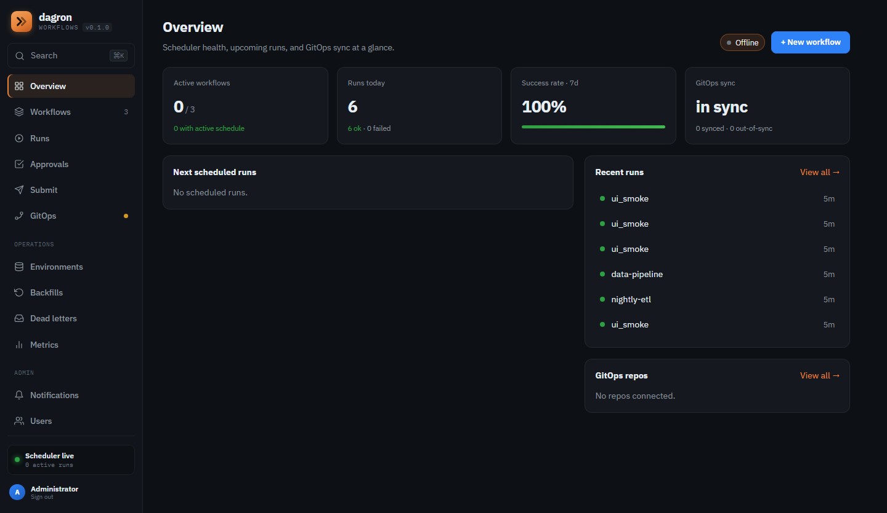
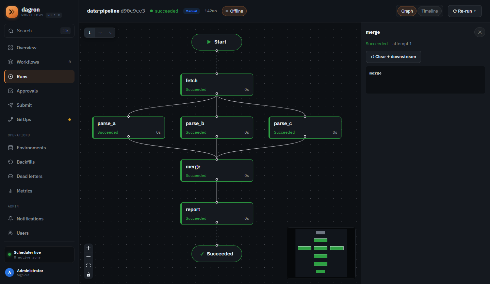
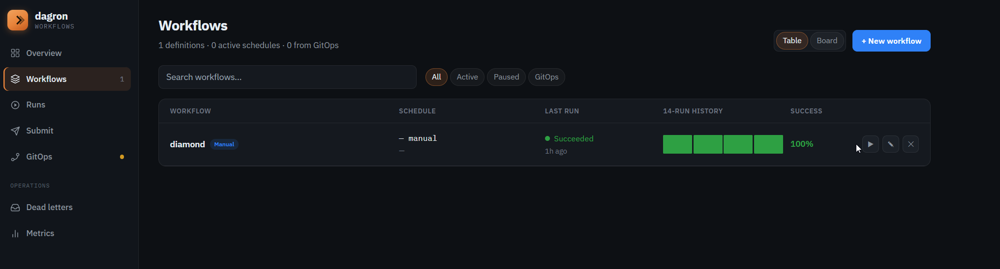
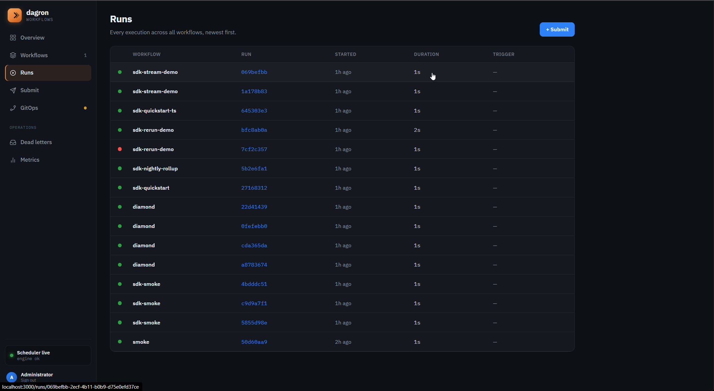
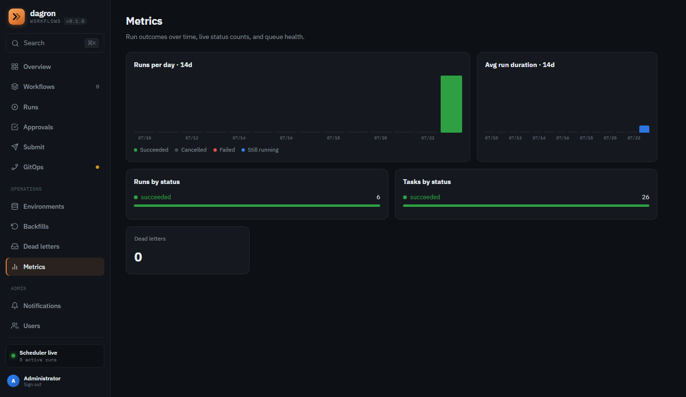

# dagron

A small, durable **DAG workflow runner**. Define a workflow as a graph of tasks
in YAML; dagron validates it, then runs each task as soon as its dependencies
succeed — concurrently, with retries and exponential backoff. Single static
binary, zero infrastructure to get started.

[](LICENSE)

**Status: pre-release** (crate `0.1.0`, `CHANGELOG.md` still *Unreleased* — no
tagged version or published artifacts yet). Everything shown below — engine,
API, UI stack — is built and runs locally today. dagron's bet is a lean trade:
one static Rust binary, plain YAML, and a database as the only state — durable
workflow orchestration with no control plane and no cluster to operate.

## See it in action

The optional web UI (the `dagron-api` gateway + Next.js frontend, brought up with
`docker compose up`) gives you a live view over the same engine the CLI drives —
submit workflows, watch runs stream, inspect the DAG, and read task logs.

| Overview — scheduler health, runs today, success rate, GitOps sync | Run detail — the live DAG graph with per-task status + output |
|---|---|
| [](docs/images/overview.png) | [](docs/images/run-graph.png) |

| Workflows — saved definitions, schedules, recent-run history | Runs — every execution across all workflows | Metrics — live run/task counts by status |
|---|---|---|
| [](docs/images/workflows.png) | [](docs/images/runs.png) | [](docs/images/metrics.png) |

## Why dagron

- **Lightweight** — a Rust binary, no Python/Celery/etc. to operate.
- **Declarative & GitOps-friendly** — workflows are plain YAML you can version.
- **Pluggable** — two small traits are the whole extension surface:
  - [`Executor`](crates/dagron-executor/src/executor.rs) — *how a task runs*
    (ships `LocalExecutor` subprocesses, plus Docker and Kubernetes backends
    behind env/feature switches).
  - [`WorkflowSource`](crates/dagron-source/src/source.rs) — *where workflows
    come from* (ships `FileSource` and an in-process `ChannelSource`).
- **Runs anywhere** — no database *server* required: the default build embeds
  SQLite (state lives in a single `workflow.db` file); switch the Cargo
  feature to `postgres` for multi-node.

## Quick start

**Option A — the full stack with UI** (needs podman or docker; ~a few minutes
on first build):

```bash
podman compose up --build     # or: docker compose up --build
```

Success looks like (trimmed; Postgres + frontend logs elided):

```text
engine-1      | INFO dagron_engine: scheduler starting worker_id=worker-… db=postgres://<redacted>@postgres:5432/workflow executor_kind=local worker_count=16 source_kind=file max_inflight_runs=64
engine-1      | INFO dagron_engine: worker pool ready size=16
engine-1      | INFO dagron_engine: reconcile loop running (multi-run, queue-driven daemon)
dagron-api-1  | INFO dagron_api: dagron-api listening addr=0.0.0.0:8080
```

Open <http://localhost:3000> and sign in with the seeded dev admin
(`admin@local` / `dagron-admin` — from `compose.yaml`; change everything for a
real deploy, see [`docs/OPERATIONS.md`](docs/OPERATIONS.md)).

**Option B — one binary, zero infra** (default build = embedded SQLite + the
management API):

```bash
cargo build --release -p dagron
./target/release/dagron dev
```

```text
INFO dagron_engine: dagron dev — local quickstart: datastore workflow.db, management API + Swagger UI on http://127.0.0.1:8787/docs (override with API_ADDR)
...
INFO dagron_engine: reconcile loop running (multi-run, queue-driven daemon)
```

Then submit a run (the body is raw workflow YAML) and watch it:

```bash
curl -s -X POST localhost:8787/runs --data-binary @examples/simple_dag.yaml
# {"run_id":"…"}
```

**Option C — one-shot run** (executes one DAG, exits when it drains; note the
DAG path is a positional argument — there is no `run` subcommand):

```bash
./target/release/dagron examples/simple_dag.yaml
```

```text
INFO dagron_engine: dispatching task=prepare attempt=1 max_attempts=3 cmd=echo
INFO dagron_engine: task succeeded task_id=…
...
INFO dagron_engine: run complete run_id=… status=succeeded
INFO dagron_engine: all runs drained — scheduler exiting
```

A task that exits non-zero is retried up to `max_attempts` with
`retry_delay_secs * 2^(attempt-1)` backoff; if it still fails, its downstream
tasks are **skipped** (by the default `all_success` trigger rule) and the run is
marked `failed` (visible in the logs, the API and the UI — the one-shot process
itself still exits 0 after draining).

A task's **`trigger_rule`** decides whether it runs based on its dependencies'
outcomes — so a task can be a cleanup join
or a failure handler instead of being skipped when an upstream fails:

```yaml
tasks:
  - { name: build,   command: ["make"] }
  - { name: deploy,  command: ["make", "deploy"], depends_on: [build] }               # all_success (default): skipped if build fails
  - { name: cleanup, command: ["make", "clean"],  depends_on: [build], trigger_rule: all_done }   # runs regardless
  - { name: alert,   command: ["notify"],         depends_on: [build], trigger_rule: one_failed }  # runs only if an upstream failed
```

Rules: `all_success` (default), `all_done` (any outcome), `one_failed`,
`all_failed`, `none_failed`. A rule-skipped task shows as `skipped`; the run is
still `failed` if any task failed.

Two related knobs: **`hook: on_exit`** (or `on_failure`) makes a task a finalizer
that runs after every other task is terminal — `on_exit` always, `on_failure`
only if something failed — without listing dependencies (sugar over trigger
rules). **`allow_failure: true`** lets an optional task fail
without failing the run:

```yaml
tasks:
  - { name: build,   command: ["make"] }
  - { name: telemetry, command: ["send-metrics"], allow_failure: true }   # best-effort; its failure won't fail the run
  - { name: notify,  command: ["slack-notify"],   hook: on_exit }         # runs at the end, whatever happened
  - { name: alert,   command: ["page-oncall"],    hook: on_failure }      # runs only if the run is failing
```

A **`type: approval`** task is a human gate:
when its dependencies finish it parks in `awaiting_approval` — no command runs —
and the run waits until you `POST /runs/{id}/tasks/{task}/approve` (the DAG
proceeds) or `.../reject` (downstream skips). An optional
`approval_timeout_secs` with `approval_on_timeout: approve|reject` (default
reject) lets the gate auto-resolve if no one answers:

```yaml
tasks:
  - { name: build,  command: ["make"] }
  - { name: gate,   type: approval, depends_on: [build], approval_timeout_secs: 3600 }  # wait for a human (default: reject after 1h)
  - { name: deploy, command: ["make", "deploy"], depends_on: [gate] }                    # runs only once approved
```

## Workflow format

```yaml
name: my_workflow
run_timeout_secs: 3600     # optional run-level wall-clock budget: past it the
                           # run is failed and its remaining tasks cancelled
deadline: { in: 45m }      # optional soft SLA: past it, emit an alert
                           # (run.deadline_exceeded event + metric) — run keeps going
tasks:
  - name: build
    command: ["cargo", "build"]
  - name: test
    command: ["cargo", "test"]
    depends_on: ["build"]
    max_attempts: 3        # default 1 (no retries)
    retry_delay_secs: 2    # base backoff; default 0 (immediate)
    retry_max_delay_secs: 60  # optional cap on the exponential backoff
    timeout_secs: 600      # per-task; default 25s
```

Fan-out tasks (`with_items` / `with_param`) may set
`instance_key: "{{ item.region }}"` to name each expanded instance
`<task>.<label>` instead of `<task>.<index>`. Runs fired by a schedule (cron,
DB schedules, backfill catch-up) receive their nominal fire time as the
`{{ scheduled_time }}` parameter (RFC-3339), so a backfilled task can process
*its* interval rather than "now".

A workflow can report its result back to a Git forge as a commit status — the
green/red check on the commit that triggered it — with a `notify.git` block
(active when `GITHUB_TOKEN` / `GITLAB_TOKEN` is set; best-effort):

```yaml
name: ci_build
parameters:
  commit_sha: ""            # supplied by the CI caller at submit time
notify:
  git:
    provider: github        # github | gitlab
    repo: acme/etl          # owner/repo (github) or project path (gitlab)
    sha: "{{ commit_sha }}"
    context: dagron/ci      # optional check name (default "dagron")
tasks:
  - { name: build, command: ["make"] }
```

A workflow's latest run status is also available as an embeddable SVG badge at
`GET /api/badges/<workflow-name>` (public, status label only).

### Call it as a durable function

Name the task whose output is the run's result with `result_from`, then submit
synchronously — the call blocks until the run finishes and returns that task's
output:

```yaml
name: score
result_from: compute        # this task's output becomes the run's result
tasks:
  - { name: fetch,   command: ["fetch-data"] }
  - { name: compute, command: ["score"], depends_on: ["fetch"] }
```

```bash
curl -s -X POST 'localhost:8787/runs?wait=true&timeout_secs=30' --data-binary @score.yaml
# {"run_id":"…","status":"succeeded","finished":true,"result":"0.97\n"}
```

`GET /runs/{id}/wait?timeout_secs=N` does the same for a run submitted earlier
(long-poll). A wait that times out returns `finished: false` with the live
status so you can re-poll — it isn't an error.

### Tail a task's logs live

A task's output streams to the datastore *as it runs* (LocalExecutor), so you
can watch a long task without waiting for it to finish. Poll the logs endpoint
with an `offset` and advance it by the returned `next_offset` until `eof`:

```bash
curl -s "localhost:8787/runs/$RUN/tasks/$TASK/logs?offset=0"
# {"output":"step 1…\n","status":"running","offset":0,"next_offset":8,"eof":false}
```

Secrets are masked in the live stream just like the final output.

The runner rejects duplicate task names, unknown dependencies, and cycles before
running anything — and `dagron validate <file|dir> [--json]` runs those same
checks offline (no database, no server), so you can lint workflow YAML in
pre-commit or CI before it ever reaches the engine. `dagron-plan <base> <head>`
(or `--git <base>..<head> <path>`) shows what a change does to the resolved DAG
as a PR-ready markdown + Mermaid diff.

## Use it as a library

The whole scheduler is the reusable **`dagron-engine`** crate; the `dagron`
binary is a thin shell over it (this is literally `src/main.rs`):

```rust
#[tokio::main]
async fn main() -> anyhow::Result<()> {
    dagron_engine::run(dagron_engine::Seams::default()).await
}
```

`Seams` is the extension seam — plug in extra workflow sources or run-lifecycle
hooks without forking the loop. To run tasks on a different substrate
(containers, remote workers), implement the `Executor` trait in
[`dagron-executor`](crates/dagron-executor/src/executor.rs); the shipped
Docker and Kubernetes executors are exactly that.

## Drive it from an AI agent (MCP)

`dagron-mcp` fronts the same `dagron-api` over the
[Model Context Protocol](https://modelcontextprotocol.io) (JSON-RPC on stdio),
so any MCP client — Claude Desktop, an IDE, your own agent — can submit,
inspect, and cancel runs **and** observe the engine's live state through three
cluster-internal tools: `dagron_get_metrics`, `dagron_list_dead_letters`, and
`dagron_get_run_events` (a bounded poll of the per-run SSE event channel).

```sh
cargo run -p dagron-mcp        # speaks JSON-RPC over stdio
```

The agent talks to the **same JWT-gated UI edge** the browser uses, never the
engine's internal ops API. See [`docs/MCP.md`](docs/MCP.md) for the tool
catalogue, MCP-client config, and **security best practices** (token scoping,
edge isolation, executor sandboxing, prompt-injection defense, audit). The
agent event-call sequence is diagrammed in
[`docs/ARCHITECTURE.md#5.8`](docs/ARCHITECTURE.md#58-mcp-agent-event-call--submit--bounded-sse-event-poll).

## Architecture

dagron is a Cargo workspace: a thin `dagron` binary over the **`dagron-engine`**
reconcile-loop library, which wires together `dagron-core` (DAG model + the
SQLite/Postgres datastore facade), `dagron-executor` (Local/Docker/Kube backends
+ worker pool) and `dagron-source` (workflow ingestion), with `dagron-api` as the
authenticated UI edge and `dagron-mcp` as the per-agent adapter. The full design
reference — component diagrams, the task state machine, and step-by-step
event/call sequences (claiming, `LISTEN/NOTIFY` wake, crash recovery, queue
ingestion, MCP) — is in [`docs/ARCHITECTURE.md`](docs/ARCHITECTURE.md).

**Reference docs:** [`docs/CONFIG.md`](docs/CONFIG.md) — every env var,
positional arg, Cargo feature and config file in one table.
[`docs/API.md`](docs/API.md) — both HTTP surfaces, endpoint by endpoint.
[`docs/OPERATIONS.md`](docs/OPERATIONS.md) — deploy, upgrade, backup per
backend, monitoring, security posture, symptom-first troubleshooting.

## License & extensibility

dagron is licensed under **Apache-2.0** (see [LICENSE](LICENSE)) — you can run it
on your own hardware, indefinitely and for free. The engine is built around
extension seams (`Seams`): identity, ingestion sources, and run-lifecycle hooks
are traits, so additional backends (SSO, queue sources, automatic
backfill/self-healing) can plug in behind the same interfaces without forking the
core.

## Contributing

See [CONTRIBUTING.md](CONTRIBUTING.md). Contributions are accepted under the
Developer Certificate of Origin (a `Signed-off-by` line, `git commit -s`).
Security reports: see [SECURITY.md](SECURITY.md).

## License

Licensed under the Apache License, Version 2.0. See [LICENSE](LICENSE) and
[NOTICE](NOTICE).
