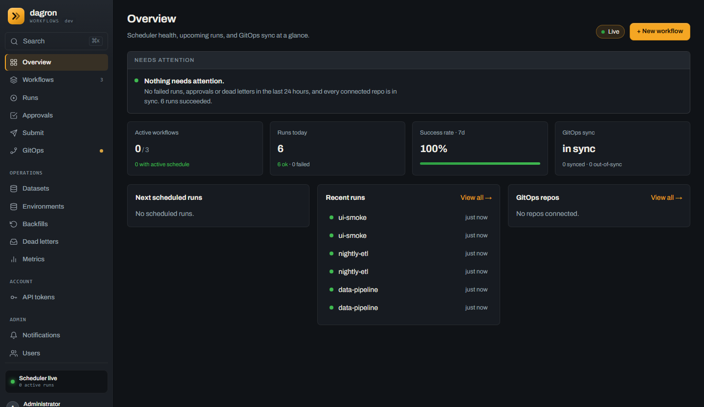
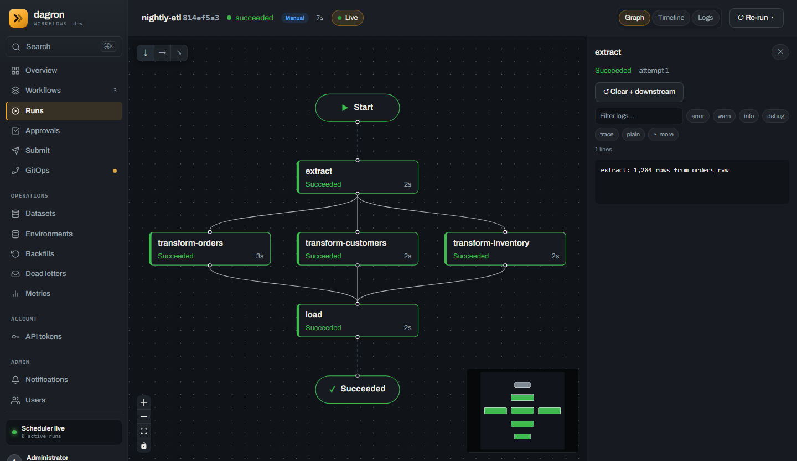
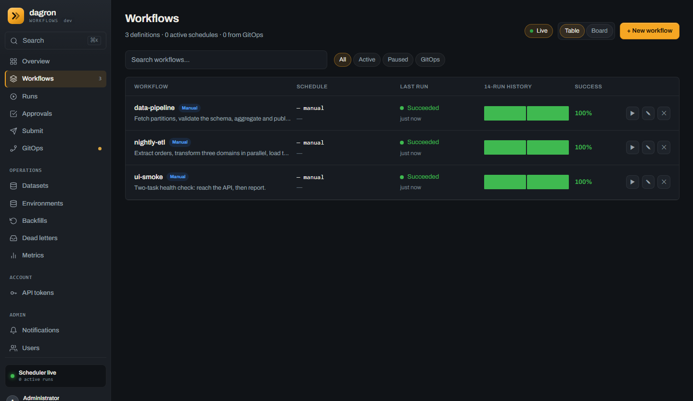
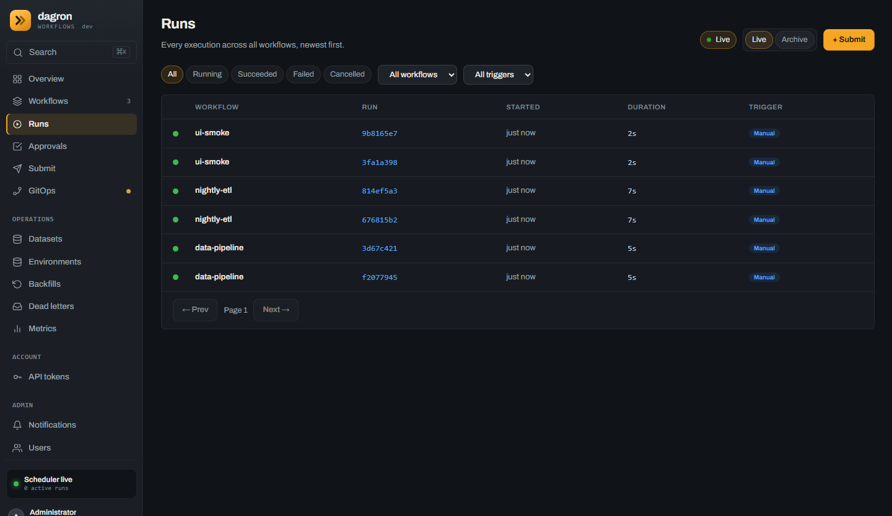
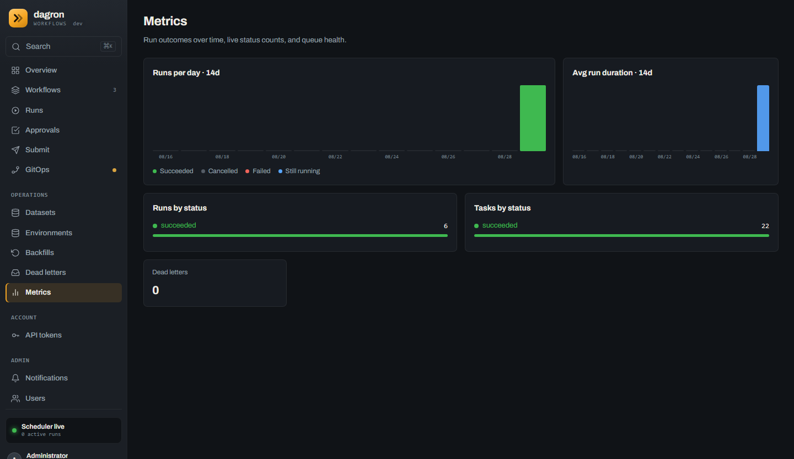
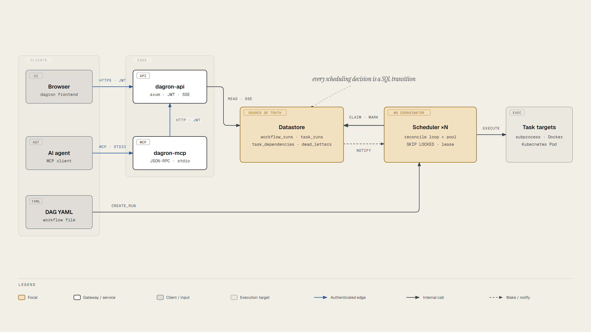

# dagron

A small, durable **DAG workflow runner**. Define a workflow as a graph of tasks
in YAML; dagron validates it, then runs each task as soon as its dependencies
succeed — concurrently, with retries and exponential backoff. Single static
binary, zero infrastructure to get started.

[](LICENSE)
[](https://github.com/lucheeseng827/dagron/releases)
[](https://github.com/lucheeseng827/dagron/actions/workflows/docker.yml)
[](https://artifacthub.io/packages/search?repo=dagron-workflow)
[](https://hub.docker.com/r/mancube/dagron-engine)
[](https://hub.docker.com/r/mancube/dagron-engine)
[](https://hub.docker.com/r/mancube/dagron-engine)

**Status: released.** The current release is **0.9.1** — multi-arch images
(`mancube/dagron-engine`, `-engine-localdev`, `-api`, `-gitops`, `-mcp`) and an
OCI Helm chart (`oci://registry-1.docker.io/mancube/dagron`, listed on
[Artifact Hub](https://artifacthub.io/packages/search?repo=dagron-workflow))
are published per tagged release. dagron's bet is a lean trade: one static Rust
binary, plain YAML, and a database as the only state — durable workflow
orchestration with no control plane and no cluster to operate.

> **Upgrading from 0.8.x?** `mancube/dagron-frontend` is discontinued — **0.8.1
> is its last tag**. The console it served now comes from `dagron-api` itself,
> on the same port as the API, so drop the container and the `frontend.enabled`
> Helm value. Migrations are forward-only and apply at startup — back up first
> ([`docs/OPERATIONS.md`](docs/OPERATIONS.md#backup--restore--what-is-the-state)).

## See it in action

The console gives you a live view over the same engine the CLI drives — submit
workflows, watch runs stream, inspect the DAG, and read task logs.
`dagron-api` serves it itself, so the stack is one port and one origin with no
separate frontend process; the engine carries a smaller console of its own for
the single-binary case (see [below](#the-console-without-the-stack)).

| Overview — scheduler health, runs today, success rate, GitOps sync | Run detail — the live DAG graph with per-task status + output |
|---|---|
| [](docs/images/overview.png) | [](docs/images/run-graph.png) |

| Workflows — saved definitions, schedules, recent-run history | Runs — every execution across all workflows | Metrics — live run/task counts by status |
|---|---|---|
| [](docs/images/workflows.png) | [](docs/images/runs.png) | [](docs/images/metrics.png) |

## Why dagron

- **Lightweight** — a Rust binary, no Python/Celery/etc. to operate.
- **Declarative & GitOps-friendly** — workflows are plain YAML you can version
  and sync from Git (runnable demo in [`examples/gitops/`](examples/gitops/)).
- **Pluggable** — two small traits are the whole extension surface:
  - [`Executor`](crates/dagron-executor/src/executor.rs) — *how a task runs*
    (ships `LocalExecutor` subprocesses, plus Docker and Kubernetes backends
    behind env/feature switches).
  - [`WorkflowSource`](crates/dagron-source/src/source.rs) — *where workflows
    come from* (ships `FileSource`, `StreamSource` — NDJSON with exactly-once
    offsets — an in-process `ChannelSource`, and `DirSource`, a watched
    directory).
- **Runs anywhere** — no database *server* required: the default build embeds
  SQLite (state lives in a single `workflow.db` file); switch the Cargo
  feature to `postgres` for multi-node.

## Quick start

> **New here?** The [**how-to guide**](docs/HOWTO.md) has copy-paste recipes:
> start a workflow via the CLI and via REST, chain one workflow from another,
> monitor runs, and wire secrets/environment variables.

**Option A — the full stack with UI** (needs podman or docker). This pulls
published images and builds nothing — a first run should not begin with
compiling four Rust crates:

```bash
docker compose -f compose.quickstart.yaml up -d
```

On podman, `podman compose` is a thin wrapper that needs podman **≥ 4.7** *and*
a compose provider (`docker-compose` or `podman-compose`) installed separately.
Older podman has no `compose` subcommand at all, so call the provider directly:

```bash
podman compose   -f compose.quickstart.yaml up -d   # podman ≥ 4.7, provider installed
podman-compose   -f compose.quickstart.yaml up -d   # standalone provider, older podman too
```

The images are pinned (`DAGRON_VERSION`, default **0.9.1** — the current
release). Floating `:latest` is deliberately not the default: a quickstart that
silently changes under you is worse than one you have to bump.

> **Changing dagron itself?** [`compose.yaml`](compose.yaml) next to it builds
> every service from source (`docker compose up --build`) — right when you are
> developing, wrong when you are meeting it.

Success looks like (`… logs -f engine dagron-api`, since `-d` detaches; trimmed,
Postgres logs elided):

```text
schema-gate-1 | schema-gate: engine migrations committed; releasing dagron-api
engine-1      | INFO dagron_engine: scheduler starting worker_id=worker-… db=postgres://<redacted>@postgres:5432/workflow executor_kind=local worker_count=16 source_kind=file max_inflight_runs=64
engine-1      | INFO dagron_engine: worker pool ready size=16
engine-1      | INFO dagron_engine: reconcile loop running (multi-run, queue-driven daemon)
dagron-api-1  | INFO dagron_api: dagron-api listening addr=0.0.0.0:8080
```

The `schema-gate` container runs once and exits 0; that is what it is meant to
do, not a failed service. It holds `dagron-api` back until the engine's migrator
has committed, because both create some of the same tables and two concurrent
`CREATE TABLE IF NOT EXISTS` for one table do not serialize — the loser exits on
`duplicate key value violates unique constraint "pg_type_typname_nsp_index"`
instead of taking the no-op path. Without the gate that race is the *default* on
a clean volume: `dagron-api` dies before it listens, and with it goes the console
and every API client behind it.

The gate is *bounded*: if the engine never opens its management port within
~60s it releases `dagron-api` anyway rather than deadlock the whole stack on an
engine that is already failing for its own reasons. That is a deliberate trade —
a current `dagron-api` retries the create-table race internally, so a degraded
start still converges — but it means the gate's exit does **not** guarantee the
engine finished migrating, only that it is worth letting the API try. On an
unusually slow host a first boot can still lose the race; if it does, bring the
stack `up` again once the engine is past its migrations.

Open <http://localhost:8080> and sign in with the seeded dev admin
(`admin@local` / `dagron-admin` — from the compose file; seeded on first start
only, so changing them later needs `down -v`. Change everything for a real
deploy, see [`docs/OPERATIONS.md`](docs/OPERATIONS.md)).

**Option B — one binary, zero infra** (default build = embedded SQLite + the
management API):

```bash
cargo build --release -p dagron
./target/release/dagron dev
```

```text
INFO dagron_engine: dagron dev — local quickstart: datastore workflow.db, management API + Swagger UI on http://127.0.0.1:8787/docs (override with API_ADDR)
...
INFO dagron_engine: reconcile loop running (multi-run, queue-driven daemon)
```

Then submit a run (the body is raw workflow YAML) and watch it:

```bash
curl -s -X POST localhost:8787/runs --data-binary @examples/simple_dag.yaml
# {"run_id":"…"}
```

**Option C — one-shot run** (executes one DAG, exits when it drains; note the
DAG path is a positional argument — there is no `run` subcommand):

```bash
./target/release/dagron examples/simple_dag.yaml
```

```text
INFO dagron_engine: dispatching task=prepare attempt=1 max_attempts=3 cmd=echo
INFO dagron_engine: task succeeded task_id=…
...
INFO dagron_engine: run complete run_id=… status=succeeded
INFO dagron_engine: all runs drained — scheduler exiting
```

A task that exits non-zero is retried up to `max_attempts` with
`retry_delay_secs * 2^(attempt-1)` backoff; if it still fails, its downstream
tasks are **skipped** (by the default `all_success` trigger rule) and the run is
marked `failed` (visible in the logs, the API and the UI — the one-shot process
itself still exits 0 after draining).

A task's **`trigger_rule`** decides whether it runs based on its dependencies'
outcomes — so a task can be a cleanup join
or a failure handler instead of being skipped when an upstream fails:

```yaml
tasks:
  - { name: build,   command: ["make"] }
  - { name: deploy,  command: ["make", "deploy"], depends_on: [build] }               # all_success (default): skipped if build fails
  - { name: cleanup, command: ["make", "clean"],  depends_on: [build], trigger_rule: all_done }   # runs regardless
  - { name: alert,   command: ["notify"],         depends_on: [build], trigger_rule: one_failed }  # runs only if an upstream failed
```

Rules: `all_success` (default), `all_done` (any outcome), `one_failed`,
`all_failed`, `none_failed`. A rule-skipped task shows as `skipped`; the run is
still `failed` if any task failed.

Two related knobs: **`hook: on_exit`** (or `on_failure`) makes a task a finalizer
that runs after every other task is terminal — `on_exit` always, `on_failure`
only if something failed — without listing dependencies (sugar over trigger
rules). **`allow_failure: true`** lets an optional task fail
without failing the run:

```yaml
tasks:
  - { name: build,   command: ["make"] }
  - { name: telemetry, command: ["send-metrics"], allow_failure: true }   # best-effort; its failure won't fail the run
  - { name: notify,  command: ["slack-notify"],   hook: on_exit }         # runs at the end, whatever happened
  - { name: alert,   command: ["page-oncall"],    hook: on_failure }      # runs only if the run is failing
```

A **`type: approval`** task is a human gate:
when its dependencies finish it parks in `awaiting_approval` — no command runs —
and the run waits until you `POST /runs/{id}/tasks/{task}/approve` (the DAG
proceeds) or `.../reject` (downstream skips). An optional
`approval_timeout_secs` with `approval_on_timeout: approve|reject` (default
reject) lets the gate auto-resolve if no one answers:

```yaml
tasks:
  - { name: build,  command: ["make"] }
  - { name: gate,   type: approval, depends_on: [build], approval_timeout_secs: 3600 }  # wait for a human (default: reject after 1h)
  - { name: deploy, command: ["make", "deploy"], depends_on: [gate] }                    # runs only once approved
```

## Workflow format

```yaml
name: my_workflow
run_timeout_secs: 3600     # optional run-level wall-clock budget: past it the
                           # run is failed and its remaining tasks cancelled
deadline: { in: 45m }      # optional soft SLA: past it, emit an alert
                           # (run.deadline_exceeded event + metric) — run keeps going
tasks:
  - name: build
    command: ["cargo", "build"]
  - name: test
    command: ["cargo", "test"]
    depends_on: ["build"]
    max_attempts: 3        # default 1 (no retries)
    retry_delay_secs: 2    # base backoff; default 0 (immediate)
    retry_max_delay_secs: 60  # optional cap on the exponential backoff
    timeout_secs: 600      # per-task; default 25s
```

> **`timeout_secs` defaults to 25 seconds** — the most common first surprise. A
> task that genuinely runs longer is killed with `command timed out after 25s`,
> and shows a single attempt because `max_attempts` defaults to `1`. There is no
> upper bound on the value; set it per task, or once via `task_defaults`. Long
> tasks are fine — a running task's lease is heartbeated, not capped.
> [`docs/HOWTO.md` §8](docs/HOWTO.md#8-tasks-that-run-longer-than-25-seconds)
> covers the three budgets and the unrelated 600 s cap on `?wait=true`.

Fan-out tasks (`with_items` / `with_param`) may set
`instance_key: "{{ item.region }}"` to name each expanded instance
`<task>.<label>` instead of `<task>.<index>`. Runs fired by a schedule (cron,
DB schedules, backfill catch-up) receive their nominal fire time as the
`{{ scheduled_time }}` parameter (RFC-3339), so a backfilled task can process
*its* interval rather than "now".

A workflow can report its result back to a Git forge as a commit status — the
green/red check on the commit that triggered it — with a `notify.git` block
(active when `GITHUB_TOKEN` / `GITLAB_TOKEN` is set; best-effort):

```yaml
name: ci_build
parameters:
  commit_sha: ""            # supplied by the CI caller at submit time
notify:
  git:
    provider: github        # github | gitlab
    repo: acme/etl          # owner/repo (github) or project path (gitlab)
    sha: "{{ commit_sha }}"
    context: dagron/ci      # optional check name (default "dagron")
tasks:
  - { name: build, command: ["make"] }
```

Operator notifications ride the same `notify:` block: a **Slack incoming
webhook** (`notify.slack`, fires on `failed` + `deadline_exceeded` by default)
and a **generic JSON webhook** (`notify.webhook`, fires on every outcome by
default). Both accept an `on:` list (`succeeded` / `failed` / `cancelled` /
`deadline_exceeded`) to widen or narrow that, template `{{ param }}`s in their
URLs, and are best-effort — a notification target being down never affects run
execution:

```yaml
notify:
  slack:
    webhook_url: "{{ slack_webhook }}"     # incidents only, by default
  webhook:
    url: https://ops.example.com/hooks/dagron
    on: [failed, deadline_exceeded]
```

Instance-wide defaults for both targets can also be configured in the UI
(sidebar → **Notifications**, stored via `PUT /api/settings/notifications`):
the engine applies them to every run *in addition to* per-workflow `notify:`
blocks, skipping any URL a spec already fired so nothing notifies twice.

A workflow's latest run status is also available as an embeddable SVG badge at
`GET /api/badges/<workflow-name>` (public, status label only).

### Environments: variables + secrets per deployment target

A workflow pins a named **environment** (managed in the UI under
*Environments*, or via `/api/environments`) and one spec runs against staging
or prod by changing a single line. Variables template as `{{ env.NAME }}`;
secrets are **write-only** (stored AES-256-GCM-encrypted under
`DAGRON_ENV_SECRET_KEY`, shared by dagron-api and the engine) and resolve via
the existing `value_from` seam at dispatch — falling back to
`DAGRON_SECRET_*` / `DAGRON_SECRETS_DIR`, so SOPS/External-Secrets setups
keep working unchanged:

```yaml
name: etl
environment: prod            # {{ env.* }} + secrets come from here
tasks:
  - name: load
    command: ["etl", "--bucket", "{{ env.BUCKET }}"]
    env:
      - { name: DB_PASSWORD, value_from: { secret: DB_PASSWORD } }
```

### Less repetition: `task_defaults`

Declared once, merged into every task (a task wins by setting its own value;
default `env` vars are prepended so same-named task vars shadow them):

```yaml
task_defaults:
  max_attempts: 3
  retry_delay_secs: 10
  timeout_secs: 300
  docker_image: etl-base:1.4
tasks:
  - { name: extract, command: ["extract"] }        # inherits all defaults
  - { name: load, command: ["load"], max_attempts: 1 }  # overrides retries
```

Combined with `templates` (reusable sub-DAGs) and `workflow_ref` (chaining
saved workflows), most copy-paste between tasks and workflows disappears.

### Branching and loops

Two `when:` flavors, told apart by what the condition references. A condition
over parameters is decided at run creation (false ⇒ the task never exists —
the recursive-template base case). A condition referencing an upstream task's
**output** is evaluated by the engine when the task becomes ready, so a check
task's *result* branches the DAG at runtime; the referenced task must be in
`depends_on`:

```yaml
tasks:
  - { name: check, command: ["decide-deploy"] }        # prints "go" or "hold"
  - name: deploy
    command: ["ship"]
    depends_on: [check]
    when: "{{ tasks.check.output }} == go"             # false ⇒ skipped
```

The `repeat:` loop operator re-runs a task until a condition on its own
output holds (`{{ output }}`, `{{ attempt }}` are bound) — the
poll-until-done pattern, bounded so it can never wedge a run:

```yaml
  - name: wait-for-export
    command: ["check-export-status"]                    # prints "done" when ready
    repeat: { until: "{{ output }} == done", max_iterations: 60, delay_secs: 30 }
```

Exhausting `max_iterations` **fails** the task (a condition that never came
true is an error, not a success).

### Call it as a durable function

Name the task whose output is the run's result with `result_from`, then submit
synchronously — the call blocks until the run finishes and returns that task's
output:

```yaml
name: score
result_from: compute        # this task's output becomes the run's result
tasks:
  - { name: fetch,   command: ["fetch-data"] }
  - { name: compute, command: ["score"], depends_on: ["fetch"] }
```

```bash
curl -s -X POST 'localhost:8787/runs?wait=true&timeout_secs=30' --data-binary @score.yaml
# {"run_id":"…","status":"succeeded","finished":true,"result":"0.97\n"}
```

`GET /runs/{id}/wait?timeout_secs=N` does the same for a run submitted earlier
(long-poll). A wait that times out returns `finished: false` with the live
status so you can re-poll — it isn't an error.

### Tail a task's logs live

A task's output streams to the datastore *as it runs* (LocalExecutor), so you
can watch a long task without waiting for it to finish. Poll the logs endpoint
with an `offset` and advance it by the returned `next_offset` until `eof`:

```bash
curl -s "localhost:8787/runs/$RUN/tasks/$TASK/logs?offset=0"
# {"output":"step 1…\n","status":"running","offset":0,"next_offset":8,"eof":false}
```

Secrets are masked in the live stream just like the final output.

### Read a whole run's logs, filtered

When a run fails and you don't yet know *which* task failed, clicking through
task panels one at a time is the actual problem. One call returns every task's
output as a single attributed stream, filtered server-side:

```bash
curl -s "localhost:8787/runs/$RUN/logs?level=error&context=1" \
  | jq -r '.lines[] | "\(.task)  \(.text)"'
# extract  2026-07-26T10:00:02Z WARN  retrying page 3
# extract  2026-07-26T10:00:03Z ERROR upstream timeout
```

The filter — `q`, `exclude`, `regex`, `level`, `case`, `context`, `limit`, `tail`
— works on both log endpoints and in the console's **Logs** view on the run page.
It runs on the server: a run's output can be hundreds of megabytes, and
downloading it all to grep in a browser is not a filter. Responses report
`matched` against `total`, so a view that hides most of a run always says so.
Full reference: [docs/API.md §Log filter](docs/API.md#log-filter).

### A directory as the inbox

`SOURCE=dir` watches `WORKFLOW_DIR` (default `/workflows`): drop a `*.yaml` in and
it runs, edit one and the next scan re-submits it.

```bash
SOURCE=dir WORKFLOW_DIR=./workflows ./dagron &
cp pipeline.yaml ./workflows/      # runs within DIR_POLL_MS (default 2 s)
```

It polls rather than watching, because inotify does not fire on the mounts this is
for — bind mounts from a Windows or macOS host, NFS and SMB shares. Each file's
(modified time, length) commits with the run it becomes, so a restart re-runs
nothing that already ran, and an edit runs whenever it moves either half of that
key — a rewrite that keeps the same length inside the filesystem's timestamp
granularity is not seen as a change. `DAG` argument and `SOURCE=file` are
unchanged: one YAML, once, then drain.

### Streaming: events in, workflows out

`SOURCE=stream` follows an append-only NDJSON file or named pipe — one workflow
submission per line, **exactly-once** (the line's offset commits in the same
datastore transaction as the run it becomes), poison lines dead-lettered
instead of wedging the stream. Anything that appends lines
is a producer (`kafkacat`, `psql COPY`, `tail -f app.log | jq -c`):

```bash
touch events.ndjson    # the path must exist at startup (STREAM_MODE=auto)
SOURCE=stream STREAM_PATH=./events.ndjson ./dagron ./events.ndjson &
echo '{"name":"handle_order","tasks":[{"name":"p","command":["echo","o-1001"]}]}' >> events.ndjson
```

Semantics, replay/drain modes, and five runnable case studies:
[`docs/STREAMING.md`](docs/STREAMING.md) + [`examples/streaming/`](examples/streaming/).
Managed broker connectors (Kafka, NATS, SQS, Redis) and a CloudEvents webhook
gateway are not in this build; the seam they plug into is
([`SourceFactory`](crates/dagron-source/src/source.rs)), and `SOURCE=stream` is
the open path to the same shape.

### AI workloads: long, preemptible, checkpointed

Long tasks are first-class: workers **heartbeat** a running task's lease (a
task may run for hours; a dead worker's task is re-dispatched in seconds), and
**checkpoint-aware resume** hands a retry the last committed checkpoint via
`DAGRON_RESUME_FROM` — resume from epoch N, not epoch 0. `resources.gpu` sugar
plus `runner_class` pools (`spot-gpu` / `ondemand-gpu` / `cpu`) route each
stage to the right capacity:

```yaml
tasks:
  - name: train
    command: ["python", "train.py"]       # reports checkpoints; resumes on retry
    runner_class: spot-gpu
    timeout_secs: 14400
    max_attempts: 5                        # preemption = a retry that resumes
    resources: { gpu: { count: 4 } }
```

The contract and five runnable case studies:
[`docs/AI_WORKLOADS.md`](docs/AI_WORKLOADS.md) + [`examples/ai/`](examples/ai/).

The runner rejects duplicate task names, unknown dependencies, and cycles before
running anything — and `dagron validate <file|dir> [--json]` runs those same
checks offline (no database, no server), so you can lint workflow YAML in
pre-commit or CI before it ever reaches the engine. `dagron-plan <base> <head>`
(or `--git <base>..<head> <path>`) shows what a change does to the resolved DAG
as a PR-ready markdown + Mermaid diff.

## Use it as a library

The whole scheduler is the reusable **`dagron-engine`** crate; the `dagron`
binary is a thin shell over it (this is literally `src/main.rs`):

```rust
#[tokio::main]
async fn main() -> anyhow::Result<()> {
    dagron_engine::run(dagron_engine::Seams::default()).await
}
```

`Seams` is the extension seam — plug in extra workflow sources or run-lifecycle
hooks without forking the loop. To run tasks on a different substrate
(containers, remote workers), implement the `Executor` trait in
[`dagron-executor`](crates/dagron-executor/src/executor.rs); the shipped
Docker and Kubernetes executors are exactly that.

## Drive it from an AI agent (MCP)

`dagron-mcp` fronts the same `dagron-api` over the
[Model Context Protocol](https://modelcontextprotocol.io) (JSON-RPC on stdio),
so any MCP client — Claude Desktop, an IDE, your own agent — can take a workflow
all the way round: register a named workflow and run it with arguments, wait on
it, read its logs and artifacts, resolve an approval gate, rerun what failed, and
record what it concluded. Forty-two tools, including the cluster-internal ones
that let an agent observe the engine rather than only command it —
`dagron_get_metrics`, `dagron_get_health`, `dagron_list_dead_letters`, and
`dagron_get_run_events` (a bounded poll of the per-run SSE event channel).

```sh
cargo run -p dagron-mcp                       # speaks JSON-RPC over stdio
DAGRON_MCP_READONLY=1 cargo run -p dagron-mcp # the 24 read tools only
```

Eighteen of the forty-two change cluster state. `DAGRON_MCP_READONLY=1` hides
them from `tools/list` and refuses them on call, which is the setting to reach
for whenever the agent's prompt carries text you don't control.

The agent talks to the **same JWT-gated UI edge** the browser uses, never the
engine's internal ops API. See [`docs/MCP.md`](docs/MCP.md) for the tool
catalogue, MCP-client config, and **security best practices** (token scoping,
edge isolation, executor sandboxing, prompt-injection defense, audit). The
agent event-call sequence is diagrammed in
[`docs/ARCHITECTURE.md#5.8`](docs/ARCHITECTURE.md#58-mcp-agent-event-call--submit--bounded-sse-event-poll).

## The console, without the stack

`dagron-api` serves the full console (runs, workflows, the editor, approvals,
settings) at `/`, with the API under `/api` — one port and one origin, no proxy
and no second image. That is the deployment with Postgres behind it.

The engine binary carries a smaller one of its own. Set `API_ADDR` and open it:

```bash
API_ADDR=127.0.0.1:8787 dagron workflow.yaml workflow.db
# then http://127.0.0.1:8787
```

Runs with a status filter, a run's tasks with their attempts and timings, whole-run
and per-task logs, cancel and rerun, per-task clear/approve/reject, dead letters with
redrive, the effective configuration and the metrics exposition. **No Node, no second
process, no network fetch** — it is embedded in the binary, so it works air-gapped and
against SQLite. `DAGRON_CONSOLE=off` leaves it unmounted.

> **The management API has no authentication.** That is true with or without the
> console — `cancel`, `rerun`, `approve` and redrive have always been reachable by
> anyone who can reach `API_ADDR`. The console makes that one browser tab away instead
> of one OpenAPI read, so keep `API_ADDR` on loopback or a private address, with
> authentication in front of it if you publish it. dagron warns at startup on a
> non-loopback bind. `DAGRON_CONSOLE=off` hides the UI and closes nothing else.

## Architecture

[](docs/ARCHITECTURE.md#1-system-context)

Three ways in — the browser, an AI agent over MCP, and YAML on disk (one file,
or a watched directory) — one datastore that *is* the source of truth,
and N identical scheduler processes that claim work out of it with no
coordinator, no leader election and no heartbeat table. Every scheduling decision
is a SQL transition, so a scheduler can be killed at any point and the survivors
reconstruct state from the rows alone.

dagron is a Cargo workspace: a thin `dagron` binary over the **`dagron-engine`**
reconcile-loop library, which wires the rest together. Nothing below is required
to run a workflow except the first five rows.

| Crate | Owns |
|---|---|
| `dagron` (bin) | the entry point, and nothing else: `dagron_engine::run(Seams::default())` |
| `dagron-engine` | the reconcile loop as a library — config, executor/worker/ingest wiring, and the ops surface (API + built-in console, cron, GC, leadership, schedules) behind `--features ops` |
| `dagron-core` | DAG model + validation, matrix/call expansion, the SQLite/Postgres datastore facade, the metrics registry |
| `dagron-executor` | the `Executor` trait + Local / Docker / Kubernetes backends, and the ractor worker pool |
| `dagron-source` | the `WorkflowSource` trait + File / Dir / Stream / Channel sources, and the ingest actor that turns submissions into runs |
| `dagron-api` | the authenticated UI edge (Postgres-only): `LISTEN/NOTIFY` → SSE, and the console itself at `/` |
| `dagron-mcp` | MCP server over stdio — the management API as agent tools |
| `dagron-gitops` | optional worker image: polls connected repos and reconciles their specs into the workflows table |
| `dagron-autopsy` | standalone job autopsy — **schedules nothing**. Joins Slurm `sacct` + DCGM + NCCL logs + InfiniBand counters into a fault-attributed record for a failed GPU job ([`docs/HPC_AUTOPSY.md`](docs/HPC_AUTOPSY.md)) |
| `dagron-identity` | auth seam — `IdentityProvider` + a local argon2 provider; SSO plugs in behind it |
| `dagron-artifact` | artifact-store seam — local filesystem by default, S3 / GCS / Azure behind features |
| `dagron-crypto` | secret-value encryption (AES-256-GCM, env-derived key), shared by the engine and the API |
| `dagron-logging` | the shared `tracing` bootstrap every binary calls first |
| `dagron-lineage` | OpenLineage emitter — best-effort `RunEvent`s on run finalization |
| `dagron-import` | importers — Argo Workflows specs → dagron YAML |
| `dagron-plan` | spec diff for a pull request: what a workflow change does before it merges |
| `dagron-forge` | commit statuses / PR checks on GitHub or GitLab when a run finishes |
| `dagron-step-mcp` | a task that calls a tool on an MCP server, with dagron's retries and artifacts around it |

The full design reference — component diagrams, the task state machine, and
step-by-step event/call sequences (claiming, `LISTEN/NOTIFY` wake, crash
recovery, queue ingestion, MCP) — is in
[`docs/ARCHITECTURE.md`](docs/ARCHITECTURE.md).

**Reference docs:** [`docs/CONFIG.md`](docs/CONFIG.md) — every env var,
positional arg, Cargo feature and config file in one table.
[`docs/API.md`](docs/API.md) — both HTTP surfaces, endpoint by endpoint.
[`docs/OPERATIONS.md`](docs/OPERATIONS.md) — deploy, upgrade, backup per
backend, monitoring, security posture, symptom-first troubleshooting.

## What this build does not do

Everything on this page is Apache-2.0 and complete on its own. A few knobs name
capabilities that are **not** in this build, and they say so rather than failing
quietly: selecting a managed connector kind (`SOURCE=kafka`, `nats`, `sqs`,
`redis`) is a startup error, not a silent downgrade to something else. The open
path — `SOURCE=stream` and the `SourceFactory` seam — always works, and a
pipeline proven on it moves to another source by changing environment
variables rather than workflows.

The same holds for the other seams: `Executor`, `WorkflowSource` and the
artifact store are traits, and a build without a given backend says which
feature is missing instead of pretending. The seams exist so an implementation
you write — or one someone else ships — drops in without forking a file here.
Nothing on this page depends on that happening.

## Contributing

See [CONTRIBUTING.md](CONTRIBUTING.md). Contributions are accepted under the
Developer Certificate of Origin (a `Signed-off-by` line, `git commit -s`).
Security reports: see [SECURITY.md](SECURITY.md).

## License

Licensed under the Apache License, Version 2.0. See [LICENSE](LICENSE) and
[NOTICE](NOTICE).
