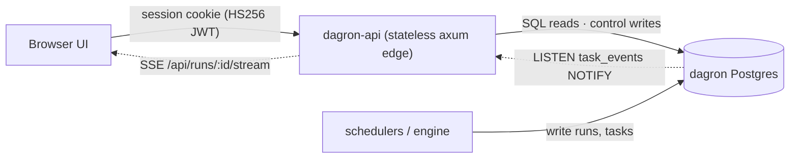
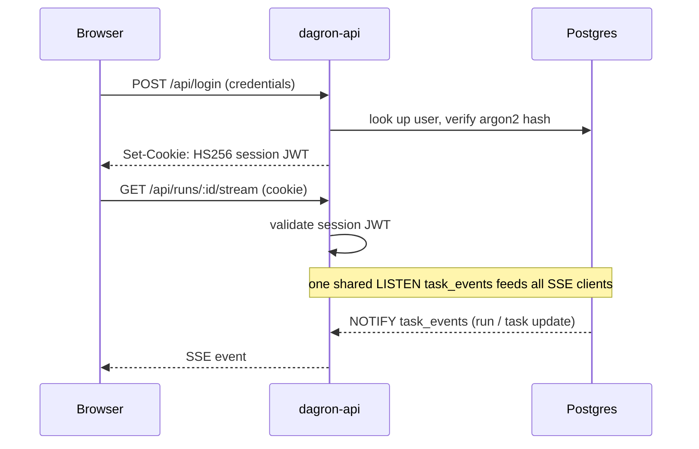

# dagron-api — authenticated UI gateway

`dagron-api` is the **public, authenticated edge** for the dagron engine.
It is a stateless, read-mostly axum service over the dagron **Postgres** datastore
that the schedulers write to — it holds no scheduler state of its own and scales
to N replicas.

## Architecture



## Two APIs, one boundary

dagron has **two** HTTP surfaces. They are intentionally separate:

| | `dagron` engine `src/api.rs` (`--features ops`) | `dagron-api` (this crate) |
|---|---|---|
| Role | **internal ops** API, in-process beside the reconcile loop | **external UI** gateway |
| Auth | **none** — must be bound to a private/cluster-internal interface | self-contained JWT (argon2 login → own HS256 session cookie) |
| Backend | whatever feature the engine is built with | Postgres only (needs LISTEN/NOTIFY for SSE) |
| Exposes | `/metrics` (Prometheus), `/openapi`, `/docs`, dead-letter mgmt, runs, cancel | runs, run detail, **DAG graph**, **task logs**, **SSE live stream**, cancel, **task retry**, submit, **metrics (JSON)**, **dead-letters** |

> **Security boundary:** the engine `src/api.rs` is unauthenticated. Bind it to
> `127.0.0.1` or a cluster-private address (it's for Prometheus scrape + internal
> ops), and route all browser/user traffic through `dagron-api`, which validates
> the shared session JWT on every request. Never expose the engine API to the
> public internet.

## Endpoints

Reads (auth required):
- `GET /api/me` — validated session claims
- `GET /api/runs?status=&limit=&offset=` — run list
- `GET /api/runs/:id` — run + task rows
- `GET /api/runs/:id/spec` — the DAG YAML this run was created from (pre-fills the re-run editor)
- `GET /api/runs/:id/graph` — nodes + edges (React-Flow-ready)
- `GET /api/runs/:id/tasks/:tid/logs` — task output
- `GET /api/runs/:id/stream` — SSE live updates (per-run)
- `GET /api/events/stream` — SSE live updates (account-wide; feeds the UI list pages' live mode)
- `GET /api/metrics` — run/task counts by status + dead-letter total (JSON)
- `GET /api/dead-letters?limit=` — parked poison submissions

Control (auth required):
- `POST /api/runs` — submit a DAG (server-side cycle check)
- `POST /api/runs/:id/cancel`
- `POST /api/runs/:id/tasks/:tid/retry`
- `POST /api/dead-letters/:id/redrive` — re-submit a parked payload as a run
- `DELETE /api/dead-letters/:id` — discard

`GET /healthz` is unauthenticated (liveness).

## Event flow

A password login mints the session JWT; live run updates ride an SSE stream fed by
a single Postgres `LISTEN` that fans `task_events` `NOTIFY`s out to every client.



## Quickstart

```bash
DATABASE_URL=postgres://…  \
DAGRON_JWT_SECRET="$(openssl rand -hex 32)"  \
cargo run -p dagron-api                 # listens on :8080 (override with PORT)
```

Bootstrap an account and log in — the login response sets the session cookie that
every other `/api/*` call requires:

```bash
curl -X POST localhost:8080/api/users -d '…'                 # create the first user
curl -X POST localhost:8080/api/login -c cookies.txt -d '…'  # -> Set-Cookie: session JWT
curl -b cookies.txt localhost:8080/api/runs                  # authenticated read
```

## Why the SQL is inlined

dagron-api inlines its queries (mirroring engine `db::postgres`) rather than
depending on the engine crate: the engine's `db.rs` has a `compile_error!` when
both the `sqlite` and `postgres` features are enabled, which Cargo's workspace
feature unification would trip if this Postgres-only service depended on
`dagron[postgres]` alongside the engine's default `sqlite` build. Keep the
inlined statements in sync if the engine schema changes (the submitted/redriven
task `input` JSON must match `dag::TaskSpec`).

## Config

| Env | Purpose |
|-----|---------|
| `DATABASE_URL` | Postgres connection string (same DB the schedulers use; a read replica may be wired into the read path later) |
| `DAGRON_JWT_SECRET` | HS256 secret dagron-api uses to sign + validate its own session JWT (≥ 32 bytes) |
| `DAGRON_COOKIE_SECURE` | set the session cookie's `Secure` attribute (enable behind HTTPS/TLS termination) |
| `PORT` | listen port (default 8080) |
