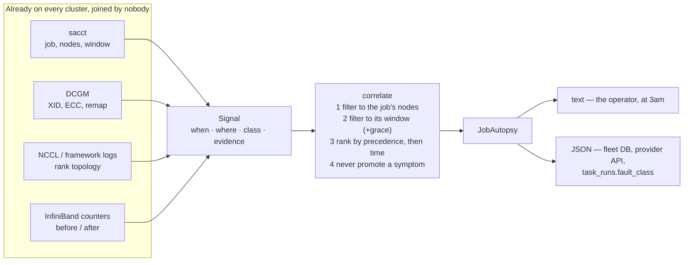
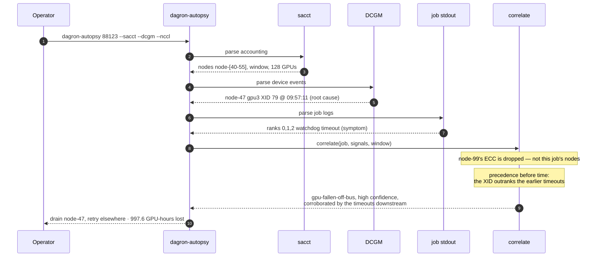

# dagron-autopsy

**A job autopsy that schedules nothing.**

Sits beside an existing Slurm cluster, joins `sacct` + DCGM + NCCL logs +
InfiniBand counters against a job's node set and time window, and emits a
fault-attributed job record: what broke, on which device, when, with the
evidence.

`sacct` is the required input — it supplies the node set and time window
everything else is joined against — so this is Slurm-based today. Reading
Kubernetes pod status and events as a fifth source is a gap, not a feature.

```text
job 88123  train_llama_70b
  VERDICT       gpu-fallen-off-bus  (infrastructure, high confidence)
  first fault   2026-08-26T09:57:11+00:00  node-47 gpu3  via dcgm
  ACTION        drain node-47 and retry elsewhere
```

Full guide: [`docs/HPC_AUTOPSY.md`](../../docs/HPC_AUTOPSY.md).
Taxonomy: `dagron-autopsy --explain`, or `dagron_core::fault`.

## Quickstart

No database, no daemon, no agent — every input is a file, so this runs against
last week's job on a laptop.

```bash
cargo build --release -p dagron-autopsy      # → target/release/dagron-autopsy

# The one required input: without a node set and a time window there is nothing
# to join against. (`--collect` runs this for you instead.)
sacct -j 88123 -P -n \
  -o JobID,JobName,State,ExitCode,Start,End,Elapsed,NodeList,AllocTRES,Reason \
  > sacct.txt

# --dcgm takes dcgmi text, CSV, or NDJSON; --nccl takes the job's stdout/stderr;
# the InfiniBand pair must be both-or-neither (a counter level is not evidence,
# only a rise during the job is).
dagron-autopsy 88123 \
  --sacct sacct.txt \
  --dcgm /var/log/dcgm/events.json \
  --nccl slurm-88123.out \
  --ib-before ib-pre.txt --ib-after ib-post.txt
```

Add `--format json` for the machine contract. Every source except `--sacct` is
optional, and a missing one is **confessed in the record** rather than quietly
narrowing the verdict:

```text
  CAVEATS
   - no --dcgm input: XID, ECC and row-remap events were not consulted, so a
     device fault cannot be found even if there was one
```

Try it with no cluster at all — the test fixtures are a realistically-shaped
failed 128-GPU training job:

```bash
# From the module root. `cargo run` rather than a bare name: after cd'ing into
# the fixtures directory the binary is not on PATH, and a shell does not search
# the working directory.
cargo run --release -p dagron-autopsy -- 88123 \
  --sacct crates/dagron-autopsy/tests/fixtures/sacct.txt \
  --dcgm  crates/dagron-autopsy/tests/fixtures/dcgm.ndjson \
  --nccl  crates/dagron-autopsy/tests/fixtures/job.out
```

## Architecture

Four collectors, one event type, one join. Adding a fifth source is a parser
that emits `Signal`s; `correlate` does not change.



## Event flow

The headline case: a GPU dies, every healthy rank reports the collective timeout
it caused, and the naive reading blames the network.



## Layout

| module | what it does |
|---|---|
| `nodelist` | Slurm hostlist expansion (`node-[01-04,07]`) — **the join key** |
| `timestamp` | one parser for four sources that disagree about time |
| `sacct` | the frame: job identity, node set, window, GPU-hours |
| `dcgm` | XIDs, ECC, row-remap — text, CSV or NDJSON |
| `nccl` | rank topology of the hang: who timed out, who stayed silent |
| `ib` | fabric counter **deltas** (a level is not evidence; a rise is) |
| `signal` | the common event type every collector produces |
| `correlate` | the join, and the ranking rule |
| `record` | the emitted record, JSON and operator-readable |

Adding a fifth source is a parser that emits `Signal`s. `correlate` does not
change.

## The rule that matters

A collective timeout is a **symptom**. It is printed by every rank that was
*waiting* — the healthy ones — and the rank that died often prints nothing at
all. It can corroborate a cause found elsewhere, and the pattern of who stayed
silent can name the culprit, but it is never promoted to a cause on its own.

## Tests

```bash
cargo test -p dagron-autopsy
```

Everything is file-driven, so the whole pipeline is exercised without a cluster:
`tests/fixtures/` holds a realistically-shaped failed 128-GPU training job, and
`tests/autopsy.rs` asserts that the dead GPU wins over the collective timeout
everyone reads first.
