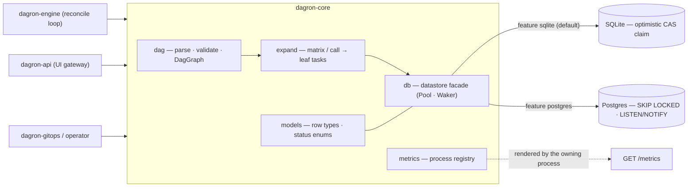
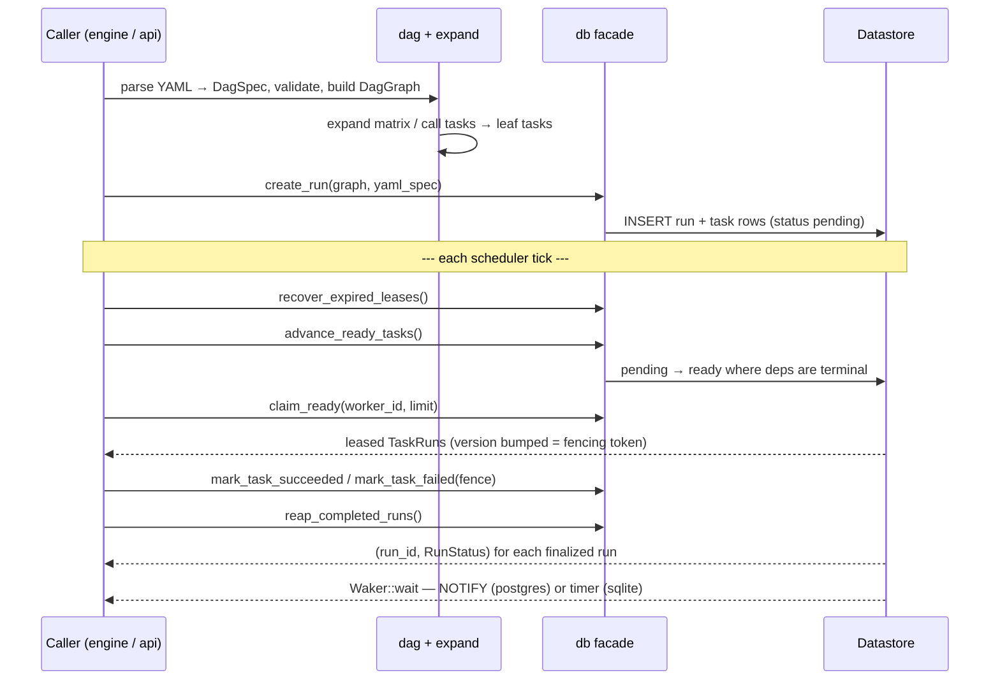

# dagron-core — DAG model, datastore facade and metrics for the dagron stack

`dagron-core` is the **foundation** shared by the engine, the API gateway and the
operator. It defines the DAG model and its validation, matrix/call expansion into
leaf tasks, the datastore facade over one compiled-in backend (SQLite or Postgres),
and the process metrics registry. It knows nothing about *how* a task runs (see
`dagron-executor`) or *where* a submission comes from (see `dagron-source`).

## Architecture



Exactly one of the two backend edges exists in a given build — see *Feature
flags* below.

## What it does

- **`dag`** — the DAG model, YAML parsing + validation, and the run graph
  (`DagSpec`, `TaskSpec`, `EnvVar`, and related spec types).
- **`expand`** — matrix / call-task expansion into concrete leaf tasks, plus the
  `substitute` helper for `{{ param }}` templating against a spec's parameters.
- **`models`** — datastore row types and status enums shared across the API.
- **`db`** — the datastore facade (`Pool`, `Waker`, run/task lifecycle queries such
  as `create_run`, `claim_ready`, `advance_ready_tasks`, `reap_completed_runs`).
  Exactly one backend is compiled in; a `compile_error!` enforces this.
- **`metrics`** — the process metrics registry (`Metrics`) rendered at `GET /metrics`.

## Call flow

A submission enters through `dag` + `expand` and is written once; from then on
every scheduler tick is pure `db` facade calls against the shared rows. Nothing
in this crate runs a task — it only moves rows between states.



## Feature flags

| Feature | Effect |
|---------|--------|
| `sqlite` (default) | Zero-infra single-node backend (optimistic CAS claim). |
| `postgres` | Horizontal scale: `FOR UPDATE SKIP LOCKED` + `LISTEN/NOTIFY`. |
| `ops` | Management/UI datastore queries (run listings, dead-letters, DB schedules, status counts) + metrics fields backing the ops HTTP API. |
| `enterprise` | Auto-backfill sweep, `run_reruns` ledger, parameterized rerun metrics, outbox eventing. Implies `ops`. |

Exactly one datastore backend must be active. `default = ["sqlite"]` so a plain
build resolves one; dependents that pick a different backend depend on this crate
with `default-features = false` and forward their choice.

Because of that, the workspace cannot be built as a single unit: the engine
resolves `sqlite` while `dagron-api`/`dagron-gitops` resolve `postgres`, and
`--workspace` would unify them into the `compile_error!`. Build the two halves
separately (this is what the release gate does, and how the images are built):

```console
cargo build --workspace --exclude dagron-api --exclude dagron-gitops
cargo build -p dagron-api -p dagron-gitops
```

## Quickstart

```rust
use dagron_core::{dag, db, metrics};

// Parse + validate a workflow spec through the same pipeline every submit path uses.
let spec: dag::DagSpec = serde_yaml::from_str(&yaml)?;

// Open the datastore (backend chosen at compile time by feature flag).
let pool = db::init_pool("workflow.db").await?;

// The process metrics registry the engine shares with its worker pool.
let metrics = metrics::Metrics::new();
```

This crate is a library only; the engine wires `dag`, `db`, `expand`, `metrics` and
`models` together into the reconcile loop and the ops surface.
