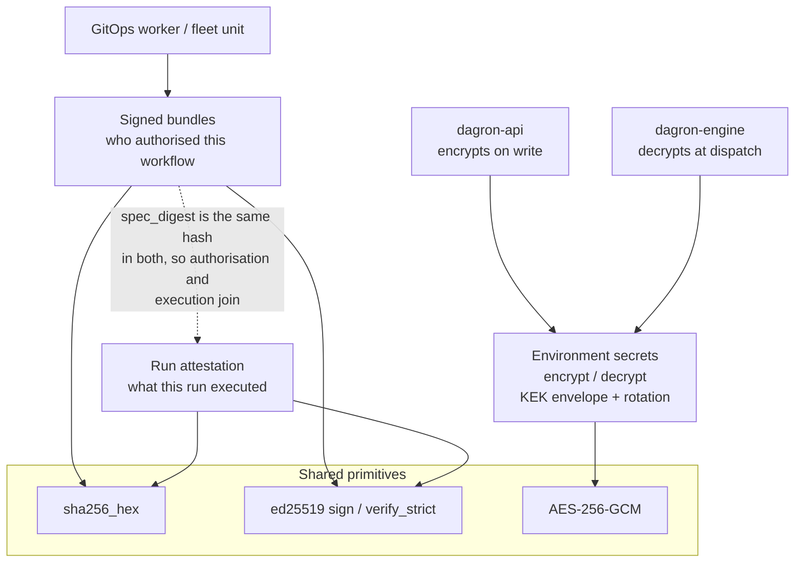
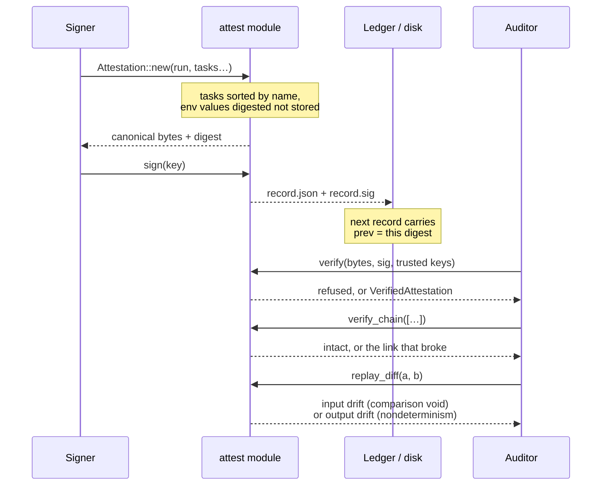

# dagron-crypto — secrets at rest, signed bundles, run attestation

The crate every other component reaches for when something has to be
**encrypted**, **signed**, or **verified**. It deliberately depends on neither
`sqlx` nor any other dagron crate: `dagron-api` cannot depend on `dagron-core`
(the sqlite/postgres feature exclusivity would trip under workspace feature
unification), so the shared primitives live here instead — and one verifier
shared by every consumer is the only way "verified" means one thing across the
engine, the management API, the GitOps worker and a fleet unit.

Three surfaces, in the order most deployments meet them.

## Quickstart

```sh
# 1. Environment secrets: one key, shared by dagron-api and dagron-engine.
export DAGRON_ENV_SECRET_KEY="$(openssl rand -base64 32)"

# 2. Sign a directory of workflow specs into a verifiable bundle.
#    --keygen prints a labelled block; `@seed.txt` wants the bare 64-hex seed,
#    so keep only that line. Guard the file: it is the signing key.
cargo run -p dagron-crypto --example bundle_sign -- --keygen > keys.txt
sed -n 's/^seed.*:  *//p' keys.txt > seed.txt && chmod 600 seed.txt
cargo run -p dagron-crypto --example bundle_sign -- ./specs @seed.txt --version 2026.09.01-1

#    Verification needs the matching public key — the other line of that block.
DAGRON_BUNDLE_PUBKEYS="$(sed -n 's/^public key: *//p' keys.txt)" \
  cargo run -p dagron-crypto --example bundle_sign -- --verify ./specs

# 3. Attest a run, then ask whether a second run did the same thing.
cargo run -p dagron-crypto --example attest_run -- --keygen > att-keys.txt
sed -n 's/^seed.*:  *//p' att-keys.txt > att-seed.txt && chmod 600 att-seed.txt
cargo run -p dagron-crypto --example attest_run -- sign run.json spec.yaml @att-seed.txt --out a1
cargo run -p dagron-crypto --example attest_run -- diff a1.json a2.json
```

## Architecture

Three surfaces over two primitives. Everything signed uses the same ed25519
code path and the same SHA-256, which is what lets one operator hold one trust
model instead of three.



## Event flow

Signing and verification never re-serialise a record to compare it: the digest
is taken over the bytes that were actually signed, so a value that round-trips
imperfectly cannot be laundered into a different digest.



## 1. Environment secrets (crate root)

AES-256-GCM under a key derived from `DAGRON_ENV_SECRET_KEY`. `dagron-api`
encrypts on write, `dagron-engine` decrypts at task dispatch, so **both
processes must see the same key**.

- `encrypt(&key, plaintext)` / `decrypt(&key, stored)` — wire format
  `v1:<base64(nonce ‖ ciphertext+tag)>`. The random 96-bit nonce makes every
  encryption unique; the version prefix leaves room to rotate the scheme
  without guessing at old rows.
- `load_key()` / `key_configured()` — the key is 32 bytes of standard base64,
  or any other string hashed to 32 bytes with SHA-256.
- `version_of(stored)` — which scheme wrote a given ciphertext.

### Envelope encryption (feature `enterprise`)

BYOK / KMS-wrapped data keys, encrypted artifacts at rest, and the key-rotation
sweep. `encrypt_envelope` / `decrypt_envelope` (plus `_bytes` and streaming
`StreamSealer` / `StreamOpener` variants) go through a `KeyProvider`:

| Provider | Selected by | Feature |
|---|---|---|
| `LocalKekProvider` | `DAGRON_ENV_KEK_PROVIDER=local` | — |
| `CommandKmsProvider` | `…=command` | — (dependency-free seam for any HSM/cloud) |
| `AwsKmsProvider` | `…=awskms` | `kms-aws` |
| GCP Cloud KMS | `…=gcpkms` | `kms-gcp` |
| Azure Key Vault | `…=azurekv` | `kms-azure` |

`rewrap_envelope` re-wraps a ciphertext under a new KEK without touching the
plaintext, which is what makes rotation possible on a live datastore.

## 2. Signed workflow bundles (`src/bundle.rs`)

ed25519 over a manifest of content-addressed specs — the answer to *who
authorised this workflow*. `docs/BUNDLES.md` is the contract.

- `verify_bundle` / `verify_bundle_dir` — check the signature over the **exact**
  manifest bytes, then that the files are exactly the manifest's specs with
  matching SHA-256s. Any failure returns an error and nothing else.
- `sha256_hex`, `parse_pubkeys`, `pubkeys_from_env` — the shared primitives, so
  a signer computes exactly what the verifier will compare.
- `VerifiedBundle::provenance()` — `bundle:<name>@<version>#<digest[..12]>`, the
  string every consumer stamps on what it applies, so one grep finds every place
  a bundle landed.

Keygen and signing live in the `bundle_sign` example rather than the library —
see the Quickstart above. `--verify` refuses to run without
`DAGRON_BUNDLE_PUBKEYS`: an empty trust set must reject every bundle, never
accept all of them.

## 3. Run attestation (`src/attest.rs`)

A signed, content-addressed record of **what a run actually executed** — the
family-5 primitive from [`docs/FAMILIES.md`](../../docs/FAMILIES.md). Built on
the same ed25519 and SHA-256 as the bundle verifier, so an operator keeps one
trust set and one key-rotation story rather than two.

- `Attestation` — spec digest, engine version, executor, and a `TaskRecord` per
  task (argv digest, image, environment digest, trust-envelope digest, output
  digest). Values are **never** recorded, only digested: an attestation is
  designed to be forwarded to an auditor.
- `prev` + `verify_chain` — each record carries the digest of the one before it,
  so excising a run from the middle is detectable even though every surviving
  record still verifies alone.
- `replay_diff` — compares two attestations and sorts every divergence into
  **input drift** (different spec, argv, image, environment or trust envelope —
  the two runs were not asked to do the same thing, so the comparison is void)
  or **output drift** (identical inputs, different result — the workload is
  nondeterministic, and this names which task). Run ids, wall clocks and attempt
  counts are never compared.

No orchestrator can make user code deterministic, so reproducibility here is a
**measurement**, not a guarantee — see the module docs for exactly what an empty
diff does and does not claim.

```sh
cargo run -p dagron-crypto --example attest_run -- --keygen
cargo run -p dagron-crypto --example attest_run -- sign run.json spec.yaml @seed.txt
cargo run -p dagron-crypto --example attest_run -- diff  att1.json att2.json
cargo run -p dagron-crypto --example attest_run -- chain att1.json att2.json
```

> The engine hook that writes an attestation per run is **not yet wired** —
> `attest_run` reconstructs one from the API and the spec, and says which source
> it used. `docs/FAMILIES.md` lists the remaining call sites.
> [`workshop/04-families/verify.sh`](../../workshop/04-families/verify.sh) drives
> the whole loop and checks it.

## Config

| Env | Purpose |
|-----|---------|
| `DAGRON_ENV_SECRET_KEY` | AES-256-GCM key for environment secrets. Same value in `dagron-api` and `dagron-engine`, or dispatch cannot decrypt what the API wrote. |
| `DAGRON_ENV_KEK_PROVIDER` | Envelope KEK provider: `local` / `command` / `awskms` / `gcpkms` / `azurekv` (feature `enterprise`). |
| `DAGRON_ENV_KEK` | The KEK itself, for the `local` provider. |
| `DAGRON_BUNDLE_PUBKEYS` | Comma-separated trusted ed25519 verifying keys for **bundles** (hex or standard base64). Unset or empty is an error — a missing trust set refuses every bundle rather than accepting all of them. |
| `DAGRON_ATTEST_PUBKEYS` | The same, for **attestations**. A separate variable on purpose: the key that *authors* workflows and the key that *witnesses* runs are different roles, and an estate that separates them must be able to. |

Full reference: [`docs/CONFIG.md`](../../docs/CONFIG.md).
