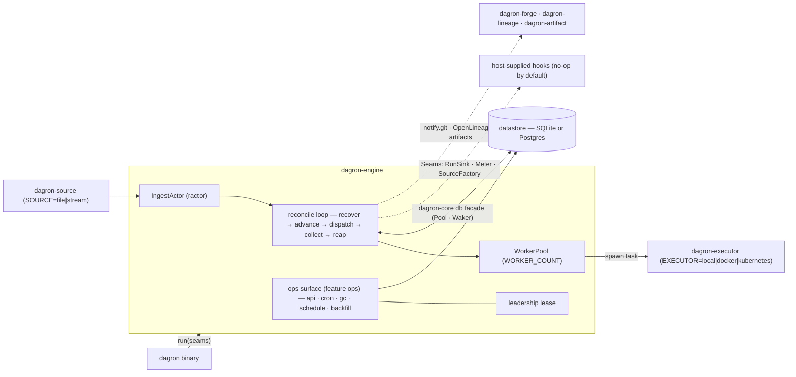
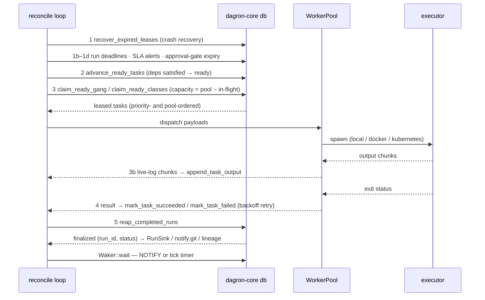

# dagron-engine — the reconcile-loop daemon as a reusable library

`dagron-engine` is the dagron scheduler itself, packaged as a library. Its `run()`
function is the whole daemon: config from env, executor + worker pool + db pool +
ingest actor, the ops surface, and the multi-run reconcile loop. The `dagron` binary
is a thin shell over `run()`; alternate builds differ only in the [`Seams`] they pass
(built-in vs. extra sources; no-op vs. active run-lifecycle hooks).

## Architecture



Only the leadership holder runs the time-driven ops loops, so cron, GC, DB
schedules and backfill fire exactly once across N replicas.

## What it does

- **`run(seams)`** — boots the scheduler: initializes logging, builds the executor
  (`EXECUTOR=local|docker|kubernetes`), spawns the `WorkerPool` and the ractor
  `IngestActor`, opens the datastore `Pool` + `Waker`, and drives the reconcile loop.
- **Reconcile loop** — per tick: recover expired leases, enforce run deadlines /
  SLA alerts / approval-gate timeouts, advance ready tasks, claim + dispatch to
  workers, drain live-log chunks, collect results (with exponential-backoff retry),
  and reap finalized runs.
- **`Seams` (`hooks`)** — the extension points: a `SourceFactory` hook for extra
  ingestion sources, and `RunSink` / `Meter` run-lifecycle hooks (no-op by default).
- **Ops surface (feature `ops`)** — the axum management API plus the leadership-gated
  `cron`, `gc`, DB-`schedule` and paced-backfill loops, coordinated by a
  `leadership` lease so time-sources fire on exactly one node.
- **Integrations** — offline `dagron validate` spec linting, `DAGRON_ARTIFACTS`
  injection via `dagron-artifact`, OpenLineage emit via `dagron-lineage`, and
  `notify.git` forge commit statuses via `dagron-forge`.

## Event flow

One tick of the reconcile loop, in source order (`src/lib.rs`, steps 1–6). Every
step is idempotent, so all replicas may sweep concurrently; the loop then parks
on `Waker::wait`, which returns on a datastore `NOTIFY` or the tick timer,
whichever comes first.



Step 6 is drain-mode shutdown: the loop stops claiming, lets in-flight tasks
finish, and exits.

## Feature flags

| Feature | Effect |
|---------|--------|
| `sqlite` (default) | SQLite backend via `dagron-core`. |
| `postgres` | Postgres backend via `dagron-core`. |
| `ops` (default) | Management API + leadership-gated cron / GC / schedule loops. |
| `kubernetes` | Kubernetes pod executor (`EXECUTOR=kubernetes`). |
| `enterprise` | Auto-backfill sweep, run_reruns ledger, parameterized rerun metrics, outbox eventing. Implies `ops`. |

## Quickstart

As a library, run the daemon with the built-in configuration:

```rust
use dagron_engine::{run, Seams};

#[tokio::main]
async fn main() -> anyhow::Result<()> {
    run(Seams::default()).await
}
```

The `dagron` binary is exactly this. Behavior is env- and arg-driven, e.g.
`dagron validate <file|dir>...` (offline lint), `dagron dev` (zero-infra local
quickstart with the API/Swagger UI), or `dagron <dag.yaml> <db-target>` for a run.

## Config

Selected environment variables read by `run()`:

| Env | Purpose |
|-----|---------|
| `DATABASE_URL` | Postgres connection string (postgres builds). |
| `EXECUTOR` | Executor backend: `local` (default) / `docker` / `kubernetes`. |
| `SOURCE` | Ingestion source: `file` (default) / `stream`. Managed broker connectors are part of dagron Enterprise and error at startup here with a pointer (`dagron-source/src/source.rs`). |
| `WORKER_COUNT` | Worker pool size (default 16). |
| `MAX_INFLIGHT_RUNS` | Admission cap on concurrently active runs (default 64; `0` disables the cap). |
| `DEAD_LETTER_MAX_ATTEMPTS` | Transient create-run retries before dead-lettering (default 3). |
| `API_ADDR` | Management API listen address (enables the ops server). |
| `CRON_CONFIG` | Path to the cron config file (enables the cron loop). |
| `GC_RETENTION_SECS` / `GC_INTERVAL_SECS` | Retention GC window and sweep interval. |
| `DB_SCHEDULES` | Enable DB-backed UI schedules (`1`/`true`). |
| `WORKFLOW_DIR` | GitOps workflow dir seeded from bundled examples (default `/workflows`). |
| `DAGRON_ARTIFACT_DIR` | Enables the per-task `DAGRON_ARTIFACTS` shared dir. |
| `DOCKER_IMAGE` / `K8S_IMAGE` / `K8S_NAMESPACE` | Container/pod executor image and namespace. |
| `LEADER_LEASE_SECS` | Leadership lease duration for ops time-sources (default 30). |
