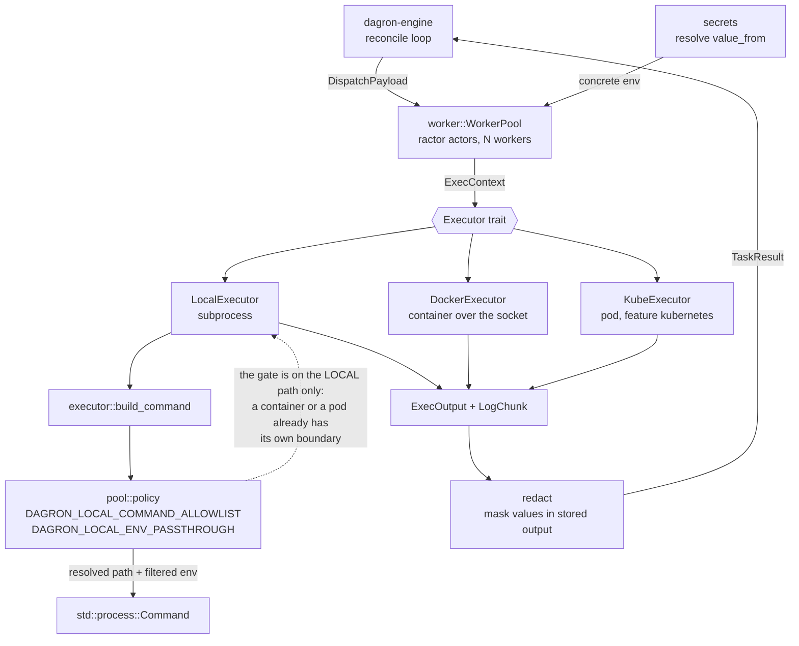
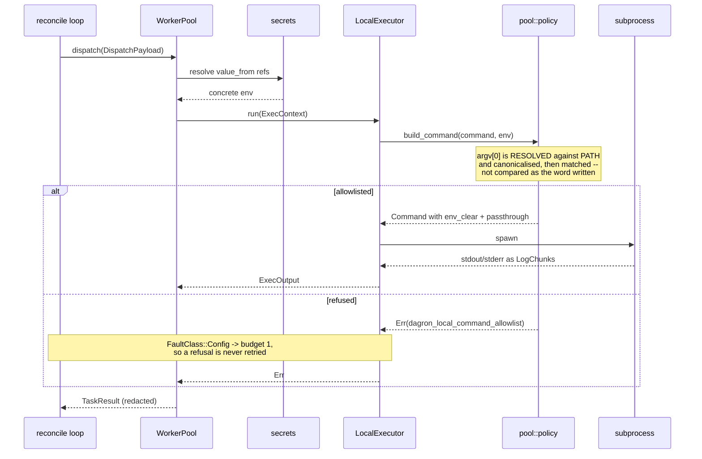

# dagron-executor — task executors and the worker pool

`dagron-executor` defines *how* a claimed task runs. It provides the `Executor`
trait and its Local / Docker / Kubernetes backends, plus the ractor worker pool that
dispatches claimed tasks to the configured executor and reports results back to the
engine's reconcile loop. It borrows core types from `dagron-core` but has no
knowledge of scheduling or ingestion.

## What it does

- **`executor`** — the `Executor` trait and the shared `ExecContext` /
  `ExecOutput` types, plus the always-available `LocalExecutor` that runs each task
  as a subprocess. `LogChunk` carries incremental output for live tailing.
- **`docker_executor`** — `DockerExecutor`, running each task in a container over a
  Docker / podman socket (`bollard`).
- **`kube_executor`** — `KubeExecutor`, running each task as a Kubernetes pod. Behind
  the `kubernetes` feature (pure-Rust client; compiles without a cluster).
- **`worker`** — the ractor `WorkerPool` that dispatches `DispatchPayload`s to the
  executor, records per-task durations into the core `Metrics` registry, and returns
  each `TaskResult` to the reconcile loop.
- **`pool`** — what an `EXECUTOR=local` pool permits: which programs a task may
  run (`DAGRON_LOCAL_COMMAND_ALLOWLIST`) and which of the pool's own environment
  variables it may see (`DAGRON_LOCAL_ENV_PASSTHROUGH`). Both opt-in — unset, a
  local pool behaves exactly as it always has. They exist because a local pool
  runs its tasks as subprocesses of the engine, so `command:` comes from the
  workflow and `Command` inherits the parent environment: on such a pool a spec
  author could run any program the pool's user can and read every variable it
  holds, the datastore DSN included. The allowlist matches a **resolved file**
  rather than the word a task wrote, since a comparison on `command[0]` is
  defeated by a planted program on a task-supplied `PATH`. See the module doc
  for the measurements.
- **`secrets`** — resolves `value_from` env references into concrete values just
  before dispatch. **`redact`** — scrubbing helpers for sensitive output. Note
  what redaction is *not*: it masks values in stored output, and cannot stop a
  task reading a value it was handed. `pool` is the module that stops the
  reading.
- **`install_crypto_provider()`** — installs the process-wide rustls `CryptoProvider`
  the kube client needs before opening TLS (feature `kubernetes`).

## Architecture

One trait, three backends, and a policy gate only the local one passes
through. The engine never names a backend: it hands the pool a `DispatchPayload`
and the pool calls whichever `Executor` was configured at startup.



Note where the policy sits. `redact` masks values on the way *out* and cannot
stop a task reading what it was handed; `pool` is the module that stops the
reading, and it is only meaningful for `LocalExecutor` because that is the
backend with no boundary of its own.

## Event flow

One claimed task, on a hardened local pool. The refusal path is the interesting
one: it happens before the process exists, and it is a *configuration* fault, so
the engine does not retry it.



## Feature flags

| Feature | Effect |
|---------|--------|
| `kubernetes` | Enables `kube_executor` (`EXECUTOR=kubernetes`); pulls in `kube` / `k8s-openapi` / `rustls`. |

## Quickstart

Library only — the engine wires it together. Pick an executor and build a pool:

```rust
use std::sync::Arc;
use dagron_executor::{executor::{Executor, LocalExecutor}, worker::WorkerPool};
use dagron_core::metrics::Metrics;

let executor: Arc<dyn Executor> = Arc::new(LocalExecutor);
let metrics = Arc::new(Metrics::new());
let workers = WorkerPool::new(16, executor, metrics).await?;

// The reconcile loop dispatches claimed tasks and collects TaskResults:
workers.dispatch(payload)?;
```

The engine selects the backend from `EXECUTOR` (`local` / `docker` / `kubernetes`)
and, for the Kubernetes build, calls `install_crypto_provider()` once at startup.
