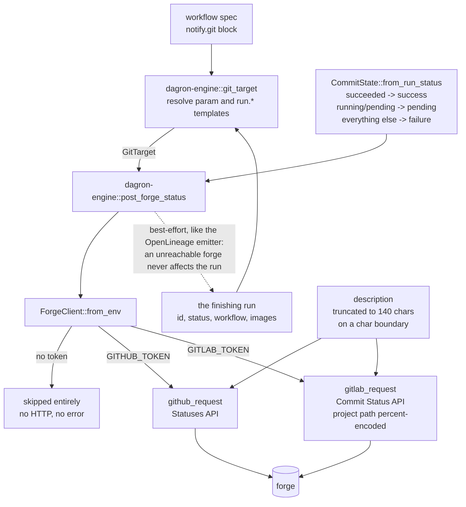
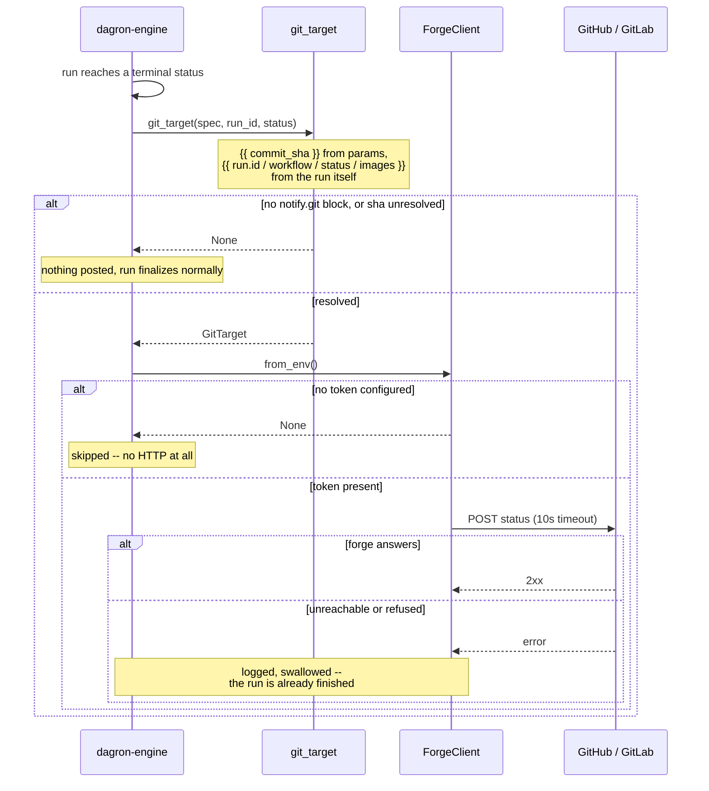

# dagron-forge — forge commit-status feedback

`dagron-forge` posts a commit status / PR check to **GitHub or GitLab** when a
dagron run finishes, so a workflow's result surfaces as a green/red check on the
commit that triggered it. When a workflow declares a `notify.git` block, the
engine calls [`ForgeClient::post_status`] on run finalization. It is
**best-effort**, mirroring the OpenLineage emitter: a forge being unreachable
never affects run execution.

## What it does

- `ForgeClient` — posts commit statuses to whichever forge(s) have a token
  configured. `ForgeClient::from_env()` returns `None` when no forge token is
  set, so the engine skips the call entirely; a bounded 10s HTTP timeout keeps a
  slow/hung forge from stalling finalization.
- `CommitState` — the outcome to publish (`Pending` / `Success` / `Failure`).
  `CommitState::from_run_status` maps a dagron run status string (`succeeded` →
  success, `running`/`pending` → pending, everything else → failure). `Pending`
  is reserved for a future run-started hook; the engine posts `Success`/`Failure`
  on finalize today.
- `GitTarget` — a resolved `notify.git` target (provider, repo, sha, context,
  optional `target_url` back to the run in the dagron UI, optional
  `description`).
- `description` — the one line the check shows. Left unset it stays the
  state's own wording (`dagron run succeeded`), which is what every existing
  workflow keeps. It is worth setting when the run *produced* something the
  reviewer is looking for: a workflow whose image is built from a recipe can
  say `description: "built {{ run.images }}"` and turn the check on the pull
  request that changed that recipe into the answer to *which image came out*,
  rather than a pass/fail that says nothing about it. Over GitHub's 140-
  character ceiling the text is cut with an ellipsis rather than the whole
  status being rejected.
- `github_request` / `gitlab_request` — build the provider-specific URL + JSON
  body (GitHub Statuses API vs GitLab Commit Status API, including project-path
  percent-encoding and GitLab's `failed` spelling of failure).

## Architecture

Two providers behind one client, and one place — `git_target` in the engine —
where a `notify.git` block becomes a resolved target. Everything templated is
resolved there, against the run that is finishing, which is why `{{ run.images }}`
can name something the workflow author could not have known when they wrote it.



The 140-character ceiling is GitHub's, and it is enforced by truncation rather
than by rejection: a status that says a little less is worth more than a status
the forge refuses. Truncation counts *characters*, not bytes, so a description
carrying non-ASCII is not cut through the middle of one.

## Event flow

A run finishing on a workflow that declares `notify.git`. Note that the token
check comes first: with no forge configured there is no HTTP call at all, which
is what makes this safe to leave wired in by default.



## Quickstart

Wired into the engine's run-finalization path:

```rust
if let Some(client) = dagron_forge::ForgeClient::from_env() {
    let target = dagron_forge::GitTarget { /* from the resolved notify.git block */ };
    let state = dagron_forge::CommitState::from_run_status(run_status);
    // best-effort: log, don't fail the run
    let _ = client.post_status(&target, state).await;
}
```

GitHub uses `Authorization: token <t>`; GitLab uses a `PRIVATE-TOKEN` header.

## Templating

Every string field of `notify.git` is `{{ param }}`-templated against the
workflow's parameters — that is how `sha: "{{ commit_sha }}"` picks up the SHA
the CI caller submitted. Four `run.*` names also resolve, because the things an
author most wants in a check are the ones only the engine knows:

| Name | Resolves to |
|------|-------------|
| `{{ run.id }}` | the run's id — so `target_url` can link to it without the caller passing it in |
| `{{ run.workflow }}` | the workflow name |
| `{{ run.status }}` | the terminal run status (`succeeded`, `failed`, …) |
| `{{ run.images }}` | the distinct task images the spec declares, first-appearance order, comma-separated; empty when the workflow names none |

They are namespaced with a dot so they can never collide with a parameter. An
unknown `{{ … }}` is left verbatim, as everywhere else in a spec.

## Config

A client is returned only if at least one token is set.

| Env | Purpose |
|-----|---------|
| `GITHUB_TOKEN` | GitHub token; enables the GitHub provider |
| `GITHUB_API_BASE` | GitHub API base (default `https://api.github.com`; set for GHE) |
| `GITLAB_TOKEN` | GitLab token; enables the GitLab provider |
| `GITLAB_API_BASE` | GitLab API base (default `https://gitlab.com/api/v4`) |
