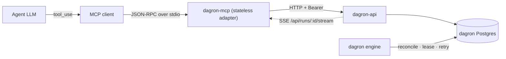
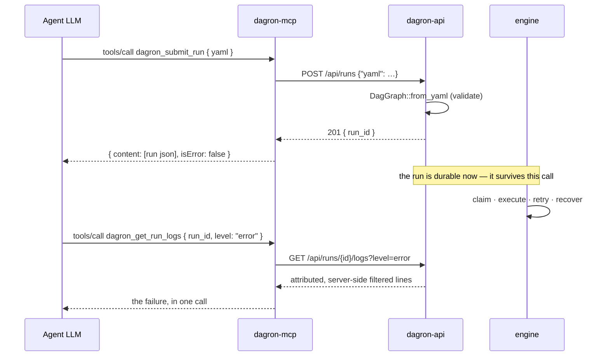

# dagron-mcp — dagron as agent tools (Model Context Protocol)

`dagron-mcp` exposes the dagron management API as MCP **tools**, so an AI agent
can drive workflows: submit a DAG, list and inspect runs, cancel one, and read
logs. It is a thin adapter — it holds no state, runs no engine logic, and calls
`dagron-api` over HTTP for everything. Transport is newline-delimited JSON-RPC
2.0 over **stdio**.

The catalogue is deliberately more than CRUD. `dagron_get_metrics`,
`dagron_list_dead_letters` and `dagron_get_run_events` let an agent *observe* a
live cluster — what's queued, what's poisoned, what just happened — rather than
only issue commands into it.

## Architecture



The adapter holds no state and runs no engine logic: every tool is one or two
`dagron-api` calls. Durability, retries and recovery are the engine's, inherited
rather than reimplemented.

## Tools

| Tool | Input | → dagron-api |
|---|---|---|
| `dagron_list_runs` | — | `GET /api/runs` |
| `dagron_get_run` | `run_id` | `GET /api/runs/{id}` |
| `dagron_submit_run` | `yaml` | `POST /api/runs` (`{"yaml": …}`, `application/json`) |
| `dagron_cancel_run` | `run_id` | `POST /api/runs/{id}/cancel` |
| `dagron_get_task_logs` | `run_id`, `task_id`, + log filter | `GET /api/runs/{id}/tasks/{tid}/logs` |
| `dagron_get_run_logs` | `run_id` + log filter | `GET /api/runs/{id}/logs` |
| `dagron_get_metrics` | — | `GET /api/metrics` |
| `dagron_list_dead_letters` | `limit?` (1–500) | `GET /api/dead-letters` |
| `dagron_get_run_events` | `run_id`, `wait_ms?` (100–10000) | bounded SSE read of `GET /api/runs/{id}/stream` |

Both log tools accept the same server-side filter grammar — `q`, `exclude`,
`regex`, `level`, `case`, `context`, `limit`, `tail` — so an agent that learns one
has learned the other. When diagnosing a failure, reach for `dagron_get_run_logs`
first: one call returns every task's output, attributed and filtered, instead of N
calls guessing which task printed the error.

## Configuration

| Variable | Default | Effect |
|---|---|---|
| `DAGRON_API_URL` | `http://localhost:8080` | the dagron-api base URL |
| `DAGRON_MCP_TOKEN` | unset | sent as `Authorization: Bearer` when set |
| `DAGRON_MCP_ALLOW_PLAINTEXT_TOKEN` | off | `1`/`true` permits sending the token over plaintext `http://` to a remote host |

> **Use `https://` for a remote `DAGRON_API_URL` when a token is set.** On
> plaintext `http://` the bearer token crosses the network readable by anything on
> the path, so the server **refuses to start** rather than leaking it — the error
> names the three ways out: use `https://`, point at loopback, or set
> `DAGRON_MCP_ALLOW_PLAINTEXT_TOKEN=1`.
>
> That opt-out exists because plaintext to an in-cluster Service with the
> transport secured by a mesh is a legitimate deployment. This process cannot
> verify that from the inside, so the operator states it once and the exception
> becomes explicit and auditable instead of silent. Loopback needs no opt-out —
> it never leaves the box.

Logs go to **stderr**. stdout is the protocol channel and carries only JSON-RPC.

## Quickstart

Register it with an MCP client (Claude Desktop, an IDE, your own harness):

```json
{
  "mcpServers": {
    "dagron": {
      "command": "dagron-mcp",
      "env": { "DAGRON_API_URL": "http://localhost:8080" }
    }
  }
}
```

Or speak to it directly:

```console
$ echo '{"jsonrpc":"2.0","id":1,"method":"tools/list"}' | dagron-mcp
{"jsonrpc":"2.0","id":1,"result":{"tools":[{"name":"dagron_list_runs",…}]}}
```

## Call flow

Submitting a workflow and then diagnosing it — the two things an agent does most.
Note that submit returns as soon as the run is *persisted*: the run outlives the
tool call, which is the whole reason to hand work to dagron rather than do it
inline.



## Contracts worth knowing

- **A tool failure is `isError: true`, not a transport error.** The model sees the
  failure text and can react to it, which is the whole point of returning it.
- **`run_id` / `task_id` are restricted to `[A-Za-z0-9_-]`** before any request is
  made. They are interpolated into request URLs, so an id carrying `/` or `?`
  could otherwise reshape which endpoint gets hit with this server's auth token.
- **Submit sends a JSON envelope.** `POST /api/runs` binds `Json<SubmitBody>`, so
  a raw YAML body with `content-type: application/yaml` is refused with 415 before
  the handler runs. `submit_posts_the_spec_as_json` pins the wire shape.
- **A JSON-RPC message with no `id` is a notification** and gets no reply, ever.

## Related

- `crates/dagron-api` — the management API these tools call.
- dagron Enterprise ships a superset of this server: these tools plus NL→DAG
  generation, a catalogue that makes each registered workflow directly callable
  by name, and an HTTP transport for agents that have no stdio.
