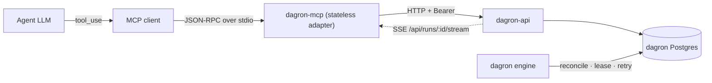
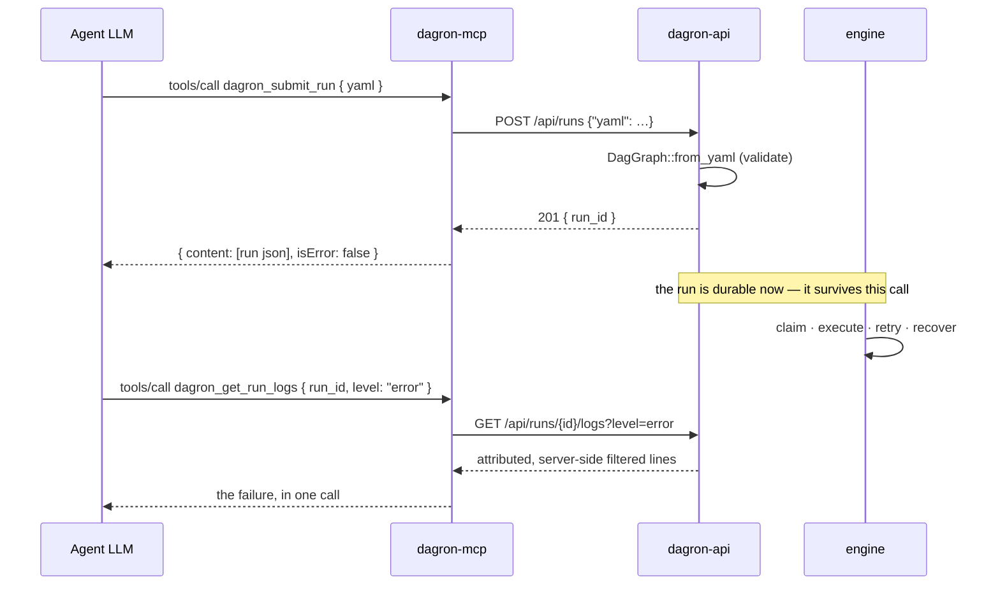

# dagron-mcp — dagron as agent tools (Model Context Protocol)

`dagron-mcp` exposes the dagron management API as MCP **tools**, so an AI agent
can take a workflow all the way round: register a named workflow, run it with
arguments, wait for it, read its logs and artifacts, resolve an approval gate,
rerun what failed, and write down what it concluded. It is a thin adapter — it
holds no state, runs no engine logic, and calls `dagron-api` over HTTP for
everything. Transport is newline-delimited JSON-RPC 2.0 over **stdio**.

The catalogue is deliberately more than CRUD. `dagron_get_metrics`,
`dagron_get_health`, `dagron_list_dead_letters` and `dagron_get_run_events` let
an agent *observe* a live cluster — what's queued, what's poisoned, what just
happened — rather than only issue commands into it.

Forty-two tools, eighteen of which write. `DAGRON_MCP_READONLY=1` removes those
eighteen — from `tools/list` and from the dispatcher both — leaving a surface
that can diagnose a cluster but not change one.

## Architecture



The adapter holds no state and runs no engine logic: every tool is one or two
`dagron-api` calls. Durability, retries and recovery are the engine's, inherited
rather than reimplemented.

## Tools

**W** = changes cluster state (hidden and refused under `DAGRON_MCP_READONLY`).

| Tool | Input | → dagron-api |
|---|---|---|
| `dagron_list_runs` | `status?`, `name?`, `trigger?`, `limit?`, `offset?` | `GET /api/runs` |
| `dagron_get_run` | `run_id` | `GET /api/runs/{id}` |
| `dagron_wait_run` | `run_id`, `timeout_secs?` (1–600) | `GET /api/runs/{id}/wait` |
| `dagron_get_run_spec` | `run_id` | `GET /api/runs/{id}/spec` |
| `dagron_get_run_graph` | `run_id` | `GET /api/runs/{id}/graph` |
| **W** `dagron_submit_run` | `yaml`, `parameters?`, `idempotency_key?` | `POST /api/runs` — body `{"yaml": …, "parameters"?: {k: v}}` as `application/json`; `idempotency_key` is sent as the **`Idempotency-Key:` header**, not a body field |
| **W** `dagron_cancel_run` | `run_id` | `POST /api/runs/{id}/cancel` |
| **W** `dagron_rerun_run` | `run_id`, `from?` | `POST /api/runs/{id}/rerun` |
| **W** `dagron_resubmit_run` | `run_id` | `POST /api/runs/{id}/resubmit` |
| **W** `dagron_retry_task` | `run_id`, `task_id` | `POST /api/runs/{id}/tasks/{tid}/retry` |
| **W** `dagron_clear_task` | `run_id`, `task_id` | `POST /api/runs/{id}/tasks/{tid}/clear` |
| **W** `dagron_triage_run` | `run_id`, `state`, `note?` | `POST /api/runs/{id}/triage` |
| **W** `dagron_clear_triage` | `run_id` | `DELETE /api/runs/{id}/triage` |
| `dagron_list_approvals` | — | `GET /api/approvals` |
| **W** `dagron_approve_task` | `run_id`, `task_id` | `POST /api/runs/{id}/tasks/{tid}/approve` |
| **W** `dagron_reject_task` | `run_id`, `task_id` | `POST /api/runs/{id}/tasks/{tid}/reject` |
| `dagron_list_workflows` | `tag?` | `GET /api/workflows` |
| `dagron_get_workflow` | `workflow_id` | `GET /api/workflows/{id}` |
| `dagron_list_workflow_runs` | `workflow_id`, `limit?`, `offset?` | `GET /api/workflows/{id}/runs` |
| `dagron_list_workflow_versions` | `workflow_id` | `GET /api/workflows/{id}/versions` |
| **W** `dagron_create_workflow` | `spec`, `name?`, `description?` | `POST /api/workflows` |
| **W** `dagron_update_workflow` | `workflow_id`, `spec`, `name?`, `description?` | `PUT /api/workflows/{id}` |
| **W** `dagron_delete_workflow` | `workflow_id` | `DELETE /api/workflows/{id}` |
| **W** `dagron_set_workflow_state` | `workflow_id`, `state` | `POST /api/workflows/{id}/state` |
| **W** `dagron_run_workflow` | `workflow_id`, `parameters?` | `POST /api/workflows/{id}/run` |
| `dagron_get_task_logs` | `run_id`, `task_id`, + log filter | `GET /api/runs/{id}/tasks/{tid}/logs` |
| `dagron_get_run_logs` | `run_id` + log filter | `GET /api/runs/{id}/logs` |
| `dagron_get_artifact` | `run_id`, `task`, `name` | `GET /api/runs/{rid}/artifacts/{task}/{name}` |
| `dagron_artifact_exists` | `run_id`, `task`, `name` | `…/{name}/exists` |
| **W** `dagron_put_artifact` | `run_id`, `task`, `name`, `content` | `PUT /api/runs/{rid}/artifacts/{task}/{name}` |
| `dagron_get_metrics` | — | `GET /api/metrics` |
| `dagron_get_metrics_timeseries` | `days?` (1–90), `name?` | `GET /api/metrics/timeseries` |
| `dagron_get_health` | — | `GET /api/health` |
| `dagron_search` | `q`, `limit?` (1–20) | `GET /api/search` |
| `dagron_list_dead_letters` | `limit?` (1–500) | `GET /api/dead-letters` |
| **W** `dagron_redrive_dead_letter` | `id` | `POST /api/dead-letters/{id}/redrive` |
| **W** `dagron_delete_dead_letter` | `id` | `DELETE /api/dead-letters/{id}` |
| `dagron_list_datasets` | `limit?` | `GET /api/datasets` |
| `dagron_get_dataset_events` | `uri?`, `limit?` | `GET /api/datasets/events` |
| `dagron_list_archived_runs` | `name?`, `limit?`, `offset?` | `GET /api/archive/runs` |
| `dagron_get_archived_run` | `run_id` | `GET /api/archive/runs/{id}` |
| `dagron_get_run_events` | `run_id`, `wait_ms?` (100–10000) | bounded SSE read of `GET /api/runs/{id}/stream` |

Both log tools accept the same server-side filter grammar — `q`, `exclude`,
`regex`, `level`, `case`, `context`, `limit`, `tail` — so an agent that learns one
has learned the other. When diagnosing a failure, reach for `dagron_get_run_logs`
first: one call returns every task's output, attributed and filtered, instead of N
calls guessing which task printed the error.

Four families of routes are deliberately absent — credentials and identity,
instance settings, GitOps wiring, and (pending per-caller budgets) schedules and
backfills. That is 42 of `dagron-api`'s 84 method+path pairs, each with a
recorded disposition in the
[full coverage matrix](../../docs/MCP.md#full-coverage-matrix), so "no tool"
stays a decision rather than an oversight.

## Configuration

| Variable | Default | Effect |
|---|---|---|
| `DAGRON_API_URL` | `http://localhost:8080` | the dagron-api base URL |
| `DAGRON_MCP_TOKEN` | unset | sent as `Authorization: Bearer` when set |
| `DAGRON_MCP_ALLOW_PLAINTEXT_TOKEN` | off | `1`/`true` permits sending the token over plaintext `http://` to a remote host |
| `DAGRON_MCP_READONLY` | off | `1`/`true` hides **and** refuses every write tool |
| `DAGRON_MCP_MAX_ARTIFACT_BYTES` | `262144` | largest artifact returned inline to the agent |

> **Use `https://` for a remote `DAGRON_API_URL` when a token is set.** On
> plaintext `http://` the bearer token crosses the network readable by anything on
> the path, so the server **refuses to start** rather than leaking it — the error
> names the three ways out: use `https://`, point at loopback, or set
> `DAGRON_MCP_ALLOW_PLAINTEXT_TOKEN=1`.
>
> That opt-out exists because plaintext to an in-cluster Service with the
> transport secured by a mesh is a legitimate deployment. This process cannot
> verify that from the inside, so the operator states it once and the exception
> becomes explicit and auditable instead of silent. Loopback needs no opt-out —
> it never leaves the box.

Logs go to **stderr**. stdout is the protocol channel and carries only JSON-RPC.

## Quickstart

Register it with an MCP client (Claude Desktop, an IDE, your own harness):

```json
{
  "mcpServers": {
    "dagron": {
      "command": "dagron-mcp",
      "env": { "DAGRON_API_URL": "http://localhost:8080" }
    }
  }
}
```

Or speak to it directly:

```console
$ echo '{"jsonrpc":"2.0","id":1,"method":"tools/list"}' | dagron-mcp
{"jsonrpc":"2.0","id":1,"result":{"tools":[{"name":"dagron_list_runs",…}]}}
```

## Call flow

Submitting a workflow and then diagnosing it — the two things an agent does most.
Note that submit returns as soon as the run is *persisted*: the run outlives the
tool call, which is the whole reason to hand work to dagron rather than do it
inline.



## Contracts worth knowing

- **A tool failure is `isError: true`, not a transport error.** The model sees the
  failure text and can react to it, which is the whole point of returning it.
- **uuid-shaped ids are restricted to `[A-Za-z0-9_-]`** before any request is
  made — `run_id`, `task_id`, `workflow_id`, a dead-letter `id`. They are
  interpolated into request URLs, so an id carrying `/` or `?` could otherwise
  reshape which endpoint gets hit with this server's auth token. The free-form
  artifact segments (`task`, `name`) are **percent-encoded** rather than
  pattern-matched, which keeps `../../etc/passwd` a single opaque segment.
- **`404` / `409` / `410` are answers, not tool errors.** A paused workflow, a
  gate that isn't awaiting approval, a run compacted to Parquet — these come
  back as `{status, outcome, detail}` with `isError: false`, because they are
  states to reason about. Tool errors stay reserved for transport, auth and
  validation failures.
- **An artifact is only inlined when it is text and small.** Anything else comes
  back as size + content type + locator: base64-inflating a 40 MB file into a
  context window is a denial of service the agent performs on itself.
- **Submit sends a JSON envelope.** `POST /api/runs` binds `Json<SubmitBody>`, so
  a raw YAML body with `content-type: application/yaml` is refused with 415 before
  the handler runs. `submit_posts_the_spec_as_json` pins the wire shape.
- **A JSON-RPC message with no `id` is a notification** and gets no reply, ever.

## Related

- `crates/dagron-api` — the management API these tools call.
- A superset of this server exists outside this build: these tools plus NL→DAG
  generation, a catalogue that makes each registered workflow directly callable
  by name, and an HTTP transport for agents that have no stdio.
