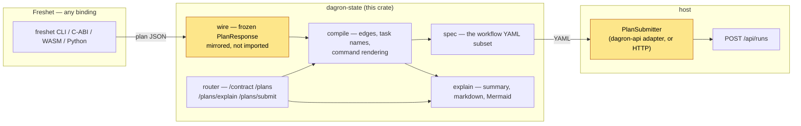
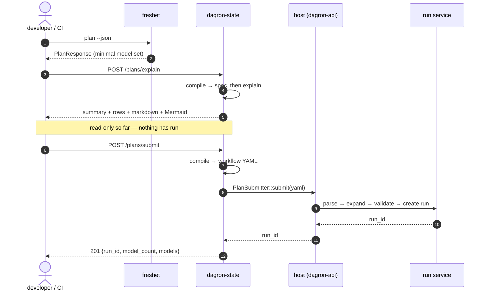

# dagron-state — run what a SQL change actually needs rebuilt

`dagron-state` turns a **backfill planner's state plan** — the minimal, topologically
ordered set of SQL models a change requires rebuilding — into a dagron run graph, and
submits it.

The planner answers *"given this SQL change, what is the minimal set of models to
rebuild?"* It is a library with no binary and no service, deliberately: it has to stay
embeddable by any orchestrator. This crate is the other half — the surface that makes
that answer runnable for someone who already has dagron.

## Quickstart

```sh
# 1. Plan: what does this SQL change actually require rebuilding?
freshet plan --project ./models --state .planner/state.json --json > plan.json

# 2. Explain: read it before you run it. No side effects.
dagron-state explain plan.json

# 3. Run it, through the dagron you already have.
jq '{plan: ., options: {command_template: ["sh","-c","dbt run --select {{ model }}"]}}' plan.json \
  | curl -sS -X POST http://localhost:8080/api/state/plans/submit \
      -H 'content-type: application/json' -H "authorization: Bearer $DAGRON_TOKEN" -d @-
```

Nothing in steps 1–2 touches a network, a database, or a running dagron. Step 3 is
the only one that creates anything.

For where the plan JSON comes from in CI — and the state-file discipline that
decides whether any of this is correct — see
[`docs/STATE_PLAN_USECASES.md`](../../docs/STATE_PLAN_USECASES.md), which also maps
27 use cases across analytics-engineering, platform, DS/ML and SRE roles.

## Architecture

Two boundaries carry this design, and neither is a linker edge. The planner reaches
this crate as **JSON on a frozen contract**, and this crate reaches its host through
**one trait**. That is what lets the component move without moving dagron.



The two shaded nodes are the seams. `wire` is where the planner's contract lands
(duplicated on purpose, guarded by a version constant and a fixture captured from
the real CLI); `PlanSubmitter` is the only thing a host must implement.

## Call flow

A submit is deliberately two steps, because the first one is free and the second
one is not. `/plans/explain` never writes anything, so a reviewer can ask "what
would this do" without risk; only `/plans/submit` reaches the run service.



An empty plan stops at the compile step with a `422`: well-formed request, nothing
to rebuild, no run to make of it.

## The `state` noun, not `backfill`

dagron already has `backfill`, and it means something else:

| | `backfill` | `state` |
|---|---|---|
| Input | a time window `[from, to]` | a state diff (SQL vs. last committed fingerprints) |
| Unit | cron fire-times | models, with column-level attribution |
| Object | a paced `backfills` job with a cursor | a run |
| Endpoint | `POST /api/backfills` | `POST /api/state/plans/submit` |

They are not the same feature and are not merged. A state plan has no cron, so it
targets the run-submit path rather than the `backfills` table.

## Routes

Paths are **mount-relative** — the component does not decide where it lives. dagron
mounts it at `/api/state`.

| Route | In dagron | What it does |
|---|---|---|
| `GET /contract` | `/api/state/contract` | The wire contract revision this build reads |
| `POST /plans` | `/api/state/plans` | Compile a plan → workflow YAML. Submits nothing. |
| `POST /plans/explain` | `/api/state/plans/explain` | Why each model rebuilds: summary, rows, markdown, Mermaid |
| `POST /plans/submit` | `/api/state/plans/submit` | Compile, then submit as a run |

`POST /plans` and `POST /plans/explain` are the explainability surface: *what would
this SQL change rebuild, and as what run graph* — with no side effects. It is the
same question `dagron-plan` answers for workflow changes. The console renders the
explanation at **/state**; the markdown and Mermaid are for pasting into a pull
request, which GitHub renders natively.

## CLI

`dagron-state` is also an offline binary, following this module's
one-binary-per-concern convention (`dagron-plan`, `dagron-import`,
`dagron-autopsy`). It never talks to a dagron — piping the result is your step.

```sh
freshet plan --project ./models --json | dagron-state explain -
```

```markdown
## State plan

**2 of 5 models rebuild — 60% pruned**

| Model | Why | Unit | Waits on |
|---|---|---|---|
| `stg_orders` | directly changed | full model | — |
| `mart_revenue` | downstream of `stg_orders` via `amount`, `order_id` | full model | `stg_orders` |
```

```text
dagron-state explain <plan.json|->
dagron-state plan    <plan.json|-> [--command '<shell>']
dagron-state contract

  --command <shell>  per-model argv as `sh -c <shell>`. `plan` needs a command
                     from somewhere: this flag, or the envelope's own
                     `options.command_template`. It refuses to guess one.
  --sequential       chain the plan instead of deriving parallel edges
  --mermaid          print only the Mermaid graph
  --json             print the explanation as JSON
  --exit-code        return 2 (not 0) when the plan is non-empty
```

Input is either a bare planner `PlanResponse` or a full envelope — told apart by the
presence of a `plan` key, so the planner's own output works unwrapped. An explicit
`--command` always wins over one carried in the envelope. Exit codes
follow `dagron-plan`, which follows `git diff`: `0` success, `1` error, and `2` with
`--exit-code` when the plan is non-empty (the CI gate shape).

The pruning percentage in the summary appears **only** when you pass `graph`. That
is unchanged by contract v2: a plan carries the edges among the models it rebuilds,
never the models it skipped, so the project total still has to come from the caller.
Claiming a saving it cannot measure would undercut the one number worth reporting.

## Use it

The planner's CLI assembles the envelope and posts it for you:

```sh
freshet submit --project ./models --state .planner/state.json \
  --to http://localhost:8080/api/state/plans/submit \
  --command 'dbt run --select {{ model }}' \
  --header "authorization: Bearer $DAGRON_TOKEN"
# submitted 2 model(s) -> run 0f0c…
```

Nothing about that couples the planner to this component: it posts its own wire
contract to a URL you supply, and forwards `options` without reading them. Any
client that can POST JSON works the same way — the CLI is a convenience, not a
requirement:

```sh
freshet plan --project ./models --state .planner/state.json --json \
  | jq '{plan: ., options: {command_template: ["sh","-c","dbt run --select {{ model }}"]}}' \
  | curl -sS -X POST http://localhost:8080/api/state/plans/submit \
      -H 'content-type: application/json' -H "authorization: Bearer $DAGRON_TOKEN" -d @-
```

```json
{ "run_id": "0f0c…", "model_count": 2, "models": ["stg_orders", "mart_revenue"] }
```

### Try it without a dagron

```sh
cargo run --example dev_server        # 127.0.0.1:8787, loopback only, no auth
```

`examples/dev_server.rs` mounts **this router, verbatim** behind a `PlanSubmitter`
that prints the YAML and mints a fake run id. So it is not a mock of the compile
path — it is the compile path, and a plan that compiles there compiles in dagron.
It is also the smallest existence proof of the host seam: if your own submitter is
much harder than those thirty lines, the difficulty is in your run API, not here.

### The request

```jsonc
{
  // The planner's PlanResponse, verbatim. From contract v3 each model may carry
  // `replace` — what its rebuild does to the relation, and whether the planner had
  // to widen the declaration to a full refresh. See "Replace ops" below.
  "plan": { /* … */ },

  // Optional. Two uses: edges for plans from a v1 planner (a v2 plan's own
  // `depends_on` wins), and project size — only this can supply the total, so
  // the pruning percentage in an explanation depends on it.
  "graph": { "mart_revenue": ["stg_orders", "dim_customer"] },

  "options": {
    "workflow_name": "state-plan",
    // Required. `{{ model }}`, `{{ unit }}`, `{{ partitions }}` substitute per
    // model, as do `{{ replace }}`, `{{ partition_column }}` and `{{ unique_key }}`
    // (empty when the plan carries no replace op).
    "command_template": ["sh", "-c", "dbt run --select {{ model }}"],
    "ordering": "derived",        // or "sequential"
    "max_attempts": 3,
    "timeout_secs": 600,
    "env": { "DBT_PROFILES_DIR": "/etc/dbt" },
    "tags": ["state-plan"]
  }
}
```

### Status codes

| Code | When |
|---|---|
| `201` | Submitted; body carries the `run_id` |
| `400` | The planner reported a failure, or no `command_template` was given |
| `401` | No valid credential (dagron layers its own auth over this component) |
| `422` | The plan is **empty** — nothing to rebuild |

`422` rather than `400` for an empty plan is deliberate: "nothing to rebuild" is the
planner's *good* outcome. A caller planning on every commit hits it constantly and
should not have to treat it as a client error.

## Replace ops

From contract v3 a plan says not just *which* partitions rebuild but what that
does to the relation: `insert_overwrite`, `delete_insert`, `merge`,
`replace_where` or `full_refresh`, with the partition column or unique key it
needs and exactly what it covers.

This crate does **not** render it. Turning `insert_overwrite` into a statement is
engine-specific and dagron has no idea which warehouse is on the other end of a
task's command — the same line the planner draws upstream. What it does instead:

* **Substitutes** `{{ replace }}`, `{{ partition_column }}` and `{{ unique_key }}`
  into the operator's argv, expanding to the planner's *word*, never to SQL.
  A model with no replace op expands them to the empty string, because a literal
  `{{ replace }}` reaching a shell is a worse failure than an empty one.
* **Records** them on the task's `input`, so a run's history says what it meant to
  do to the table even when the command never referenced it.
* **Warns** in `explain`. A declaration the planner could not honour widens to a
  full refresh of the whole relation, and the explanation leads with a
  `[!WARNING]` callout naming every widened model:

  > **1 model widened to a full refresh of the whole relation.**
  > - `user_dim` — the model is a table, so it has no partitions to replace in place

  That is the difference between rewriting two partitions and rewriting a table,
  and a reviewer must not have to infer it from a 40-row table.

`replace` is absent for a plan from a v2 producer *and* for a v3 model that
declared nothing. Those read differently but mean the same thing here — apply no
replace-specific behaviour — so unlike `depends_on`, absence is not a version
signal and this crate does not treat it as one.

## Dependency edges

Contract **v2** plans carry the planner's own edge set (`depends_on` per model),
already narrowed to the models the plan rebuilds. That is the authoritative answer
and the normal case: the run graph is exact, and you supply nothing.

It has to be carried explicitly, because nothing else in the plan substitutes for it:

* **Topological order is not adjacency.** It says `b` *may* run after `a`, not that
  it *must*.
* **`reason` is an explanation, not a dependency list.** It names a single
  `because_of` cause. A model downstream of both `a` and `b` is blamed on one of
  them, so a run graph built from attributions is under-constrained — a rebuild can
  start before one of its inputs has finished.

`ordering` picks how edges are resolved:

* **`derived`** (default) — the plan's `depends_on`, else a caller-supplied `graph`,
  else `because_of`. Only the last is lossy, and it is reached only for a v1 plan
  with no `graph` **entry for that model** — the lookup is per-model, so a partial
  graph covers the models it names and the rest still fall through.
* **`sequential`** — chain the plan into one file in plan order. Always correct, no
  parallelism, and it ignores edges entirely.

Whatever the source, edges are filtered to models appearing *earlier in the plan*, so
a stale or malformed `graph` can never produce a cycle dagron would reject at submit.

> **Upgrading from a v1 planner?** Nothing breaks — a v1 payload still parses and
> falls back as before. `depends_on` is read as `Option`: absent means v1, `[]` means
> a v2 planner saying this model waits for nothing. Those are different answers and
> are not collapsed.

## What it deliberately does not link

Neither the planner nor `dagron-core`:

* **Not the planner.** The plan arrives as JSON on the planner's frozen wire
  contract (`src/wire.rs`). This keeps the planner orchestrator-agnostic, which is
  the entire point of it not being dbt-shaped.
* **Not `dagron-core`.** `dagron-api` links this crate and pins `dagron-core` to
  `postgres` while the rest of the workspace takes `sqlite`; that crate's "exactly
  one backend" `compile_error!` fires if both unify. `dagron-core` is a
  **dev-dependency** here — `tests/dagron_compat.rs` parses this crate's output
  through dagron's real `DagGraph::from_yaml`, so the hand-kept spec subset in
  `src/spec.rs` cannot drift without a test failing.

What is left is a component with exactly one seam — `PlanSubmitter` — that can be
split into its own service without touching dagron. That is the property this shape
buys, and the reason the API level is kept separate.

## Wire contract

`src/wire.rs` mirrors the planner's response DTOs rather than importing them, so the
duplication needs a guard. Upstream gets one free (an exhaustive, no-wildcard match
that breaks compilation when a variant is added); this side is guarded by
`WIRE_CONTRACT_VERSION` plus two fixtures in `tests/wire_contract.rs` — one
hand-written, and one **captured verbatim from the planner CLI as actually built**.

If a contract test fails, the contract moved: fix `wire.rs` and bump the version.
Do not edit the fixture to match the code.

## Tests

```sh
cargo test -p dagron-state
```

Nothing here needs a database, a network, or a running dagron.
