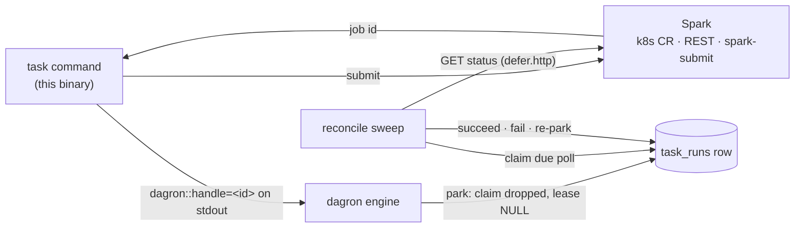
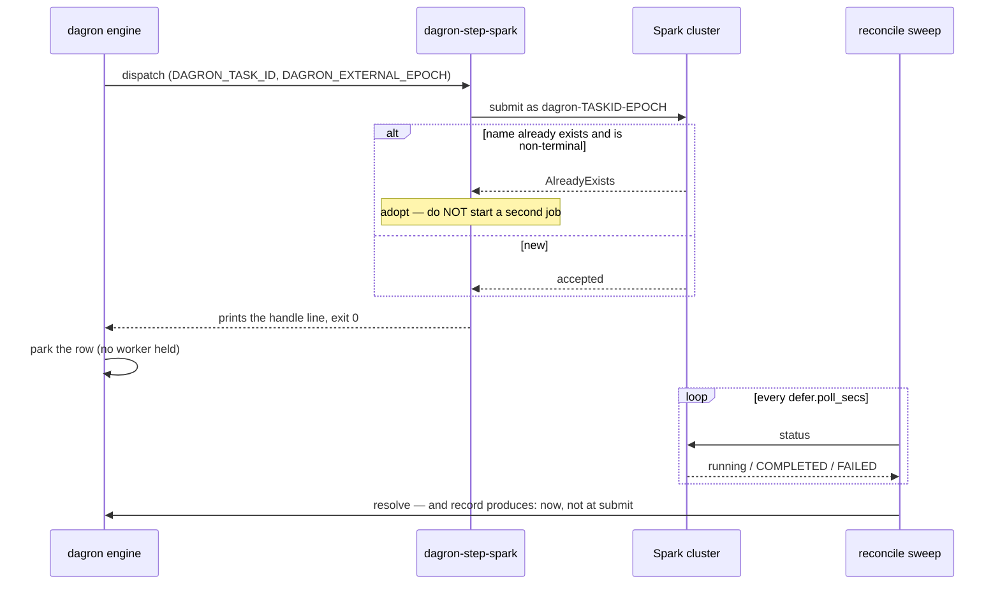

# dagron-step-spark — submit a Spark job, hand back its id, exit

The task's `command` is the **submit**, and nothing else. This binary starts a Spark
job, prints `dagron::handle=<id>` on stdout, and exits 0. The engine parks the task
row on that id and a reconcile sweep polls it.

So a six-hour Spark run costs **one database row**, not a worker slot — and if every
scheduler dies mid-job, the row is untouched and whichever replica comes back resumes
the poll.

## Architecture



In the default `SPARK_WAIT=defer` flow the binary is **only** the submit: it never
polls, never waits, and holds nothing — the row is the whole contract, so whichever
scheduler survives resolves a job that any other scheduler submitted.
(`SPARK_WAIT=inline` is the deliberate exception, and only on `spark-submit`; see
[Configuration](#configuration).)

## Quickstart

```yaml
- name: rollup
  command: ["dagron-step-spark", "submit", "--app", "s3://jobs/daily_rollup.py"]
  timeout_secs: 300              # bounds the SUBMIT
  pool: spark                    # for a deferred task, caps concurrent REMOTE JOBS
  env:
    - { name: SPARK_BACKEND,   value: k8s }
    - { name: SPARK_NAMESPACE, value: "{{ env.SPARK_NS }}" }
    - { name: SPARK_CONF_SPARK_EXECUTOR_INSTANCES, value: "8" }
  defer:
    kind: spark-k8s
    poll_secs: 30
    max_wait_secs: 21600         # bounds the JOB
```

`timeout_secs` bounds the submit; `defer.max_wait_secs` bounds the job. Conflating
those two is the mistake the split exists to prevent — the executor's default
`timeout_secs` is **25 seconds**.

## Event flow



## The name is the idempotency

The one genuinely dangerous window: the cluster accepts the job, and the engine dies
before the park commits. A naive retry starts a second 200-node cluster.

So the job is named `dagron-<DAGRON_TASK_ID>-<DAGRON_EXTERNAL_EPOCH>`, both injected
by the engine at dispatch. `task_runs.id` is stable across lease recovery, so the
retried submit reuses the name, the cluster answers AlreadyExists, and this step
**adopts** the running job instead of starting another. The epoch changes only when a
row is deliberately re-armed for a fresh job, so a genuine retry gets a genuine new
job.

`attempt` could not serve this: it increments on every claim *including* lease
recovery, so a name built from it would change at exactly the moment adoption is
needed. Adoption is conditional on the found job being **non-terminal** — adopting a
job that already failed would park the task on a corpse it can never leave.

**How strong that is depends on the backend, so pick deliberately:**

| Backend | Idempotency |
|---|---|
| `k8s` | **Real.** `AlreadyExists` is the apiserver's own guarantee on the object name, so a duplicate is impossible |
| `rest` | **Only as strong as your body.** `{{ name }}` goes wherever you put it; unless that is a field the vendor treats as an idempotency key (Databricks `idempotency_token` and its equivalents), a crash-retry submits a second job. The step cannot verify this without knowing the vendor's schema — which is the coupling `rest` exists to avoid |
| `spark-submit` | **None.** `--name` is `spark.app.name`, a label. Spark offers no submission idempotency and this step does no pre-submit lookup, so a retried submit starts a second application |

Use `k8s` where a crash during submit must not double-spend a cluster.

## Backends

| `SPARK_BACKEND` | What it does |
|---|---|
| `k8s` (the implicit default — **but only a `--features k8s` build can run it**, which the published image is) | creates a `SparkApplication` CR — vendor-free, no account, and AlreadyExists is the API's own semantics |
| `rest` | POSTs a body you supply to a URL you supply, and reads the id out of the response by path — one adapter for Databricks, EMR Serverless, Dataproc, Livy, Kyuubi |
| `spark-submit` | spawns the CLI. The honest escape hatch; needs a version-matched Spark distribution in the task image |

Vendor names (`livy`, `databricks`, `emr`, `dataproc`, `kyuubi`) are **refused with a
pointer at `rest`**, not silently accepted. They all submit over HTTP like everything
else; naming each one here would buy a maintenance burden and no capability.

## Configuration

Entirely by environment, like every other dagron step.

| Variable | Meaning |
|---|---|
| `SPARK_APP` | application URI to run (or `--app`, which wins) |
| `SPARK_BACKEND` | `k8s` (default) · `rest` · `spark-submit` |
| `SPARK_WAIT` | `defer` (default — print the handle and exit) · `inline` (block until the job finishes; **`spark-submit` only** — refused on `k8s` and `rest`, which submit and return) |
| `SPARK_NAMESPACE` | Kubernetes namespace (default `default`) |
| `SPARK_IMAGE` | Spark image for the CR (default `spark:3.5.3`) |
| `SPARK_DRIVER_SERVICE_ACCOUNT` | ServiceAccount the driver pod runs as (`k8s`; default: the operator's, i.e. the namespace's `default`, which usually cannot create executor pods). **Use this, not `SPARK_CONF_*`** — that mapping lowercases every key and Spark's are case-sensitive, so `spark.kubernetes.authenticate.driver.serviceAccountName` cannot be written as an env var |
| `SPARK_CONF_*` | extra `sparkConf` / `--conf` entries — `SPARK_CONF_SPARK_EXECUTOR_INSTANCES=4` → `spark.executor.instances=4` |
| `SPARK_MASTER` | master URL, for `spark-submit` |
| `SPARK_SUBMIT_BIN` | path to the CLI, for `spark-submit` |
| `SPARK_REST_URL` | submit endpoint, for `rest` |
| `SPARK_REST_BODY` / `SPARK_REST_BODY_FILE` | the JSON body to POST |
| `SPARK_REST_HANDLE_PATH` | dotted path to the job id in the response |
| `SPARK_REST_HEADER_*` | request headers — `SPARK_REST_HEADER_AUTHORIZATION` becomes `Authorization` |

`SPARK_WAIT=inline` is the fallback for an engine too old to park, and it only means
anything on `spark-submit`, where the CLI genuinely blocks on the child process. On
`k8s` and `rest` it is **refused**: those backends submit and return, so "inline"
there would succeed the task the moment the job was *accepted* and release every
dependent against work that has not run. A warning would not have prevented that, so
it is an error.

Where it is legal, it is still a trap worth naming: without an explicit and generous
`timeout_secs:`, the task is killed long before any real job ends.

## Features

`k8s` is **not** a default feature. The default build carries the `rest` and
`spark-submit` backends and no Kubernetes client; the published image is built with
`--features k8s`.

**So a default build must set `SPARK_BACKEND` explicitly.** `Backend::parse(None)`
still resolves to `k8s` — the default is a property of the *configuration*, not of
what happens to be linked — and in a build without the feature `submit_k8s` is a stub
that refuses with a message naming both `--features k8s` and `SPARK_BACKEND=rest`.
That is a clear failure rather than a silent one, but it is a failure, so set the
variable or use the published image. CI lints and tests both worlds, because an import used only by a
feature-gated function is dead in the default build and invisible to a lint that only
ever runs with the feature on — which is exactly how one reached main.

## Image

`mancube/dagron-step-spark` — a Rust binary on distroless/cc, nonroot (uid 65532),
`linux/amd64` + `linux/arm64`. Usually you do not deploy it; you copy the binary into
the image your task already uses:

```dockerfile
COPY --from=mancube/dagron-step-spark:0.10 \
     /usr/local/bin/dagron-step-spark /usr/local/bin/dagron-step-spark
```

## See also

- [`docs/EXTERNAL_JOBS.md`](../../docs/EXTERNAL_JOBS.md) — `defer:`, the park shape, and the poll sweep
- [`examples/warehouse/`](../../examples/warehouse/) — this step in a partitioned rollup, with `produces:` recorded when the *remote* job finishes
- [`dagron-step-sql`](../dagron-step-sql/) — the other half of the warehouse pair
