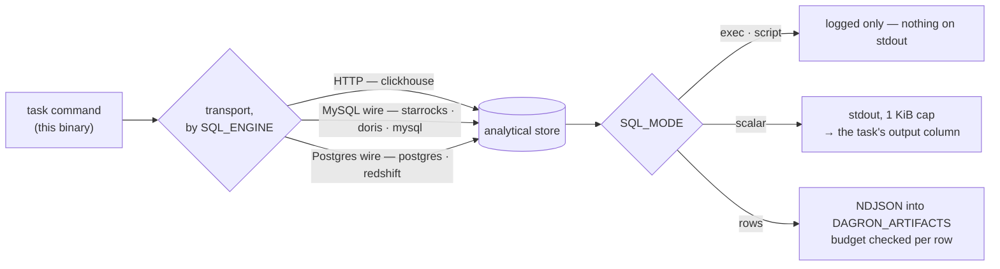

# dagron-step-sql — one statement against an analytical store, with a bounded result

One binary, one statement (or, in `script` mode, one script), per-protocol
transports. Named after what people search for (ClickHouse, StarRocks, Postgres) and
implemented against what actually varies (HTTP, MySQL wire, Postgres wire).

## Architecture



Rows never reach stdout, because the engine appends every stdout line to the task's
`output` column with no cap on that path. Which destination a mode uses *is* the
safety property.

## Quickstart

```yaml
- name: verify
  command: ["dagron-step-sql"]
  env:
    - { name: SQL_ENGINE,    value: clickhouse }
    - { name: SQL_DSN,       value: "http://reader@{{ env.CH_HOST }}:8123/" }
    - { name: SQL_PASSWORD,  value_from: { secret: CLICKHOUSE_PASSWORD } }
    - { name: SQL_MODE,      value: scalar }
    - { name: SQL_STATEMENT, value: "SELECT count() > 0 FROM marts WHERE ds = '{{ ds }}'" }
```

## Event flow

```mermaid
sequenceDiagram
  participant Engine as dagron engine
  participant Step as dagron-step-sql
  participant Store as analytical store

  Engine->>Step: dispatch (env: SQL_ENGINE, SQL_DSN, SQL_PASSWORD, …)
  Note over Step: refuse an inline credential in SQL_DSN<br/>(the redactor masks by NAME, and SQL_DSN is not one)
  Step->>Store: one statement, over the wire its engine speaks
  Store-->>Step: result rows, streamed — never the whole set at once
  loop per row, as it arrives
    Note over Step: Budget::admit — over budget means stop reading and write nothing
  end
  alt exec
    Step-->>Engine: nothing on stdout; outcome logged
  else scalar
    Step-->>Engine: one value on stdout, for a downstream when:
  else rows
    Step-->>Engine: NDJSON artifact; stdout stays empty
  end
```

## Why not `command: ["sh","-c","clickhouse-client …"]`

That already works, and the docs say so. Two things it cannot do:

1. **A bounded result contract** instead of `SELECT *` into an uncapped column.
2. One image instead of N vendor CLIs baked into N task images.

**What this step is not, yet.** Having a binary here leaves room for a cancel hook
(`KILL QUERY <query_id>`) and a defer handle, and **neither is built**. Nothing
captures a query id, so a cancelled run abandons the statement exactly as an opaque
`command:` would; and this step never prints `dagron::handle=`, so `defer:` on a
`dagron-step-sql` task would park on nothing — a 40-minute query holds its worker for
40 minutes. [`dagron-step-spark`](../dagron-step-spark/) is the deferred one.

## The output contract is the point

Live-log streaming is unconditional in the engine, and each stdout line is appended
to the task's `output` column with `output = COALESCE(output,'') || ?` — **no cap
anywhere on that path**. So a `SELECT *` that writes rows to stdout is an unbounded
write into the datastore, and a check applied *after* the rows are printed is a check
applied after the damage.

Therefore: rows never go to stdout, and the budget is checked **before each row is
written**, so an over-budget statement writes nothing rather than being cleaned up
afterwards.

**It bounds the read too.** Both transports stream — `bytes_stream()` with
incremental NDJSON parsing on the HTTP path, `fetch` rather than `fetch_all` on the
wire path — so a row is admitted as it arrives and the first refusal drops the
stream. A `SELECT *` over a huge table fails with the message naming `SQL_MAX_ROWS`
or `SQL_MAX_BYTES` instead of being OOM-killed before the refusal can print;
resident memory is one row plus one chunk, whatever `SQL_MAX_BYTES` is set to. A
store that answers with one enormous row rather than many completes no row, so the
budget also refuses a row *while it is still arriving*.

Streaming the read does not weaken the write: `rows` mode writes to a temporary file
and renames it into place only once the whole result has been admitted, so a refusal
still leaves nothing at the artifact path. A `LIMIT` in the statement remains the
better way to ask for less data — the store stops working, rather than this step
stopping reading — but it is no longer what stands between a careless `SELECT *` and
an exit code nobody can explain.

| `SQL_MODE` | What it writes |
|---|---|
| `exec` | **nothing to stdout** — the outcome is logged, and what the log carries differs by transport, so it is not something to gate on. For INSERT / MERGE / DDL |
| `scalar` | exactly one row, one column, to stdout — so a downstream `when:` can gate on it. **Both are enforced**: more than one row is refused rather than having its first taken, because without an `ORDER BY` there is no first row. Bounded by `MAX_SCALAR_BYTES` (1 KiB), **not** by `SQL_MAX_BYTES`: this is the one mode that writes to the uncapped `output` column on purpose, so it gets the stricter limit |
| `rows` | NDJSON into `$DAGRON_ARTIFACTS`. Never stdout |
| `script` | **nothing to stdout**, like `exec` — but for several statements run in order on one session. Wire transports only; see [Scripts](#scripts) |

## Scripts

`exec` prepares its statement, and a prepared statement holds exactly one. Some
writes are a sequence — Postgres has no `CREATE OR REPLACE TABLE`, so recreating a
table is `BEGIN; DROP …; CREATE … AS …; COMMIT;` — and `script` mode exists for
them:

* **Sent as one simple-query message** (`sqlx::raw_sql`: no arguments, no
  preparation), which the store runs statement by statement on the same session.
  The first failure stops the script.
* **Atomicity is the script's**, not this step's. On Postgres a script with no
  `BEGIN`/`COMMIT` of its own runs as one implicit transaction; one that manages its
  own gets exactly what it wrote. The MySQL wire autocommits each statement, and DDL
  commits implicitly there.
* **Refused on HTTP.** ClickHouse's HTTP interface takes one statement per request,
  so a script there would run its first statement and silently drop the rest. The
  step fails before sending anything and says to split the script into tasks.

Its main customer is a backfill planner that renders its own rebuild SQL. From plan
contract v4, [`dagron-state`](../dagron-state/#rendered-sql) expands `{{ sql }}` to
the planner's statements for each model it compiles into a task, and the env is the
place to put them — no shell quotes a multi-line script there. The `options` of the
envelope posted to `/api/state/plans/submit`:

```json
{
  "command_template": ["dagron-step-sql"],
  "env": {
    "SQL_ENGINE": "postgres",
    "SQL_DSN": "postgresql://etl@warehouse/analytics",
    "SQL_MODE": "script",
    "SQL_STATEMENT": "{{ sql }}"
  },
  "secret_env": { "SQL_PASSWORD": "WAREHOUSE_PASSWORD" }
}
```

`{{ sql }}` is dagron-state's placeholder, not a dagron template variable: each
generated task's `SQL_STATEMENT` holds that model's statements verbatim. The
password rides as `value_from: { secret: WAREHOUSE_PASSWORD }` on every task, so it
reaches this step the way the credential rules above require — resolved at dispatch,
masked by name, never in the plan.

A plan with a single statement per model can use `exec` instead; `{{ sql }}` passes a
lone statement through exactly as the planner rendered it, with no trailing `;`.

## Engines and transports

Maintenance here is bounded by **protocol count, not vendor count** — Airflow ran the
per-store-operator experiment and reversed it, deprecating `SnowflakeOperator`,
`BigQueryExecuteQueryOperator`, `PostgresOperator` and `TrinoOperator` in favour of
one `SQLExecuteQueryOperator` plus a connection. Per-store operators rot; generic SQL
plus a per-store connection ages.

| Transport | `SQL_ENGINE` values |
|---|---|
| HTTP | `clickhouse` |
| MySQL wire | `starrocks`, `doris`, `mysql` |
| Postgres wire | `postgres`, `redshift` (and anything speaking that wire — Materialize, CockroachDB, Greenplum) |

## Configuration

| Variable | Meaning |
|---|---|
| `SQL_ENGINE` | which store (table above) — **required** |
| `SQL_DSN` | how to reach it — **required** |
| `SQL_STATEMENT` / `SQL_STATEMENT_FILE` | the one statement to run — in `script` mode, the script |
| `SQL_MODE` | `exec` · `scalar` · `rows` · `script` |
| `SQL_USER` | username, when the DSN does not carry one |
| `SQL_PASSWORD` | the credential. **Always pass via `value_from: { secret: … }`** |
| `SQL_MAX_ROWS` | row budget, refused before anything is written (default `10000`) |
| `SQL_MAX_BYTES` | byte budget, same (default `8 MiB`) |
| `SQL_TIMEOUT_SECS` | statement deadline |
| `SQL_OUTPUT_NAME` | artifact filename in `rows` mode (default `result.ndjson`) |

**A credential inline in the DSN is refused, not warned about.** The engine's
redactor masks task env vars by *name*, so a password inside `SQL_DSN` would be
logged in full — the refusal points at `SQL_PASSWORD`, which is masked.

## Features

`mysql` and `postgres` are **not** default features (each also enables `sqlx/any`).
The default build carries the HTTP transport only; the published image is built with
both. CI lints and tests both worlds.

## Image

`mancube/dagron-step-sql` — a Rust binary on distroless/cc, nonroot (uid 65532),
`linux/amd64` + `linux/arm64`. Usually you copy the binary into the image your task
already uses:

```dockerfile
COPY --from=mancube/dagron-step-sql:0.10 \
     /usr/local/bin/dagron-step-sql /usr/local/bin/dagron-step-sql
```

## See also

- [`examples/warehouse/`](../../examples/warehouse/) — this step gating a publish on a partition check
- [`dagron-step-spark`](../dagron-step-spark/) — the other half of the warehouse pair
- [`docs/EXTERNAL_JOBS.md`](../../docs/EXTERNAL_JOBS.md) — `defer:` and the park shape
