# Architecture & event-call diagrams

Design reference for the **workflow scheduler** (`module-54`) — a durable, reconcile-loop DAG
scheduler whose datastore *is* the source of truth. This complements [`README.md`](../README.md)
(usage, API reference, design decisions). Diagrams are [Mermaid](https://mermaid.js.org/) and
render inline on GitHub.

> **North star:** the scheduler is a *durable state machine driven by a reconcile loop*. Everything
> in memory is a cache; the DB rows are the truth. The persistence layer's transaction + locking
> semantics **are** the scheduling correctness.

---

## 1. System context

A YAML DAG is parsed, persisted as rows, then driven to completion by one or more identical
scheduler processes. From **v2** those processes scale horizontally against one Postgres database
with no coordinator — the row leases are the only coordination point.

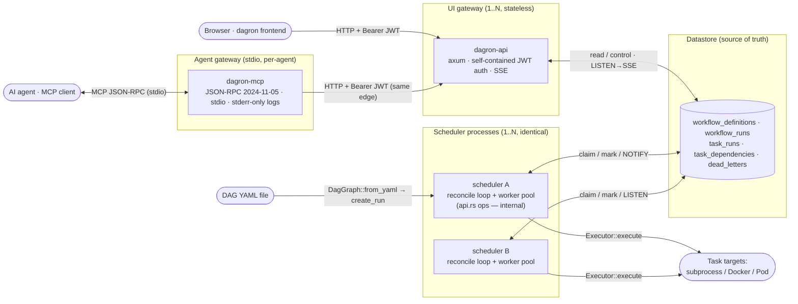

> **Three surfaces, one edge.** The engine's `api.rs` (`--features ops`) is an
> **internal, unauthenticated** ops API (Prometheus `/metrics`, OpenAPI, dead-letter
> management) — bind it cluster-private. **`dagron-api`** is the **authenticated
> public UI edge** (self-contained argon2 + HS256 session JWT — no external IdP).
> **`dagron-mcp`** is a thin per-agent adapter that fronts the same `dagron-api`
> over MCP/JSON-RPC on stdio, so an AI agent gets the engine's CRUD plus
> cluster-internal signals (metrics, dead-letters, the per-run SSE event channel)
> through one consistent JWT-gated edge — never directly against the engine.
> See [§2a](#2a-two-http-surfaces--engine-ops-api-vs-ui-gateway),
> [§5.8](#58-mcp-agent-event-call--submit--bounded-sse-event-poll),
> [`crates/dagron-api/README.md`](../crates/dagron-api/README.md), and
> [`docs/MCP.md`](MCP.md).

**Two backends, one API** (selected at compile time; see [`crates/dagron-core/src/db.rs`](../crates/dagron-core/src/db.rs)):

| Backend | Feature | Claim mechanism | Loop wake |
|---|---|---|---|
| **SQLite** (default) | `--features sqlite` | read-then-CAS on `version` | fixed 500 ms timer |
| **Postgres** (v2) | `--features postgres` | `FOR UPDATE SKIP LOCKED` | `LISTEN/NOTIFY` + timer safety net |

---

## 2. Workspace & component architecture

The engine is a Cargo **workspace** under `module_54/`. The root `dagron` package's
`src/main.rs` is a one-call shell over the **`dagron-engine`** library crate, which owns
config, the multi-run reconcile loop, the `Seams` extension seam, and the ops modules —
and wires the reusable library crates in `crates/` together. Alternate builds can plug
different seams into the same shell. The reconcile loop never
names a concrete database type — it talks only to the `dagron_core::db` facade, which
compiles in exactly one backend. That single seam is where horizontal scale slots in.

| Crate | Path | Owns |
|---|---|---|
| `dagron` (bin) | `src/` | thin entry point: `dagron_engine::run(Seams::default())` — default seams (built-in sources, no-op run-lifecycle hooks) |
| `dagron-engine` | `crates/dagron-engine` | env config, the reconcile loop + `in_flight` accounting, the `Seams` seam (`hooks.rs`), and the ops modules (`api`/`cron`/`gc`/`leadership`/`schedule`, feature `ops`) that wire the libs together |
| `dagron-core` | `crates/dagron-core` | DAG model + validation, matrix/call expansion, the datastore facade (SQLite/Postgres + migrations), the metrics registry |
| `dagron-executor` | `crates/dagron-executor` | the `Executor` trait + Local/Docker/Kube backends + the ractor worker pool |
| `dagron-source` | `crates/dagron-source` | the `WorkflowSource` trait, the built-in File/Channel backends, the `source::build` factory, and the ingest actor — Redis/SQS/Kafka/NATS backends plug in via a `SourceFactory` seam |
| `dagron-api` | `crates/dagron-api` | the authenticated public UI gateway (separate crate, Postgres-only) — see [§2a](#2a-two-http-surfaces--engine-ops-api-vs-ui-gateway) |
| `dagron-mcp` | `crates/dagron-mcp` | the per-agent stdio MCP adapter fronting `dagron-api` — see [§5.8](#58-mcp-agent-event-call--submit--bounded-sse-event-poll) and [`docs/MCP.md`](MCP.md) |
| seam crates | `crates/dagron-{identity,artifact,import,lineage,logging}` | `dagron-api`'s auth seam (argon2 local login, IdP-swappable) · artifact-store seam (local FS today) · Argo→dagron YAML importer · OpenLineage emitter (best-effort, on run finalization) · shared `tracing` bootstrap |

Feature flags keep their original names on the bin but **forward** through `dagron-engine`
to the crate that owns the gated code: `sqlite`/`postgres` → `dagron-core`, `kubernetes` →
`dagron-executor`, `ops` → the engine's ops modules + `dagron-core`.
`dagron-core` defaults to `sqlite`; dependents pin `default-features = false` so a
`--features postgres` build never also drags in sqlite (the two collide via `compile_error!`).

```mermaid
flowchart TB
    subgraph bin["dagron (bin) · src/"]
        main["main.rs — thin shell<br/>dagron_engine::run(Seams::default())"]
    end

    subgraph eng["dagron-engine · crates/dagron-engine"]
        direction TB
        run["lib.rs — run(Seams)<br/>env config · reconcile loop · in_flight accounting"]
        hooks["hooks.rs — Seams<br/>extra sources · run-lifecycle hooks (default: no-op)"]
        api["api.rs<br/>axum ops API · list/inspect/submit/cancel (feature: ops)"]
        cronm["cron.rs<br/>cron-triggered create_run (leadership-gated)"]
        lead["leadership.rs<br/>leader_election lease · cluster singleton"]
        gcm["gc.rs<br/>retention sweep (leadership-gated)"]
        sched["schedule.rs<br/>DB-backed UI schedules (leadership-gated)"]
    end

    subgraph core["dagron-core · crates/dagron-core"]
        direction TB
        dag["dag.rs<br/>YAML → petgraph DiGraph · cycle check · dep_count"]
        expand["expand.rs<br/>matrix / call-task expansion → leaf tasks"]
        models["models.rs<br/>TaskStatus / RunStatus enums · TaskRun struct"]
        met["metrics.rs<br/>process counters · Prometheus text"]
        subgraph dbfacade["db.rs — backend facade (compile_error unless exactly one)"]
            direction LR
            sqlite["db/sqlite.rs<br/>SqlitePool · CAS claim · timer Waker"]
            postgres["db/postgres.rs<br/>PgPool · SKIP LOCKED · PgListener Waker"]
        end
    end

    subgraph execc["dagron-executor · crates/dagron-executor"]
        direction TB
        wp["worker.rs<br/>WorkerPool · ractor WorkerActor (round-robin)"]
        ex["executor.rs<br/>Executor trait · LocalExecutor · run_command"]
        dx["docker_executor.rs<br/>DockerExecutor (bollard)"]
        kx["kube_executor.rs<br/>KubeExecutor — one-shot Pod (feature: kubernetes)"]
    end

    subgraph srcc["dagron-source · crates/dagron-source"]
        direction TB
        ig["ingest.rs<br/>IngestActor (ractor) · create_run + backpressure"]
        src["source.rs<br/>WorkflowSource trait · File/Channel · source::build"]
    end

    q["queue sources (SourceFactory backends)<br/>Redis · SQS · Kafka · NATS"]

    main --> run
    run --> hooks
    run --> dag & dbfacade & wp & ig & api & cronm & gcm & lead & sched
    dag --> expand
    ig --> src
    src -.->|"SourceFactory seam"| q
    ig --> dbfacade
    api --> dbfacade & met
    cronm --> dbfacade
    gcm --> dbfacade
    sched --> dbfacade
    cronm -.->|"reads is_leader"| lead
    gcm -.->|"reads is_leader"| lead
    sched -.->|"reads is_leader"| lead
    dbfacade -.->|"#cfg(feature)"| sqlite
    dbfacade -.->|"#cfg(feature)"| postgres
    wp --> ex & dx
    wp -.->|"#cfg(feature)"| kx
    ex --> dag
    sqlite --> models
    postgres --> models
```

| Module (crate) | Responsibility |
|---|---|
| `src/main.rs` (bin) | thin entry point — calls `dagron_engine::run(Seams::default())`; alternate builds plug different seams into the same shell |
| `lib.rs` (engine) | `run(Seams)` — builds executor + worker pool + db pool + ingest actor, runs the multi-run daemon loop, tracks `in_flight`. Re-aliases the lib crates (`use dagron_core::{dag, db, metrics}`, …) so the wiring reads against the original short paths |
| `hooks.rs` (engine) | the `Seams` extension seam — extra ingestion sources + run-lifecycle hooks; the default seams are no-ops |
| `dag.rs` (core) | `DagSpec`/`TaskSpec` deserialization, `DiGraph` build, `is_cyclic_directed`, `dep_count` (in-degree); `DagGraph::from_yaml` runs parse → expand → build → validate |
| `expand.rs` (core) | matrix / call-task expansion into leaf tasks before the graph is built; `when` evaluation |
| `db.rs` (core) | facade: feature-gates one backend, re-exports `Pool`, `Waker`, and the CRUD/claim/mark API |
| `db/sqlite.rs` (core) | v0/v1 backend — optimistic CAS claim, timer `Waker` |
| `db/postgres.rs` (core) | v2 backend — `FOR UPDATE SKIP LOCKED` claim, `pg_notify` + `PgListener` `Waker` |
| `models.rs` (core) | `TaskStatus`/`RunStatus` enums (+ `Display`/`FromStr`), `TaskRun`/`WorkflowRun` `FromRow` |
| `metrics.rs` (core) | process-lifetime counters + Prometheus text exposition (datastore gauges read per scrape) |
| `worker.rs` (executor) | `WorkerPool` of N ractor actors; `dispatch` round-robins; `TaskResult` returned on mpsc |
| `executor.rs` (executor) | `Executor` trait, `LocalExecutor` (tokio subprocess), `run_command` helper |
| `docker_executor.rs` (executor) | `DockerExecutor` — per-task container, hard timeout, log capture, force-remove |
| `kube_executor.rs` (executor, v3) | `KubeExecutor` — per-task one-shot Pod, phase poll under timeout, log capture, pod delete; `--features kubernetes` |
| `source.rs` (source, v4) | `WorkflowSource` trait; `FileSource`/`ChannelSource`; `source::build` selects the backend |
| queue sources (SourceFactory backends) | the Redis/SQS/Kafka/NATS queue backends (each behind its own feature) with at-least-once ack semantics + native dead-letter routing; registered via the `SourceFactory` seam |
| `ingest.rs` (source, v4) | `IngestActor` (ractor) — pulls the source → `create_run`; `MAX_INFLIGHT_RUNS` admission backpressure; dead-letters poison submissions (parse failure → immediate; `create_run` failure → after `DEAD_LETTER_MAX_ATTEMPTS`) |
| `api.rs` (engine, v5) | **internal, unauthenticated** `axum` ops API — list/inspect/submit/cancel runs + `/metrics`, `/healthz`, OpenAPI (`/openapi.{yaml,json}`, `/docs`), dead-letter list/redrive/discard; thin shell over the `dagron_core::db` facade. Bind cluster-private; user traffic goes through `dagron-api` instead |
| `cron.rs` (engine, v5) | cron-triggered `create_run`; only the leadership holder fires, followers track `next` to avoid backlog |
| `leadership.rs` (engine, v5) | `leader_election` lease renew loop → shared `is_leader` flag; cluster-wide singleton for cron/GC/schedules |
| `gc.rs` (engine, v6) | retention sweep calling `db::gc_old_runs`; leadership-gated |
| `schedule.rs` (engine) | DB-backed UI schedules (`DB_SCHEDULES=1`) — leadership-gated firing of first-class workflows |

---

## 2a. Two HTTP surfaces — engine ops API vs UI gateway

dagron exposes **two** axum services with a deliberate boundary. The engine's
`api.rs` is in-process, unauthenticated, ops-focused; **`dagron-api`** is a
separate stateless crate — the authenticated public edge the browser uses. Auth is
**self-contained** (argon2 password hashing + HS256 session JWT in an HttpOnly
cookie — no external IdP). It adds what the UI needs (per-run **SSE**, **DAG
graph**, **task logs**, **task retry**) and re-surfaces the ops capabilities
(metrics, dead-letters) behind auth, so the frontend has one coherent backend.

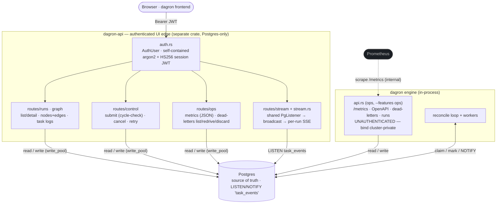

**Boundary at a glance**

| | engine `api.rs` (`ops`) | `dagron-api` |
|---|---|---|
| Auth | none — cluster-private | self-contained JWT (argon2 + HS256 cookie) |
| Backend | engine's compiled feature | Postgres only (SSE needs LISTEN/NOTIFY) |
| Unique surface | Prometheus `/metrics`, OpenAPI/`/docs`, in-process | SSE stream, DAG graph, task logs, task retry, `/api/me` |
| Shared | runs list/detail, submit, cancel, dead-letters, metrics |

> `dagron-api` is a **standalone** crate (it builds from its own dir, depending only
> on `dagron-logging` and `dagron-identity` — see its Dockerfile), so it **inlines** the Postgres SQL
> rather than depending on `dagron-core`: that keeps its image a simple single-crate
> build and sidesteps the backend `compile_error!` entirely. (Inside the engine
> workspace the same collision is handled by pinning `dagron-core` with
> `default-features = false` — see [§2](#2-workspace--component-architecture).) The
> submitted/redriven task `input` JSON must match `dag::TaskSpec`.

---

## 3. Task state machine

The `status` column on `task_runs` is the entire state machine. Every transition is a single SQL
write; the lease (`claimed_by` + `lease_expires_at`) + `version` are the correctness anchors.

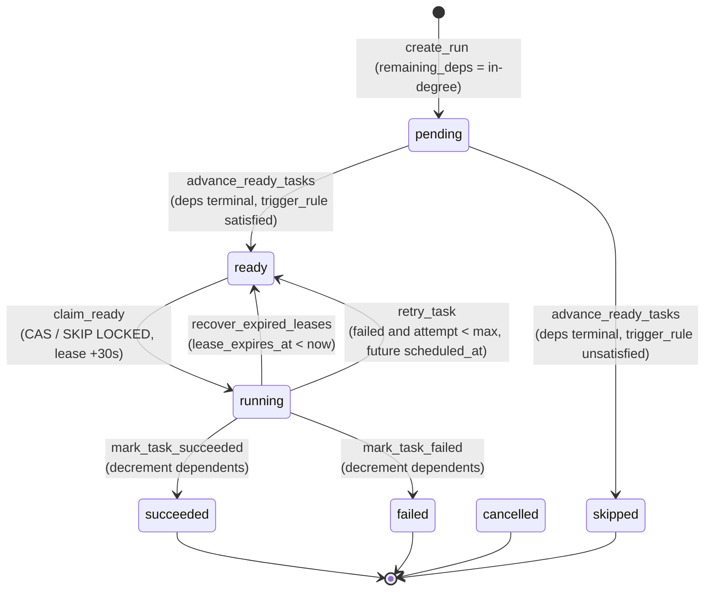

Every terminal transition (`succeeded`/`failed`/`skipped`/`cancelled`) decrements
its dependents' `remaining_deps`. When a task's counter reaches 0 (all deps
terminal), `advance_ready_tasks` evaluates its **`trigger_rule`** against the
deps' outcomes: satisfied → `ready`, unsatisfied → `skipped` (which is itself
terminal and cascades). The default `all_success` rule skips a task when any
dependency failed — so a failed task's downstream is skipped, not cancelled;
`cancelled` now means only an operator cancel or a run-deadline sweep.

Terminal states: `succeeded`, `failed`, `cancelled`, `skipped`. `is_run_complete` flips the
`workflow_runs` row to `succeeded`/`failed` once every task is terminal.

---

## 4. The reconcile loop

Level-triggered and idempotent, like a Kubernetes controller. Safe to restart at any point; the DB
is the only durable state.

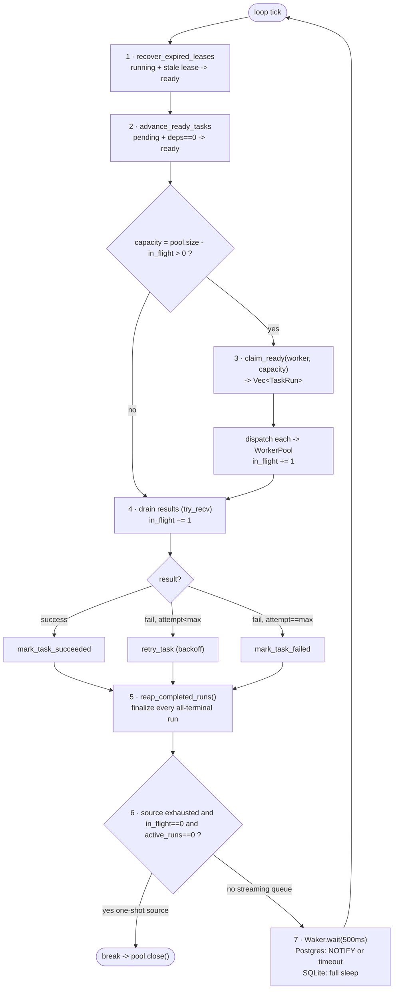

---

## 5. Event-call sequence diagrams

### 5.1 Run lifecycle — happy path (fan-out / fan-in)

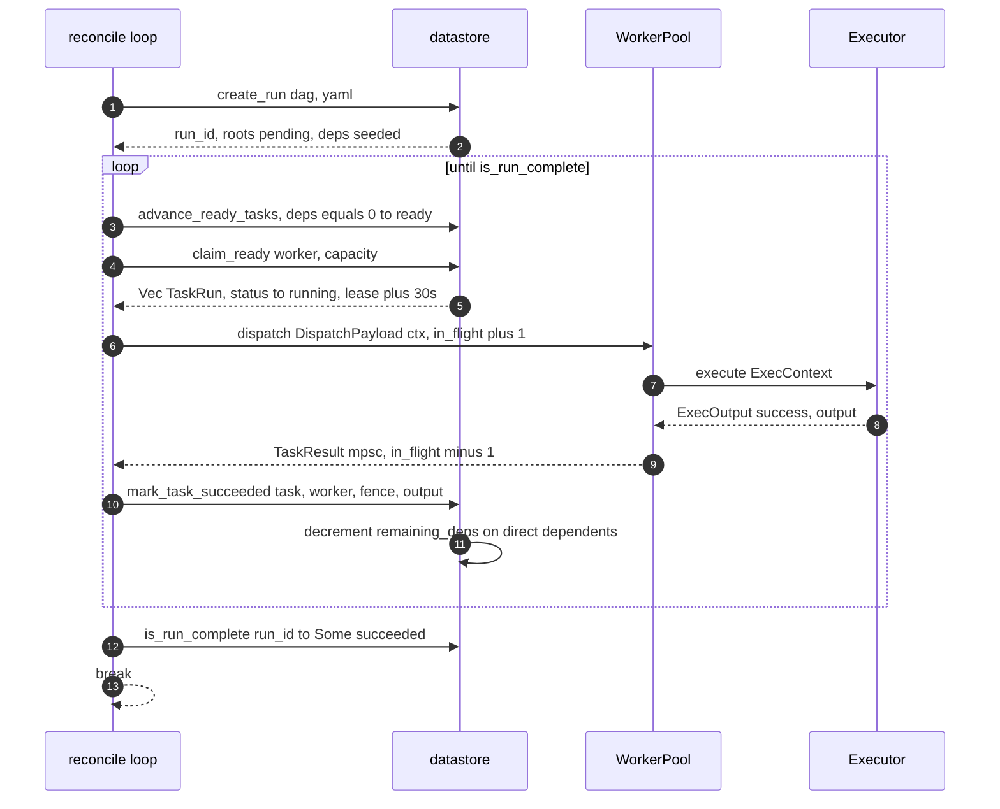

### 5.2 v2 event-driven wake (Postgres `LISTEN/NOTIFY`)

The poll interval stops being the heartbeat: a worker (on *any* scheduler) finishing a task pushes
the listening loop forward within milliseconds. NOTIFYs are buffered in-transaction and delivered
only on commit, so a rolled-back mutation never wakes a peer for work that didn't happen.

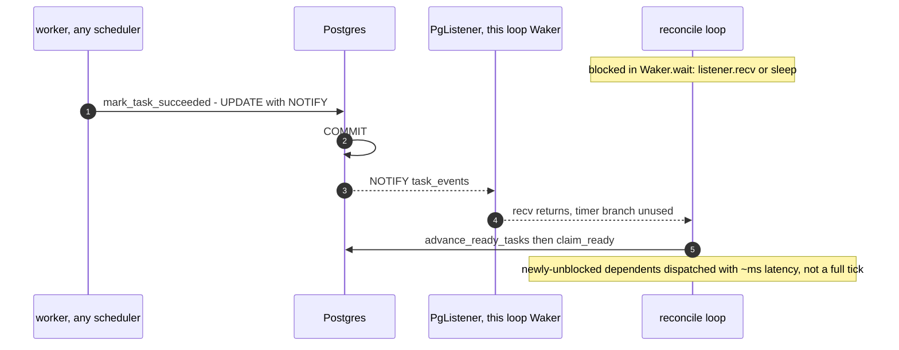

### 5.3 v2 multi-worker disjoint dispatch (`FOR UPDATE SKIP LOCKED`)

N schedulers point at one datastore with no coordinator. Each claim transaction locks-and-skips, so
the ready set is partitioned with no double-dispatch — verified end-to-end (48 tasks, two
schedulers, no task claimed or run twice).

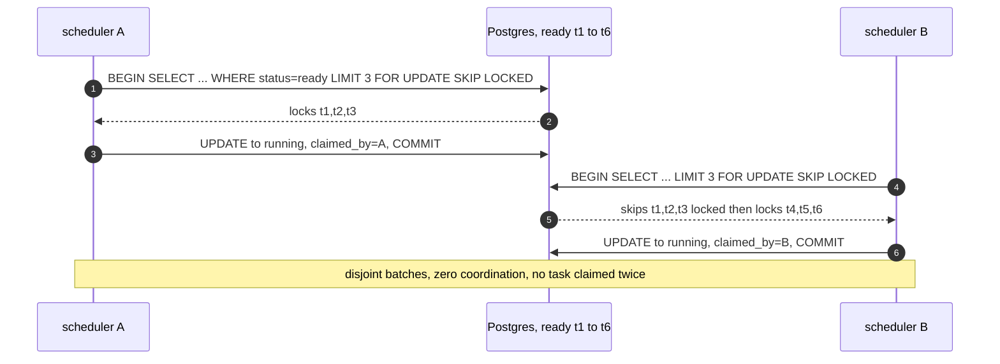

### 5.4 Failure path — decrement dependents, then trigger-rule evaluation

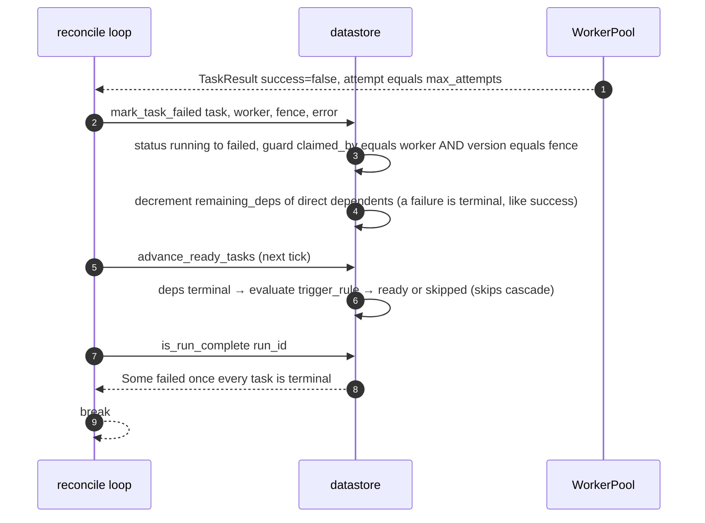

### 5.5 Crash recovery — orphaned lease reclaimed by a survivor

A scheduler holding a lease dies (crash, or — as in testing — a per-run process exiting while
holding another run's lease). The lease, not a heartbeat table, is the recovery mechanism: it
simply expires, and the next reconcile tick of any surviving scheduler reclaims the row.

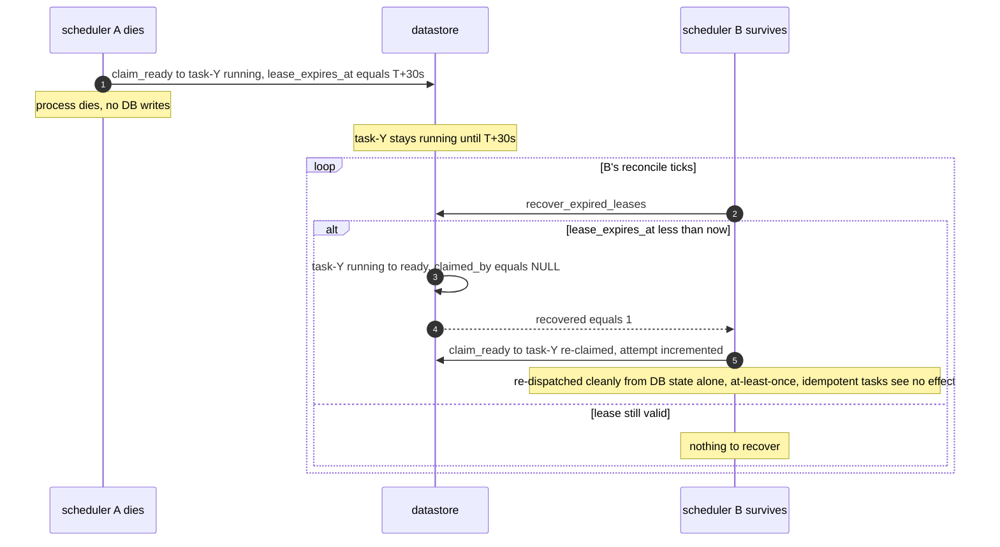

### 5.6 v4 queue-driven ingestion + admission backpressure

The `IngestActor` (ractor) consumes a `WorkflowSource` and turns each message into
a run, but only admits work while `count_active_runs() < MAX_INFLIGHT_RUNS`. Under
a large influx the overflow stays in the broker (SQS/Kafka/Redis) — the durable
store holds the backlog, never the scheduler. The reconcile loop runs
concurrently, draining all active runs and `reap_completed_runs()` finalizing each,
which frees admission slots.

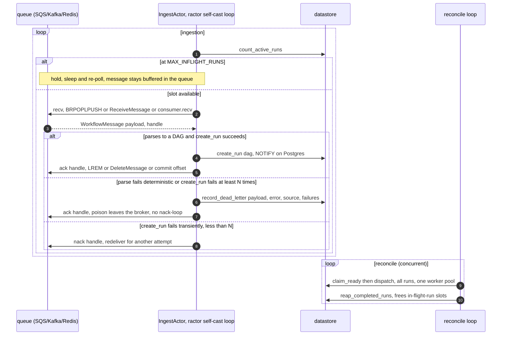

### 5.7 v5/v6 ops — leadership-gated cron + retention GC

The management API serves reads/writes straight off the datastore. Cron firing
and GC are time-driven side effects that must happen on exactly one node, so they
gate on a `leader_election` lease — the same lease-is-the-truth pattern as task
recovery, lifted to a cluster-wide singleton.

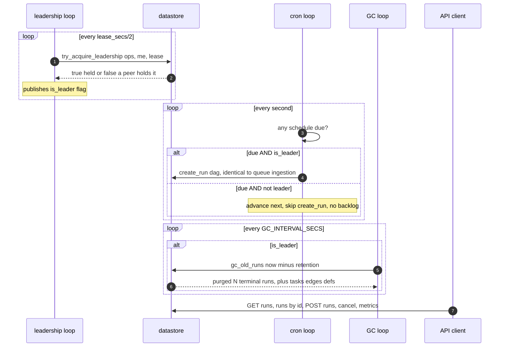

### 5.8 MCP agent event-call — submit + bounded SSE event poll

`dagron-mcp` is request/response (one MCP `tools/call` → one HTTP call), but the
agent needs to *observe* the engine, not just drive it. The `dagron_get_run_events`
tool opens the same SSE channel the browser uses and reads it for a bounded
window (`wait_ms`, capped at 10 s / 256 KiB), parses the SSE frames into JSON
events, and returns them as a single tool response. The same edge enforces JWT;
ids are validated locally so a crafted argument can't reshape the request path.

```mermaid
sequenceDiagram
    autonumber
    participant Ag as AI agent (MCP client)
    participant Mc as dagron-mcp (stdio, per-agent)
    participant Gw as dagron-api (UI edge · JWT)
    participant DB as Postgres (LISTEN/NOTIFY)
    participant Lp as scheduler reconcile loop

    Note over Ag,Mc: JSON-RPC over stdio (2024-11-05); logs to stderr only
    Ag->>Mc: tools/call dagron_submit_run, yaml
    Mc->>Mc: validate args, no path-segment escapes
    Mc->>Gw: POST api/runs Authorization Bearer JWT
    Gw->>DB: insert workflow_run + task_runs + deps
    Gw-->>Mc: 200 run_id
    Mc-->>Ag: tools/result run_id

    Ag->>Mc: tools/call dagron_get_run_events, run_id, wait_ms=2000
    Mc->>Mc: safe_id(run_id), wait_ms in 100..=10000
    Mc->>Gw: GET api/runs/{id}/stream accept text/event-stream
    Gw->>DB: subscribe to task_events broadcast
    par engine progress
        Lp->>DB: mark_task_succeeded NOTIFY task_events
        DB-->>Gw: NOTIFY commit-ordered
        Gw-->>Mc: SSE event chunk(s)
    and bounded window
        Note over Mc: tokio time::timeout(wait_ms) around reqwest chunk()
    end
    Mc->>Mc: parse SSE frames, cap 256 KiB total
    Mc-->>Ag: tools/result events[], event_count
    Note over Ag: agent re-polls for the next window — the bounded read keeps the JSON-RPC call short
```

---

## 6. Process lifecycle

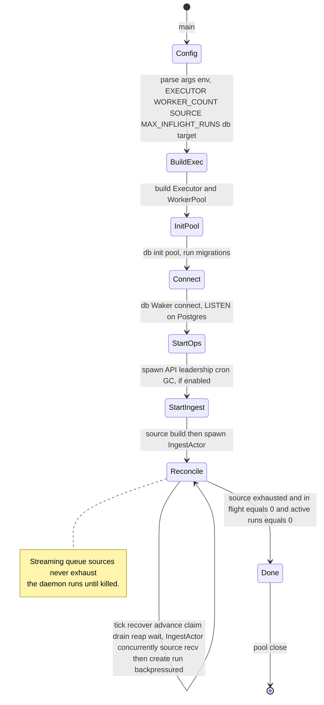

---

## 7. Concurrency & invariants

- **The row is the truth.** Every scheduling decision is a SQL transition; nothing durable lives in
  memory. A scheduler can be killed at any transition and the survivors (or a restart) reconstruct
  state from `task_runs` alone.
- **Lease + version + status is the whole contract.** No double-claim: SQLite guards with CAS on
  `version`; Postgres uses `FOR UPDATE SKIP LOCKED`. No stranded tasks: an expired lease is always
  reclaimable by any tick.
- **Stale-writer guard (fencing token).** `mark_task_succeeded` / `mark_task_failed` /
  `retry_task` all require `claimed_by = worker_id AND version = fence`, where `fence` is the
  post-claim `version` handed to that attempt. `worker_id` alone is *not* a fencing token — a
  process reuses one worker_id, so reclaiming its own expired lease would still match; the version
  fence pins each mutation to one exact claim. An executor that finishes after its lease was
  reclaimed (by any process, including itself) fails the version check and cannot double-apply
  dependency decrements or downstream cancellation.
- **Dependency counter, not graph re-walk.** `remaining_deps` is seeded to in-degree and decremented
  per *terminal* dependency (success, failure, or skip) — O(edges) per completion, not
  O(nodes+edges) per tick.
- **Termination guarantee.** Every terminal transition decrements its dependents, and a task whose
  `trigger_rule` cannot be satisfied is `skipped` (itself terminal, cascading further). So the
  dependency frontier always drains to a terminal state and `is_run_complete` terminates.
- **At-least-once execution.** The lease bounds *concurrent* execution to one holder, but a worker
  that completes side effects then crashes before recording may have its task re-run after lease
  expiry — task commands should be idempotent. The bundled tasks (`echo`) are.
- **Horizontal scale is free of coordination.** N identical schedulers share one Postgres DB; no
  leader election, no heartbeat table — `SKIP LOCKED` partitions work and lease expiry handles death.
