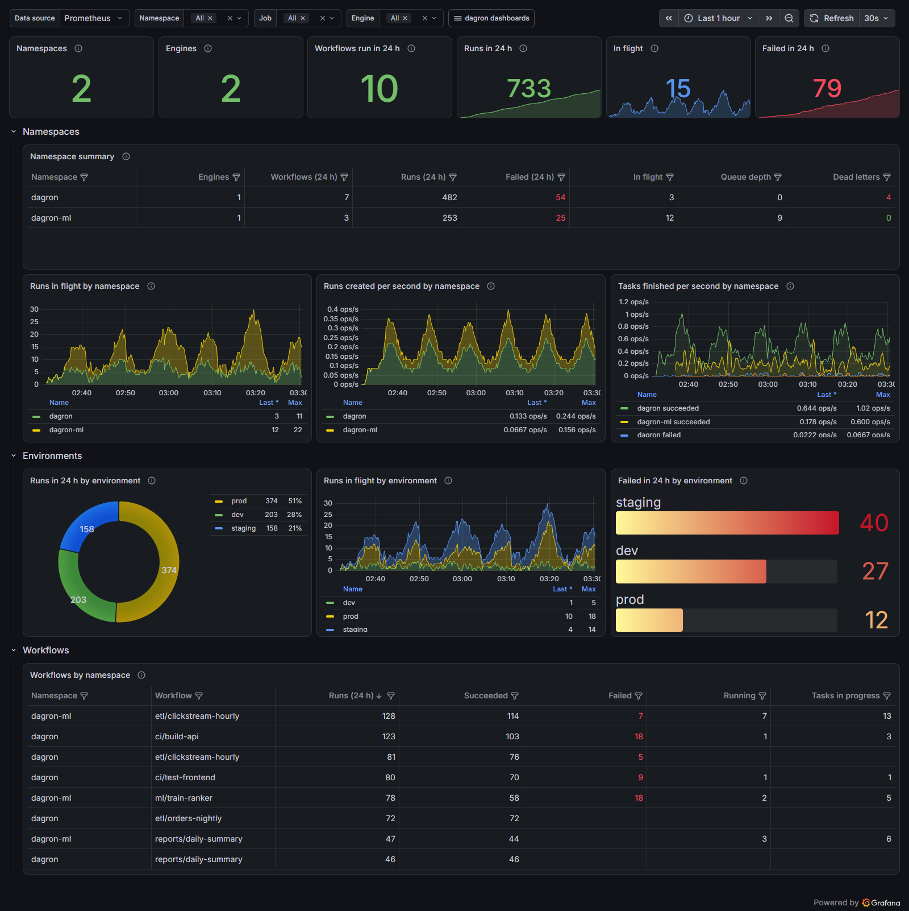
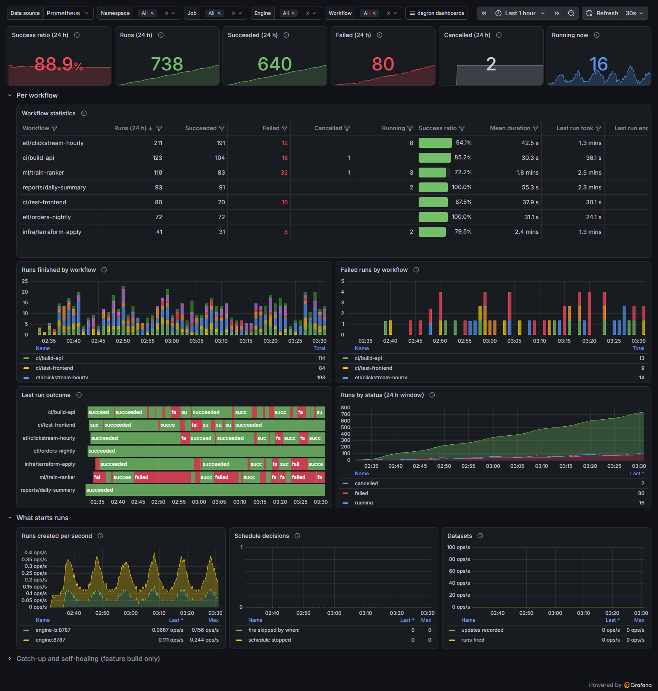
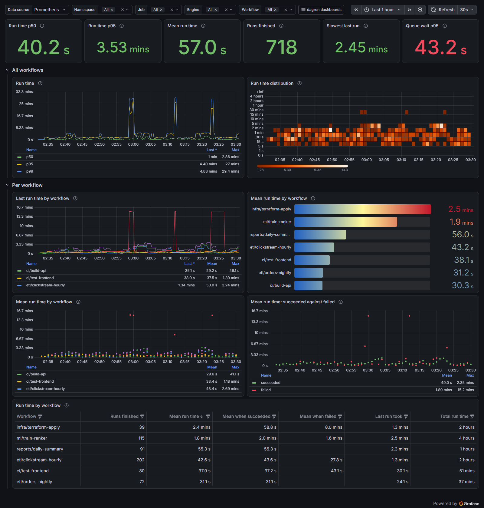
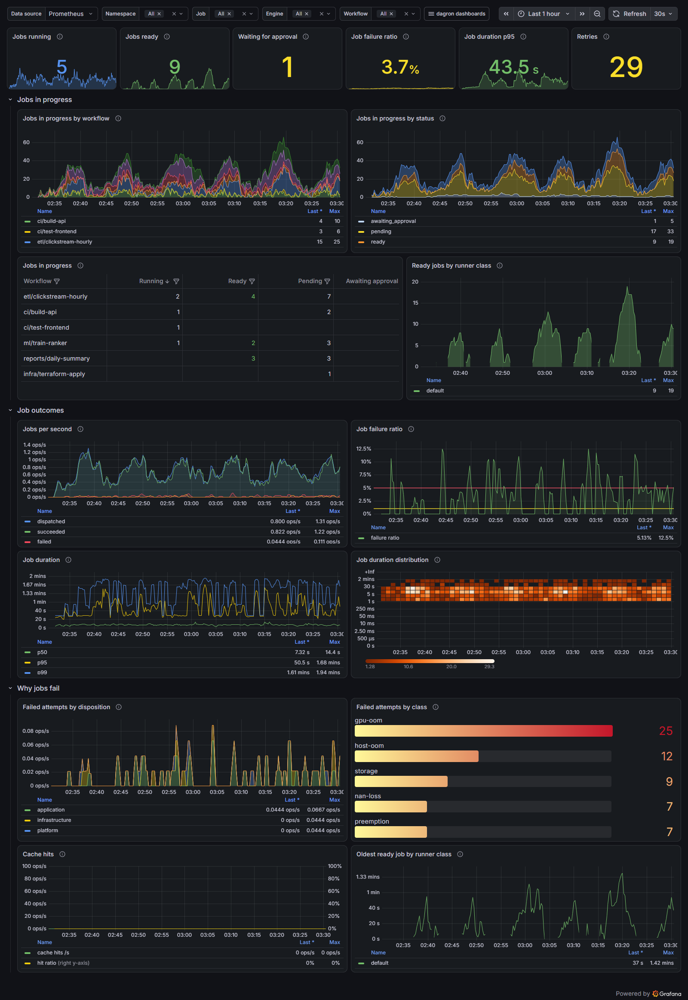
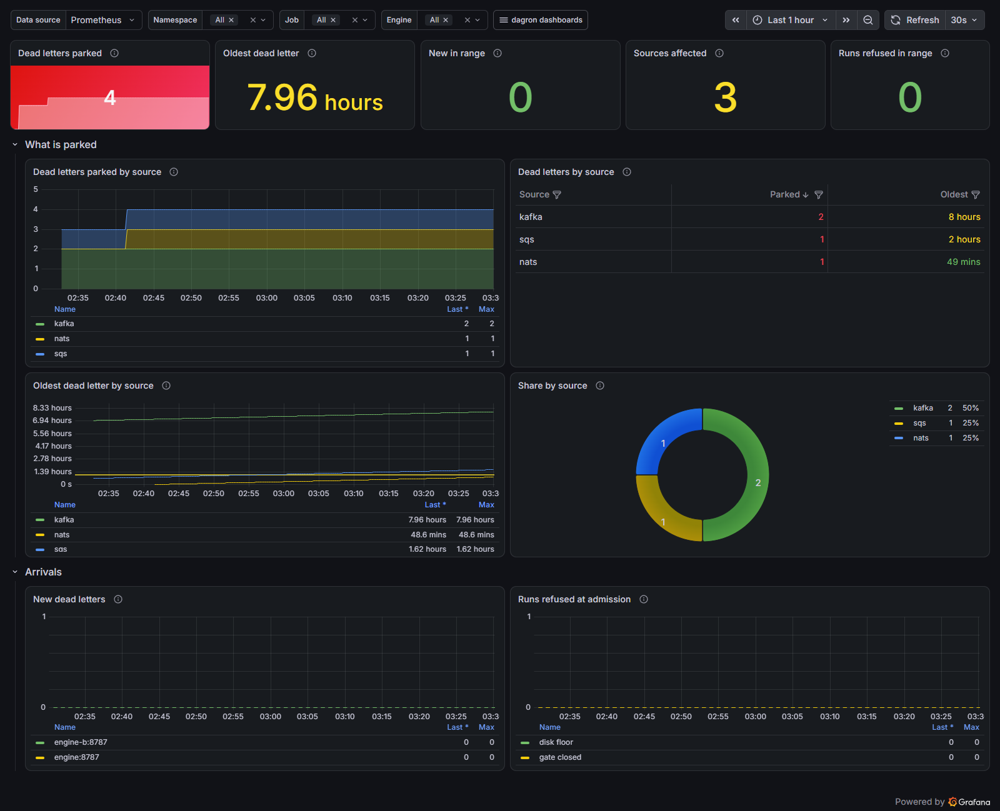
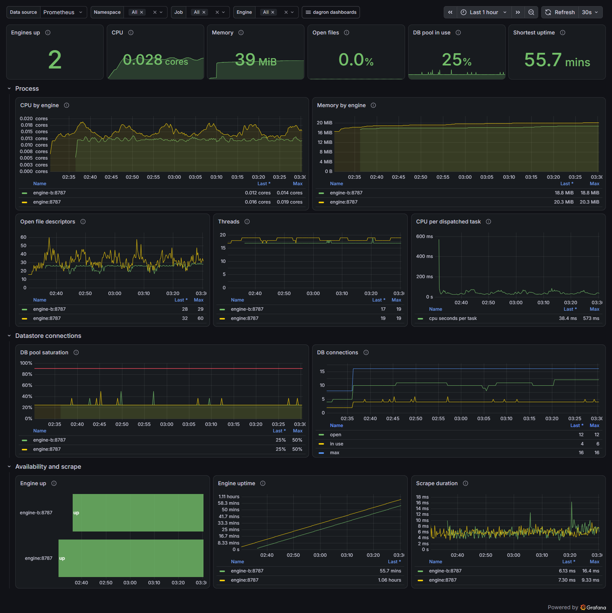
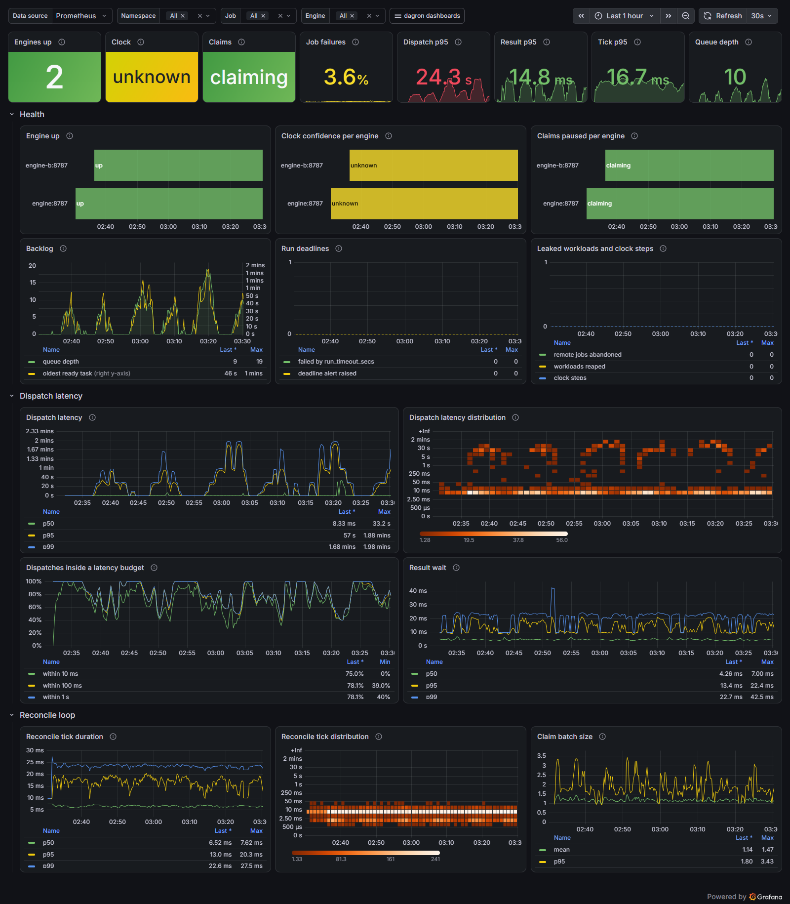

# dagron metrics guide

Every metric the dagron engine exports, what it measures, how to query it, what
to alert on, and the Grafana dashboards that are built from it.

- [Where the metrics come from](#where-the-metrics-come-from)
- [Reading them correctly](#reading-them-correctly)
- [Metric reference](#metric-reference)
- [Query recipes](#query-recipes)
- [Alerts](#alerts)
- [Dashboards](#dashboards)
- [What the metrics do not tell you](#what-the-metrics-do-not-tell-you)

## Where the metrics come from

The **engine** serves Prometheus text at `GET /metrics` on its management API
(`text/plain; version=0.0.4`). Two things must be true:

1. the engine is an `ops` build (the default, and what every published image is);
2. `API_ADDR` is set, for example `API_ADDR=0.0.0.0:8787`.

The endpoint has no authentication, like the rest of the management API. The
network is its boundary: in the Helm chart, `networkPolicy.engine.monitoringNamespace`
names the one namespace allowed to scrape it.

`dagron-api` (the gateway) does not serve Prometheus text. Its `GET /api/metrics`
is JSON for the console. Point Prometheus at the engine.

A minimal scrape config:

```yaml
scrape_configs:
  - job_name: dagron-engine
    metrics_path: /metrics
    static_configs:
      - targets: ["engine:8787"]
        labels:
          namespace: dagron   # see "The namespace label" below
```

On Kubernetes with the Prometheus Operator, use a `ServiceMonitor` on the engine
Service; [`loadtest/deploy/dagron/servicemonitor.yaml`](../loadtest/deploy/dagron/servicemonitor.yaml)
is a working one. A ready-to-run local stack is in
[`examples/monitoring/`](../examples/monitoring/).

## Reading them correctly

The series fall into three kinds, and each is aggregated differently. Getting
this wrong is the most common way to draw a wrong graph.

| Kind | What it is | Across engines | Examples |
|---|---|---|---|
| **Process counters and histograms** | Counted by one engine since it started. Reset to zero on restart. | `sum(rate(...))` or `sum(increase(...))` | `scheduler_tasks_succeeded_total`, `scheduler_dispatch_latency_seconds` |
| **Datastore gauges** | Read from the database on every scrape. Every engine of one installation reports the same number. | `max(...)`, never `sum(...)` | `scheduler_runs`, `scheduler_queue_depth`, `scheduler_workflow_recent_runs` |
| **Engine state gauges** | The current state of one engine. | per `instance`, or `max` for "is any engine affected" | `scheduler_claims_paused`, `scheduler_db_pool_in_use`, `process_resident_memory_bytes` |

With three engines on one Postgres, `sum(scheduler_queue_depth)` is three times
the real backlog. `max(scheduler_queue_depth)` is right.

### Labels

Labels dagron sets itself:

| Label | On | Values |
|---|---|---|
| `status` | run and task gauges, per-workflow series | runs: `pending`, `running`, `succeeded`, `failed`, `cancelled`. Tasks add `ready`, `awaiting_approval`, `skipped`. |
| `workflow` | per-workflow series | the workflow's `name:` |
| `environment` | `scheduler_environment_recent_runs` | the run's `environment:`, or `(none)` |
| `runner_class` | ready-backlog gauges | the task's `runner_class:` (`default` when unset) |
| `class`, `disposition` | fault counters | see [Faults](#faults) |
| `source` | dead-letter gauges | the ingest source that produced the row |
| `le` | histograms | bucket upper bound |

Every label that takes its value from a submitted workflow is capped, so one
client cannot create an unbounded number of series:

| Label | Series kept | The rest |
|---|---|---|
| `workflow` | 50 busiest | summed as `workflow="other"` |
| `environment`, `source`, `runner_class` | 20 busiest | summed as `"other"` |

For the age gauges the `other` series carries the oldest age in the tail, so
something folded into it can still fire an alert.

### The namespace label

dagron has no namespace of its own. `namespace` is a label Prometheus puts on
the scrape target: on Kubernetes a `ServiceMonitor` sets it to the engine pod's
namespace, and elsewhere you set it in the scrape config as shown above. The
dashboards group and filter by it, which is how one Grafana shows several
installations side by side. If the label is absent the dashboards still work,
with one unnamed group.

Inside one installation, the grouping dagron does have is the named
`environment:` a run declares.

## Metric reference

All names start with `scheduler_` except the process metrics, which use the
standard `process_` names.

### Runs and workflows

| Metric | Type | Labels | Meaning |
|---|---|---|---|
| `scheduler_runs_created_total` | counter | | Runs this engine created, whatever started them: the API, a schedule, a dataset trigger, a backfill, an ingest source. |
| `scheduler_runs` | gauge (datastore) | `status` | Every run in the datastore, by status. Terminal counts fall when retention removes old runs. |
| `scheduler_workflow_recent_runs` | gauge (datastore) | `workflow`, `status` | Runs created in the last 24 hours, by workflow and current status. |
| `scheduler_environment_recent_runs` | gauge (datastore) | `environment`, `status` | The same runs, by environment. |
| `scheduler_run_duration_seconds` | histogram | `le` | Wall time from a run being created to reaching a terminal state: queueing, every task, and any wait at an approval gate. Buckets from 1 s to 4 h. |
| `scheduler_workflow_run_duration_seconds` | summary (`_sum`, `_count`) | `workflow`, `status` | The same wall time, totalled by workflow and outcome (`succeeded`, `failed`). No quantiles: the sum and the count give a mean and a success ratio. |
| `scheduler_workflow_last_run_duration_seconds` | gauge | `workflow` | Wall time of the workflow's most recently finished run. |
| `scheduler_workflow_last_run_finished_timestamp_seconds` | gauge | `workflow` | Unix time that run finished. |
| `scheduler_workflow_last_run_success` | gauge | `workflow` | `1` if that run succeeded, `0` if it failed. |
| `scheduler_runs_deadline_exceeded_total` | counter | | Runs failed by `run_timeout_secs`. |
| `scheduler_deadline_alerts_total` | counter | | Soft SLA alerts raised by `deadline:`. The run keeps running. |

The run-duration series (histogram, summary and the three `last_run` gauges)
count runs the reconcile loop finalized as succeeded or failed, plus runs failed
by `run_timeout_secs`. Cancelled runs are not in them.

### Tasks (jobs)

| Metric | Type | Labels | Meaning |
|---|---|---|---|
| `scheduler_tasks_dispatched_total` | counter | | Task attempts handed to a worker. |
| `scheduler_tasks_succeeded_total` | counter | | Tasks that finished successfully. |
| `scheduler_tasks_failed_total` | counter | | Tasks that failed for good: retries exhausted, or a timeout that opted out of retry. |
| `scheduler_tasks_retried_total` | counter | | Failed attempts rescheduled for another try. |
| `scheduler_cache_hits_total` | counter | | Tasks answered from the memoization cache without running. |
| `scheduler_tasks` | gauge (datastore) | `status` | Every task in the datastore, by status. |
| `scheduler_workflow_active_tasks` | gauge (datastore) | `workflow`, `status` | Tasks that have not finished, by workflow. Status is `pending` (waiting on dependencies), `ready`, `running` or `awaiting_approval`. |
| `scheduler_task_duration_seconds` | histogram | `le` | Task wall time from claim to finish, measured in the worker. |

Cancelled tasks are in neither `succeeded` nor `failed`.

### Backlog

| Metric | Type | Labels | Meaning |
|---|---|---|---|
| `scheduler_queue_depth` | gauge (datastore) | | Ready tasks waiting for a worker. |
| `scheduler_ready_tasks_by_class` | gauge (datastore) | `runner_class` | The same backlog, by the pool that must serve it. |
| `scheduler_ready_oldest_age_seconds` | gauge (datastore) | `runner_class` | Age of the longest-waiting ready task in the class. A class no engine serves only ever grows here. |

The two per-class gauges are emitted only while there is at least one ready
task. In an alert, an absent series means an empty queue, not a broken scrape.

### Scheduler latency

All four are histograms with the same buckets: 250 µs to 300 s.

| Metric | Meaning |
|---|---|
| `scheduler_dispatch_latency_seconds` | A task becoming claimable to being handed to a worker: claim wait, tick pacing, dispatch preparation. A retry's clock starts at its due time, so backoff is not counted. This is the scheduler's own queueing delay. |
| `scheduler_result_wait_seconds` | The executor finishing to the reconcile loop collecting the result. |
| `scheduler_reconcile_tick_seconds` | One pass of the reconcile loop: recover, advance, dispatch, collect, reap. |
| `scheduler_claim_batch_size` | Tasks taken by one non-empty claim call. The unit is tasks, not seconds; buckets 1 to 256. |

### Faults

When a failed attempt's output matches a known failure signature, the attempt is
counted by fault class. An attempt is counted whether or not it is retried. A
failure that matches no signature is not counted here; it still shows in
`scheduler_tasks_failed_total` or `scheduler_tasks_retried_total`.

| Metric | Type | Labels | Meaning |
|---|---|---|---|
| `scheduler_task_faults_total` | counter | `class`, `disposition` | Failed attempts by fault class. All 23 classes are emitted from zero. |
| `scheduler_task_faults_by_disposition_total` | counter | `disposition` | The same attempts rolled up by who owns the failure. |

| `disposition` | Meaning | `class` values |
|---|---|---|
| `infrastructure` | hardware, fabric, storage, a lost node | `gpu-xid`, `gpu-ecc`, `gpu-fallen-off-bus`, `nvlink`, `gpu-unresponsive`, `fabric-ib`, `nccl-comm-abort`, `storage`, `node-fail` |
| `application` | the job's own code, data or configuration | `deadlock`, `straggler-rank`, `dataloader-stall`, `host-oom`, `gpu-oom`, `nan-loss`, `checkpoint-corrupt`, `user-code`, `config` |
| `platform` | the platform stopped it | `preemption`, `walltime-exceeded`, `cancelled` |
| `unknown` | a symptom with no clear owner | `nccl-timeout`, `unknown` |

### Dead letters

| Metric | Type | Labels | Meaning |
|---|---|---|---|
| `scheduler_dead_letters_total` | counter | | Submissions this engine parked in the dead-letter store. |
| `scheduler_dead_letters` | gauge (datastore) | | Rows parked now. Falls when rows are redriven or deleted. |
| `scheduler_dead_letters_by_source` | gauge (datastore) | `source` | Rows parked now, by ingest source. |
| `scheduler_dead_letters_oldest_age_seconds` | gauge (datastore) | `source` | Age of the oldest parked row from that source. |

See [`DLQ.md`](DLQ.md) and [`DEAD_LETTERS.md`](DEAD_LETTERS.md) for what lands
there and how to redrive it.

### Schedules and datasets

| Metric | Type | Meaning |
|---|---|---|
| `scheduler_schedule_gated_total` | counter | Schedule fires skipped because a `when:` gate was false. |
| `scheduler_schedules_stopped_total` | counter | Schedules switched off by a `stopStrategy` expression. |
| `scheduler_dataset_updates_total` | counter | Dataset updates recorded: a `produces:` task succeeding, or an external event. |
| `scheduler_dataset_fires_total` | counter | Runs started by a dataset trigger (`on_datasets:`). |

A build with the catch-up feature also emits:

| Metric | Type | Meaning |
|---|---|---|
| `scheduler_catchup_runs_total` | counter | Runs created for schedule fires that were missed while the scheduler was down. |
| `scheduler_auto_reruns_total` | counter | Failed runs re-armed from their failure frontier. |
| `scheduler_overdue_schedules` | gauge | Catch-up schedules with a missed fire still outstanding. |
| `scheduler_schedule_lag_seconds` | gauge | Age of the oldest outstanding missed fire. |
| `scheduler_incomplete_runs` | gauge | Runs still running past the stall SLA. |

### Admission, leaks and host health

| Metric | Type | Meaning |
|---|---|---|
| `scheduler_admission_refused_disk_total` | counter | Runs refused by the free-disk floor (`DAGRON_MIN_FREE_BYTES`). |
| `scheduler_admission_refused_gate_total` | counter | Runs refused because the admission gate (`DAGRON_ADMISSION_FILE`) was closed. |
| `scheduler_claims_paused` | gauge (engine) | `1` while `DAGRON_PRESSURE_FILE` is holding task claims at zero. |
| `scheduler_external_orphans_total` | counter | Remote jobs (`defer:`) the engine gave up tearing down. Each may still be running and costing money. |
| `scheduler_orphan_workloads_reaped_total` | counter | Pods or containers the fleet sweep deleted because their task was no longer live. Each one outlived a scheduler that died mid-task. |
| `scheduler_clock_steps_total` | counter | Wall-clock steps caught by the clock detector (`DAGRON_CLOCK_STEP_TOLERANCE_MS`). |
| `scheduler_clock_confidence` | gauge (engine) | Confidence stamped on new runs: `0` synced, `1` drifted, `2` unknown. |

`scheduler_clock_confidence` reads `2` on any host where no clock-sync source is
configured. That is the normal state of a default install, not a fault. See
[`EDGE_PROFILE.md`](EDGE_PROFILE.md).

### What this build refused

| Metric | Type | Labels | Meaning |
|---|---|---|---|
| `scheduler_signpost_hits_total` | counter | `gate` | Requests the engine refused because they need something this build does not include, answered with a pointer to what it does. |

`gate` is one of `external_cost_attribution` (a spec with
`budget.external_cost_attribution`), `defer_connection` (a task with
`defer.connection:`) and `external_dataset_events` (`POST /datasets/events`).
Each is emitted at zero from the first scrape.

It counts the gates that refuse a request while the engine keeps running. A
refusal at startup (`SOURCE=fleet`, a managed connector kind, a key provider this
build lacks) stops the engine, so there is nothing left to scrape. Spec
validation counts in whichever process parses the spec: a spec refused by
dagron-api or the GitOps worker is not in the engine's count. The count is of
refusals, not of people: the same spec refused twice counts twice.

### Engine and process

| Metric | Type | Meaning |
|---|---|---|
| `scheduler_uptime_seconds` | gauge | Seconds since this engine started. |
| `scheduler_db_pool_connections` | gauge | Open datastore connections. |
| `scheduler_db_pool_in_use` | gauge | Connections checked out now. |
| `scheduler_db_pool_max` | gauge | The pool's configured ceiling. |
| `process_cpu_seconds_total` | counter | User plus system CPU time of the engine process. |
| `process_resident_memory_bytes` | gauge | Resident memory. |
| `process_virtual_memory_bytes` | gauge | Virtual memory. |
| `process_threads` | gauge | Operating-system threads. |
| `process_open_fds` | gauge | Open file descriptors. |
| `process_max_fds` | gauge | The open file descriptor limit. |
| `process_start_time_seconds` | gauge | Unix time the process started. |

The `process_*` series are read from `/proc`, so they exist on Linux only. They
cover the engine process, not the tasks it runs: a task under the Kubernetes or
Docker executor is its own pod or container, and its resources belong to
cAdvisor and kube-state-metrics.

## Query recipes

`$__rate_interval` is Grafana's; in a rule file use a fixed window such as `5m`.

```promql
# Runs created per second
sum(rate(scheduler_runs_created_total[5m]))

# Task failure ratio
sum(rate(scheduler_tasks_failed_total[5m]))
  / (sum(rate(scheduler_tasks_succeeded_total[5m])) + sum(rate(scheduler_tasks_failed_total[5m])))

# Backlog, and the oldest thing in it
max(scheduler_queue_depth)
max(scheduler_ready_oldest_age_seconds)

# Dispatch latency p95
histogram_quantile(0.95, sum by (le) (rate(scheduler_dispatch_latency_seconds_bucket[5m])))

# Share of dispatches inside a 100 ms budget
sum(rate(scheduler_dispatch_latency_seconds_bucket{le="0.1"}[5m]))
  / sum(rate(scheduler_dispatch_latency_seconds_count[5m]))

# Run time p95 across all workflows
histogram_quantile(0.95, sum by (le) (rate(scheduler_run_duration_seconds_bucket[30m])))

# Mean run time per workflow over the last hour
sum by (workflow) (increase(scheduler_workflow_run_duration_seconds_sum[1h]))
  / sum by (workflow) (increase(scheduler_workflow_run_duration_seconds_count[1h]))

# Success ratio per workflow, runs created in the last 24 hours
# (a status with no runs has no series, so "none succeeded" is made a zero)
(
  sum by (workflow) (max by (workflow, status) (scheduler_workflow_recent_runs{status="succeeded"}))
  or sum by (workflow) (max by (workflow, status) (scheduler_workflow_recent_runs{status=~"succeeded|failed"})) * 0
)
  / sum by (workflow) (max by (workflow, status) (scheduler_workflow_recent_runs{status=~"succeeded|failed"}))

# Workflows whose last run failed
# (each engine reports the last run it finalized; keep the newest per workflow)
min by (workflow) (
  scheduler_workflow_last_run_success
  and (scheduler_workflow_last_run_finished_timestamp_seconds
       == on (workflow) group_left
       max by (workflow) (scheduler_workflow_last_run_finished_timestamp_seconds))
) == 0

# Seconds since each workflow last finished a run
time() - max by (workflow) (scheduler_workflow_last_run_finished_timestamp_seconds)

# Failed attempts by owner over the last hour
sum by (disposition) (increase(scheduler_task_faults_by_disposition_total[1h]))

# Engine CPU cores and memory
sum by (instance) (rate(process_cpu_seconds_total[5m]))
sum by (instance) (process_resident_memory_bytes)

# DB pool saturation per engine
scheduler_db_pool_in_use / scheduler_db_pool_max
```

## Alerts

Start with these. Thresholds are starting points; tune them to your workload.

| Alert | Expression | For | Why |
|---|---|---|---|
| Engine down | `up{job="dagron-engine"} == 0` | 2m | A scheduler replica is unreachable. |
| Backlog growing | `max(deriv(scheduler_queue_depth[10m])) > 0` | 10m | Ready tasks arrive faster than they drain. |
| Task stuck in a class | `max by (runner_class) (scheduler_ready_oldest_age_seconds) > 600` | 5m | A runner class no engine is serving. |
| Reconcile loop saturated | `histogram_quantile(0.95, sum by (le) (rate(scheduler_reconcile_tick_seconds_bucket[5m]))) > 1` | 5m | The control plane is falling behind. |
| DB pool saturated | `max(scheduler_db_pool_in_use / scheduler_db_pool_max) > 0.9` | 5m | The engine is starved of connections. |
| Dead letters parked | `max(scheduler_dead_letters) > 0` | 15m | Submissions are being rejected and nobody has redriven them. |
| Task failures high | task failure ratio above `> 0.05` | 10m | More than 1 task in 20 is failing for good. |
| Workflow broken | the "last run failed" recipe above | 30m | A workflow's last run failed and nothing has succeeded since. |
| Remote job abandoned | `increase(scheduler_external_orphans_total[15m]) > 0` | 0m | A remote job may still be running and consuming cluster-hours. |
| Workloads outliving tasks | `increase(scheduler_orphan_workloads_reaped_total[1h]) > 0` | 0m | A scheduler died mid-task. |
| Claims paused | `max(scheduler_claims_paused) == 1` | 15m | The pressure file has been holding work for a long time. |
| Clock drifted | `scheduler_clock_confidence == 1` | 5m | New runs are being stamped with a clock that stepped. |

A `PrometheusRule` with the first five is in
[`loadtest/deploy/grafana/alert-rules.yaml`](../loadtest/deploy/grafana/alert-rules.yaml).

## Dashboards

Eight dashboards ship in
[`examples/monitoring/grafana/dashboards/`](../examples/monitoring/grafana/dashboards/).
Each answers one question. They share the `Namespace`, `Job` and `Engine`
filters, and a menu in the top bar switches between them and keeps the time
range.

| Dashboard | The question it answers |
|---|---|
| [Overview](#overview) | Is anything obviously wrong? |
| [Workflows by namespace](#workflows-by-namespace) | Which namespace and environment is running what? |
| [Workflow statistics](#workflow-statistics) | How is each workflow doing? |
| [Run time](#run-time) | How long do runs take, and is it drifting? |
| [Workflow jobs](#workflow-jobs) | Which tasks are running, waiting or failing, and why? |
| [Dead letter queue](#dead-letter-queue) | What could not become a run? |
| [Instance metrics](#instance-metrics) | Is each engine process healthy as a process? |
| [Health and latency](#health-and-latency) | Is dagron itself up and fast? |

The screenshots below were taken from a local stack: the repository's compose
file plus `examples/monitoring/`, with a second engine added as a second
namespace, running a synthetic mix of CI, ETL, ML and infrastructure workflows.
The dead letters in them were inserted by hand, because the stack has no broker
source to produce any. The numbers show what the panels look like, not how
dagron performs.

### Overview

`dagron-overview.json`. Throughput, runs and tasks by status, task duration,
reconcile tick, backlog and the DB pool on one page. Described in
[`examples/monitoring/README.md`](../examples/monitoring/README.md).

### Workflows by namespace

`dagron-namespaces.json`. One row per namespace (engines, workflows, runs,
failures, backlog, dead letters), then the same runs by named environment, then
every workflow with the namespace it runs in.



### Workflow statistics

`dagron-workflow-statistics.json`. For each workflow: runs in the last 24 hours
by outcome, success ratio, mean run time, and how the last run ended. Below
that, what is starting runs: the API, schedules, dataset triggers. Adds a
`Workflow` filter.



### Run time

`dagron-run-time.json`. The pipeline view for CI and batch work: run wall time
p50, p95 and p99, its distribution, each workflow's last and mean run time, and
whether failed runs fail early or late. One stat separates time spent waiting
for a worker from time spent working.



### Workflow jobs

`dagron-jobs.json`. The task level: jobs in progress by workflow and by status,
the ready backlog by runner class, throughput, failure ratio, job duration, and
failed attempts by fault class and by who owns the failure.



### Dead letter queue

`dagron-dead-letters.json`. How many submissions are parked, which source they
came from, how old the oldest is, and how fast new ones arrive. Runs refused at
admission are shown next to them because they are the other way a submission
fails to become a run.



### Instance metrics

`dagron-instance.json`. Each engine as a process: CPU, memory, file descriptors,
threads, database connections, uptime, and how long `/metrics` takes to answer.



### Health and latency

`dagron-health-latency.json`. Engines up, clock and claim state, backlog,
deadlines and leaked workloads, then the scheduler's own latency: dispatch,
result wait, reconcile tick and claim batch size.



### Grafana compatibility

The dashboards are written for and tested on **Grafana 13.2.3**, the current
release, in the classic dashboard JSON at schema version 42. They use only
panels that ship with Grafana (stat, time series, heatmap, table, bar gauge,
pie chart, state timeline) and need no plugins. The checks run against that
version:

- all eight load through file provisioning with no error;
- every panel query parses and runs against Prometheus;
- Grafana converts each one to its `v1` and `v2` dashboard API schemas with
  `conversion.failed: false`, so they also open under its newer dashboard
  schema.

Each dashboard picks its Prometheus through a `Data source` variable, so the
same file works provisioned or imported by hand (Dashboards → New → Import).
The seven newer dashboards are generated by
[`generate-dashboards.mjs`](../examples/monitoring/grafana/generate-dashboards.mjs);
change the generator and re-run it rather than editing their JSON.

## What the metrics do not tell you

- **Nothing is labelled by task name.** Task duration and task outcomes are
  totals across all workflows. Per-task timing lives in the run itself: the
  console's timeline view, or `GET /runs/{id}`.
- **Run-duration series are per engine and since it started.** They reset on
  restart, and with several engines each one counts the runs it finalized.
  `sum by (workflow)` across engines gives the whole picture. The `last_run`
  gauges cannot be summed: take the engine with the newest
  `scheduler_workflow_last_run_finished_timestamp_seconds`, as the "last run
  failed" recipe does.
- **Cancelled runs have no duration.** They appear in the status gauges, not in
  the run-duration series.
- **The per-workflow gauges look back 24 hours** by the time a run was created.
  A workflow that last ran two days ago is not in them.
- **Unclassified failures have no fault class.** The fault counters cover
  failures whose output matched a signature.
- **Task resources are not here.** `process_*` is the engine. Pods and
  containers that run tasks are measured by the cluster's own exporters.
- **No trace of who.** Metrics carry no user or run id. Use the run history for that.
