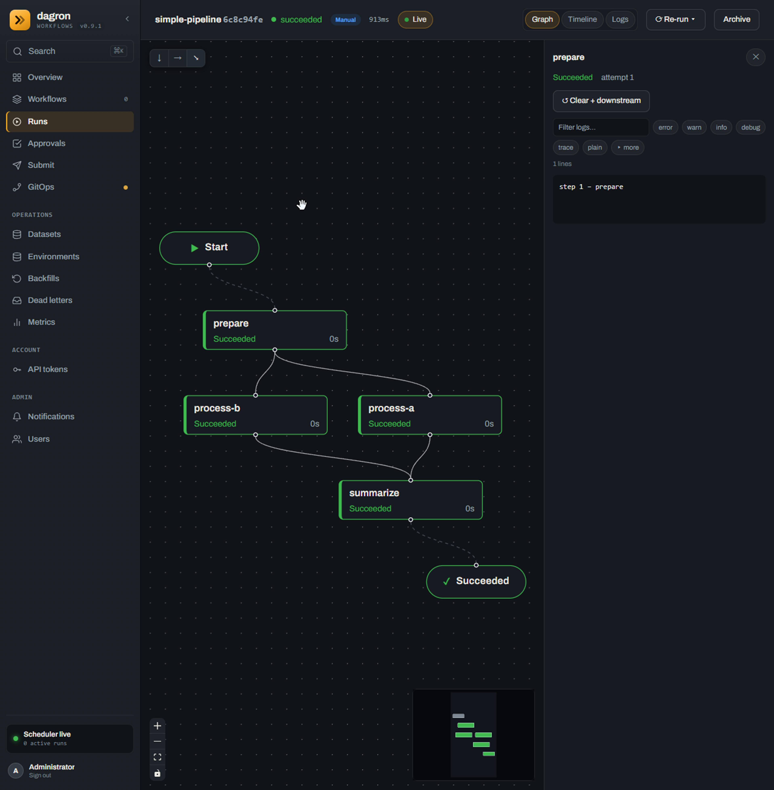
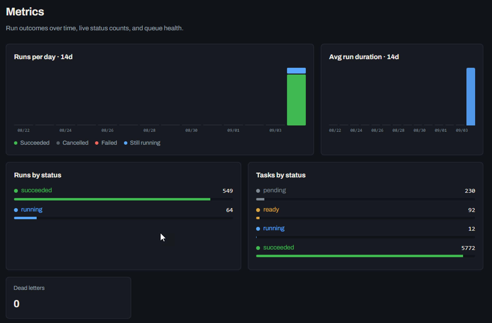
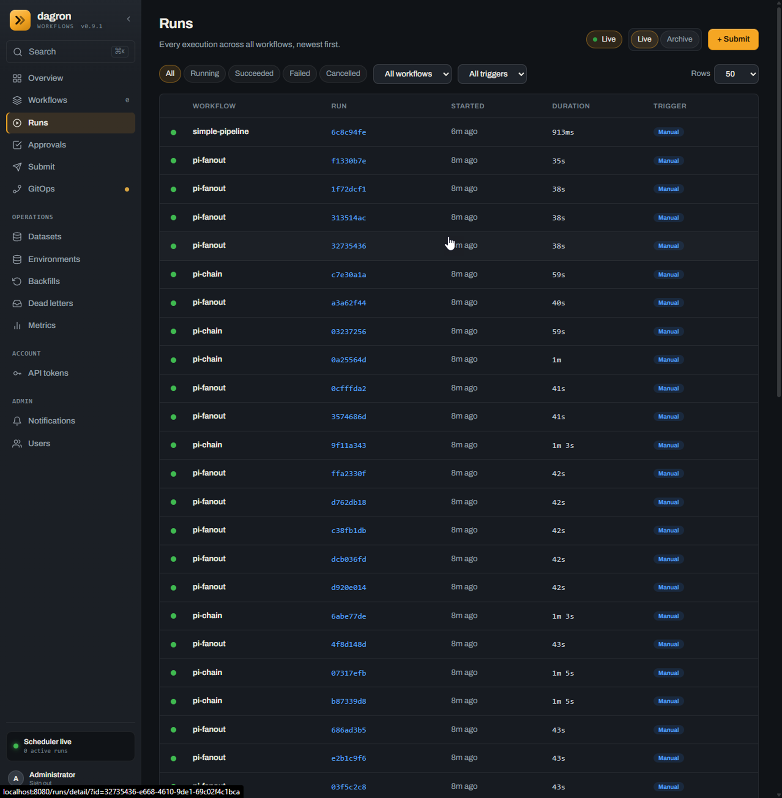

# dagron on a Raspberry Pi 4

Measured numbers for the whole quickstart stack — engine, API, Postgres — on one
Raspberry Pi 4B, and the method that produced them, so you can repeat it on your
own board and disagree with a number rather than take it on faith.

Companion pages: [`EDGE_PROFILE.md`](EDGE_PROFILE.md) is the due-diligence sheet
for *one engine* on a constrained host (binary size, flash, clock confidence,
`profile: edge`). This page is the other half: the **full stack with Postgres**,
under load, with a ceiling attached to it.

**The short version.** A Pi 4 comfortably runs dagron. Sustained **4 workflow
runs/s (~40 tasks/s)** with second-scale latency and no shedding; it starts
shedding at **~5.5 runs/s**; overloaded, it degrades to **~3.3 runs/s** without
dropping anything. Memory is a non-issue (**~340 MB of 3.7 GB** at peak). The
binding resource is **Postgres CPU and disk I/O**, not the engine.

---

## The board

| | |
|---|---|
| Board | Raspberry Pi 4 Model B Rev 1.4, 4 × Cortex-A72 |
| RAM | 3.7 GiB |
| OS | Ubuntu 22.04.1 LTS **arm64**, kernel 5.10.103-v8+ |
| Host | Mythic Beasts hosted Pi (NFS root, no local block device) |
| Runtime | Docker 29.8.0, compose 5.5.1 |
| dagron | 0.9.1, `compose.quickstart.yaml`, `EXECUTOR=local` |
| Engine limits | `WORKER_COUNT=16`, `MAX_INFLIGHT_RUNS=64` (defaults) |

Install cost: **114 s** from `compose up` to a serving API on a cold cache,
**874 MB** of disk for all three images (postgres:16-alpine 411 MB,
dagron-engine-localdev 192 MB, dagron-api 94 MB, plus layers).

Idle, doing nothing:

```text
root-engine-1       cpu  2.7%   rss   14.5 MB
root-dagron-api-1   cpu  0.0%   rss   70.9 MB
root-postgres-1     cpu  5.1%   rss  687.7 MB   <- see the RSS caveat below
host: 279 MB used of 3.7 GB, load1 0.93
```

---

## Results

Every figure below is one measured run. Nothing is extrapolated.

### Smoke — 1 run/s, 30 s

| | |
|---|---|
| submitted / accepted / succeeded | 29 / 29 / 29 |
| 429s, errors, failed runs | 0, 0, 0 |
| throughput | 0.98 runs/s |
| submit latency | p50 34 ms, p95 48 ms, p99 53 ms |
| completion latency | p50 **1.01 s**, p95 1.34 s |
| peak load1 / host mem | 0.90 of 4 cores / 285 MB |

An unloaded 10-task workflow finishes in **about a second**. That is the number
to compare every loaded figure against.



The stack's own seeded run, on the Pi, in the console: **913 ms** for the whole
DAG, every task `0s`, with per-task logs attached. Nothing about the UI is
degraded on this hardware — the graph, the live badge and the log panel all
behave as they do anywhere else.

### Ramp — 1 to 15 runs/s over 300 s (finding the knee)

```text
 t(s)  target/s   sub    ok   429    ok/s
    0       1.5    31    31     0    1.55
   20       2.4    49    49     0    2.45
   40       3.3    67    67     0    3.35
   60       4.3    87    87     0    4.35
   80       5.2   104   104     0    5.20   <- last clean bucket
  100       6.1   124   112    12    5.60   <- 429s begin; peak accepted rate
  120       7.1   142    79    63    3.95
  140       8.0   161    70    91    3.50
  160       8.9   180    68   112    3.40
  180       9.9   198    62   136    3.10
  200      10.8   217    67   150    3.35
  220      11.7   235    65   170    3.25
  240      12.7   255    71   184    3.55
  260      13.6   273    66   207    3.30
  280      14.5   277    61   216    3.05   <- settles ~3.3/s
```

Totals: 2400 submitted, 1059 accepted, **1341 rejected with 429, 0 errors, 0
failed runs**. Every accepted run — 10,590 tasks — succeeded.

| | |
|---|---|
| throughput | 3.44 runs/s |
| submit latency | p50 14 ms, p95 61 ms, **p99 99 ms** |
| completion latency | p50 10.4 s, p90 33.1 s, p99 37.0 s |
| peak load1 / host mem | 3.79 of 4 cores / 336 MB |
| peak CPU | postgres 115 %, engine 79 %, api 4 % |

**How to read this.** The generator is *open-loop*: it submits at the scheduled
rate whether or not dagron keeps up. A closed-loop client would slow itself down
and hide the ceiling.

* **Rows 0–80** — `ok == sub`. Accepted rate tracks target exactly. Nothing is
  shed, latency stays near the unloaded 1 s.
* **Row 100** — the boundary. The first 429s appear, and `ok/s` peaks at 5.60.
  This is the moment in-flight runs reach `MAX_INFLIGHT_RUNS=64`.
* **Rows 120+** — accepted rate *falls* to ~3.3/s and stays there.

The fall is the interesting part, and it is not a bug. The cap is on **in-flight
runs, not on submission rate**, so once 64 runs are in flight a new one is
admitted only as an old one finishes: **accepted rate becomes completion rate**.
Below saturation the Pi completed ~5.6 runs/s; with 64 runs in flight their tasks
contend for 16 workers and one Postgres, per-run latency rises from 1.0 s to
10.4 s, and aggregate completions settle at 3.3/s.

So the two numbers answer different questions:

* **~5.2 runs/s** — the most this Pi absorbs with zero shedding and ~1 s latency.
  The design point.
* **~3.3 runs/s** — what it still completes while overloaded and queue-full. The
  degraded floor.

The gap between them is congestion cost: a saturated system does *less* useful
work per second than an unsaturated one. That is the reason to run below the
knee, not at it.



The console during the overloaded stretch, which is the clearest picture of what
the paragraph above describes. **Runs by status: `running` 64** — exactly
`MAX_INFLIGHT_RUNS`, pinned to the cap, which is why the 429s are flowing. Tasks
behind it: 230 `pending`, 92 `ready`, **12 `running`** against `WORKER_COUNT=16`
— the worker pool is the throttle underneath. And 5772 tasks `succeeded` with
**0 dead letters**: saturated, not damaged.

**A 429 is not an error.** It is the admission valve declining with a
`Retry-After`, and the harness counts `rejected` separately from `errors`
(transport failures, 5xx, dropped connections) on purpose. Zero errors across
2400 submissions means the Pi never fell over, never dropped a connection and
never lost a run. Note also that **submit latency stayed low at full overload**
(p99 99 ms) because rejecting is cheap — the console and API stay responsive
while the box is saturated. You get a clear "try again shortly", not a hang.

### Sustained — 4 runs/s, 180 s (the recommended operating point)

| | |
|---|---|
| submitted / accepted / succeeded | 719 / 719 / 719 |
| 429s, errors, failed | **0, 0, 0** |
| throughput | 3.98 runs/s |
| accept rate | **1.000** |
| submit latency | p50 38 ms, p95 69 ms, p99 123 ms |
| completion latency | p50 **1.11 s**, p90 2.0 s, p99 4.3 s |
| peak load1 / host mem | 3.29 of 4 cores / 329 MB |
| peak in-flight runs | **5** of 64 |

7190 tasks in three minutes, nothing shed, latency essentially unchanged from
idle. **Peak in-flight of 5 against a cap of 64 is the headroom statement**: at
4 runs/s the queue never builds, so the box is absorbing bursts, not surviving
them.

### Is the ceiling the cap, or the hardware?

The honest way to answer is to remove the cap and see whether anything improves.
Same 8 runs/s push, twice, with only the engine's limits changed:

| | B: defaults (16 / 64) | C: raised (`WORKER_COUNT=32`, `MAX_INFLIGHT_RUNS=256`) |
|---|---|---|
| accepted / submitted | 430 / 959 | 449 / 959 |
| **throughput** | **3.31 runs/s** | **2.60 runs/s** (down 22 %) |
| completion p50 | 12.9 s | **71.4 s** (up 5.5x) |
| completion p99 | 39.5 s | **150.1 s** (up 3.8x) |
| peak in-flight | 64 | 200 |
| peak load1 | 3.81 | 4.78 |
| postgres peak CPU | 162 % | 195 % |
| errors / failed | 0 / 0 | 0 / 0 |

**Raising the cap made it strictly worse.** Throughput fell 22 % while latency
grew 5.5x, and the 429s barely moved (529 to 510). This is congestion collapse:
more concurrency bought more contention, not more work. The hardware is the
ceiling, and `MAX_INFLIGHT_RUNS=64` is not the thing holding this Pi back.

That matters operationally, because it settles what to do about the 429s. Raising
the cap does not create capacity — it converts backpressure the client can act on
(a `429` + `Retry-After`, answered in 20 ms) into queue latency it cannot (a run
that sits for 71 seconds). **Leave the cap alone and slow the producer down.**

---

## Headroom summary

| Question | Answer |
|---|---|
| Comfortable sustained rate | **4 runs/s ~ 40 tasks/s**, p50 1.1 s, nothing shed |
| Absorbs bursts to | ~5.2 runs/s before the first 429 |
| Degraded floor when overloaded | ~3.3 runs/s, still 0 failures |
| CPU at the comfortable rate | ~3.3 of 4 cores load1; postgres is the hot one |
| Memory at any rate tested | **<= 343 MB of 3.7 GB** — never close to a constraint |
| Disk | 874 MB images + Postgres growth |
| What breaks first | Postgres CPU + disk I/O. Not the engine, not RAM. |

**Postgres is the bottleneck, not dagron.** It peaked at 115–195 % CPU while the
engine sat at 65–85 %. On this host that is aggravated by storage: the root
filesystem is NFS, so `load1` of 3.79 against only ~2 cores of actual container
CPU means a large share is I/O wait, not compute. **A Pi with a decent USB3 SSD
should beat these numbers** — treat them as a floor for Pi-class hardware, not a
ceiling.

If you need more than ~4 runs/s from one Pi, in order of effect: put Postgres on
real storage; move Postgres off the Pi entirely; then add engine replicas against
that shared Postgres. Tuning `WORKER_COUNT` upward is the one thing measured *not*
to help.

For a smaller footprint than the quickstart — one engine, SQLite, no Postgres and
no API — see [`EDGE_PROFILE.md`](EDGE_PROFILE.md) and `profile: edge`
(`WORKER_COUNT=2`, `MAX_INFLIGHT_RUNS=4`, slow ticks, a free-disk floor).

---

## Room to optimize

**None of this is measured.** Everything above is; everything here is a
hypothesis with the experiment that would settle it, ordered by how much effect
the measurements suggest. They are written this way so a contributor can pick one
up and come back with a number, and so nobody quotes them as results.

Two facts drive the whole list. Postgres burned 115–195% CPU against the engine's
65–85%, and `load1` reached 3.79 against only ~2 cores of actual container CPU —
so roughly half of what looks like saturation is **I/O wait**, not compute.

### 1. Real storage (largest expected effect)

This host is NFS-rooted with 4 KB `rsize`/`wsize`, and Postgres is writing its WAL
through a loop-mounted ext4 image on top of that. Every task status transition is
a durable write down that path.

*Test:* the same `smoke` / `ramp` / `steady` sequence on a Pi with a USB3 SSD, or
with the Postgres volume moved to one. Compare the knee, and compare `load1`
against summed container CPU — if the gap closes, the I/O-wait reading was right.

*Expected:* the knee moves up. How far is the interesting part, and it is the
single number that would most change this page.

### 2. `synchronous_commit = off` on Postgres

Every task state change costs a WAL fsync. Turning that off is the biggest single
Postgres lever on a box like this.

*Test:* `steady` and `push` with `-c synchronous_commit=off` added to the postgres
service's command, against the figures above.

*Trade, and it is a real one:* a power cut or kernel panic can lose the last few
hundred milliseconds of committed run state. **Not a production recommendation** —
but it cleanly separates "the Pi cannot compute this fast" from "the Pi cannot
fsync this fast", which is worth knowing even if you then leave it on.

### 3. Postgres off the Pi

The two roles are competing for four cores. Moving the database to another machine
asks a different and more useful question: is a Pi a good *engine* even though it
is a poor *database server*?

*Test:* point `DATABASE_URL` at Postgres on another host, re-run `ramp`. The
engine's own ceiling is then visible for the first time.

### 4. `WORKER_COUNT` **down**, not up

Raising it to 32 measurably hurt (§ "Is the ceiling the cap, or the hardware?").
Nobody has tried the other direction. 16 workers forking tasks on 4 cores may
itself be past the optimum, and this is the cheapest experiment on the list.

*Test:* `steady` at 8 runs/s with `WORKER_COUNT` at 4, 8 and 16.

*Expected:* genuinely unknown, which is why it is worth running. If fewer workers
give more throughput, the Pi default should not be 16 — and the same reasoning
would apply to any 4-core host.

### 5. `DB_MAX_CONNECTIONS`

The engine and `dagron-api` each default to a pool of 8
([`CONFIG.md`](CONFIG.md)), so up to 16 Postgres backends contend for four cores.
Postgres being the hot component makes this suspicious.

*Test:* `steady` and `push` with `DB_MAX_CONNECTIONS=4` on the engine. Floor is 2;
below that the claim transaction and the listener deadlock.

### 6. Slower ticks

`POLL_INTERVAL_MS` and `SWEEP_INTERVAL_MS` both default to 500 ms, and the sweeps
are database queries. The reconcile loop also wakes on task completion and on
`LISTEN/NOTIFY`, so the timer is a bound rather than the main path — raising it
should cost little and cut baseline DB load.

*Test:* idle Postgres CPU at 500 ms versus 2000 ms, then `steady` at both to check
nothing regressed. `profile: edge` already takes this position
(`POLL_INTERVAL_MS=1000`, `SWEEP_INTERVAL_MS=5000`).

### 7. Read the workload honestly

Not a knob. These DAGs are ten `true` tasks each, chosen to measure the control
plane, so **runs/s here is close to a worst case per unit of useful work**. Real
pipelines have fewer, longer tasks: a Pi that manages 4 runs/s of this will
comfortably run far more of a workload whose tasks take seconds or minutes,
because the scheduler cost per run is amortised over real work. Do not read
"4 runs/s" as "4 pipelines per second" for your pipelines — measure yours.

---

## Reproduce it

Everything here is in the repo. You need a Pi and about 30 minutes.

### 1. Install and verify (~5 min)

Copy the repository, not loose files: step 2's `run.sh` resolves the driver at
`../../loadtest/harness/run_fleet.py`, so the rig only works with its directory
structure intact. From the root of a dagron checkout:

```bash
rsync -a --exclude target --exclude .git -e 'ssh -p <port>' ./ pi@<host>:~/dagron/
ssh -p <port> pi@<host> 'sudo bash ~/dagron/scripts/rpi-smoke.sh --fresh'
```

`scripts/rpi-smoke.sh` installs Docker, brings the stack up, waits for the API,
logs in, checks the seeded run succeeded, submits a diamond DAG and asserts 4/4
tasks green. It ends in `PASS` or dumps `compose logs` and exits non-zero.

### 2. Load test (~15 min)

Runs **on the Pi** — the engine's management port is not published to the host —
and from the tree copied in step 1, since the profiles, workflows and driver are
all resolved relative to `run.sh`:

```bash
cd ~/dagron
sudo bash loadtest/pi/run.sh smoke     # 1 run/s x 30s  — does the rig work
sudo bash loadtest/pi/run.sh ramp      # 1->15 run/s x 300s — find your knee
sudo bash loadtest/pi/run.sh steady    # 4 run/s x 180s — confirm it is sustainable
sudo bash loadtest/pi/run.sh push      # 8 run/s x 120s — past the knee
```

Each writes `results/fleet-<profile>.log` (throughput, accept rate, latency
percentiles) and `results/resources-<profile>.csv` (load, host memory, in-flight
runs, SoC temperature, throttle word, per-container CPU and RSS every 5 s), and
prints the peaks — including a warning if the board throttled, which invalidates
the run.

To repeat the cap-vs-hardware experiment, run `push` twice with
`loadtest/pi/compose.tune.yaml` layered on for the second:

```bash
docker compose -f compose.quickstart.yaml -f loadtest/pi/compose.tune.yaml up -d engine
```

### What the rig is

* **Driver** — `loadtest/harness/run_fleet.py`, unchanged from the EKS fleet:
  open-loop rate schedule, latency percentiles, 429 accounting, drain-to-terminal,
  and a dirty-queue preflight. Stdlib + PyYAML.
* **Workflows** — `loadtest/pi/workflows/{fanout,chain}.yaml`. The same two shapes
  as the cloud fleet (8-wide fan-out/fan-in, 10-deep chain) with `command: ["true"]`.
  The cloud fleet's DAGs need the S3-backed `etl-task` image; on a Pi the question
  is what the **control plane** costs, and real ETL work would bury that under its
  own CPU. Under `EXECUTOR=local` each task is still a real fork+exec inside the
  engine container, so the per-task floor being measured is the one this
  deployment actually pays.
* **Target** — the **engine's** management API on `:8787`, not `dagron-api:8080`.
  The harness posts raw `application/yaml` to `POST /runs` with no auth, which is
  the engine's route; `dagron-api` wants a JWT and a JSON envelope. The quickstart
  does not publish 8787, so `run.sh` reads the container IP from `docker inspect`.
* **Sampler** — `loadtest/pi/sample.sh`, one CSV row per container per tick:
  load, host memory, in-flight runs, SoC temperature, the throttle word, and
  per-container CPU and RSS.



What the two shapes look like afterwards. Both carry ten tasks, and the durations
separate them exactly as intended: **`pi-fanout` 35–43 s** against **`pi-chain`
59 s–1 m 5 s** in the same queue. The chain pays for ten sequential
claim → run → status → advance hops where the fan-out overlaps eight of its
tasks, so the pair measures scheduler *latency* and *width* separately rather
than averaging them into one number. Note the footer — `Scheduler live, 0 active
runs`: this is the drained state after the window closed.

### Reporting your numbers

The board, the storage, `WORKER_COUNT`/`MAX_INFLIGHT_RUNS`, and the profile — a
throughput figure without the concurrency it was measured at is not comparable to
anything. `run.sh` prints the engine's limits above every result for that reason.
Useful contributions: a Pi 5, a Pi 4 on USB3 SSD (the obvious win over this NFS
host), a Pi with Postgres on another machine, and a `profile: edge` SQLite
single-engine run.

---

## What edge testing still needs

This page measured **throughput on a healthy, mains-powered, rack-hosted Pi with
a network filesystem**. That is one corner of what "runs on a Pi" means, and the
gaps below are the rest of it. Several exercise machinery
[`EDGE_PROFILE.md`](EDGE_PROFILE.md) already documents but that nothing here
touched — a documented gate that has never been fired is a claim, not a feature.

Roughly in order of how likely they are to bite a real deployment.

**1. Thermal throttling — a known hole in the numbers above.** A Pi 4 under
sustained load throttles at 80 °C, and a throttled Pi silently halves everything
on this page. This host is rack-mounted and may never have throttled; a Pi on a
desk in a case without a heatsink certainly will. Nothing sampled temperature
during the runs above, so **every figure on this page carries an unstated
assumption that the board was not throttling.** It cannot be retro-fitted to
results already taken.

`sample.sh` now records `temp_c` and the raw `vcgencmd get_throttled` word every
tick, and `run.sh` prints the peak temperature and refuses to let a throttled run
pass quietly:

```text
peak SoC temp: 84.1 C
WARNING: board reported throttling (0x50005) - these numbers are not comparable
```

The throttle word is kept raw rather than reduced to a boolean because which bit
tripped matters: bits 0 and 2 mean *throttling right now*, bits 16 and 18 mean
*it happened at some point since boot*. Both reads degrade to empty off a Pi, so
the sampler stays portable. Any re-run therefore reports what these did not — but
the figures above stay as they are, with the caveat attached.

Then wire the gate that already exists for it: `DAGRON_PRESSURE_FILE`
([`EDGE_PROFILE.md`](EDGE_PROFILE.md) § 2.1) pauses task claims when a file
appears, driven by a ten-line thermal guard from cron. Run `ramp` with it
connected and confirm claims pause, resume, and that **no run fails** — a pause
is "start nothing new", not "stop", and that distinction has never been tested on
hardware that actually gets hot.

**2. SQLite instead of Postgres.** Everything here is the Postgres stack, and
Postgres turned out to be the bottleneck. `profile: edge` is a single engine on
SQLite with no Postgres and no API — arguably the *more* representative edge
configuration, and completely unmeasured on a Pi. Since the bottleneck would be
removed and replaced with a different one, the result could move sharply in
either direction. Same profiles, same shapes, `SOURCE=dir`.

**3. Power loss.** [`EDGE_PROFILE.md`](EDGE_PROFILE.md) § 3 covers SQLite on
flash and what the WAL does when power goes. Untested here: pull power mid-run,
confirm the datastore survives and in-flight runs resume or fail cleanly rather
than being lost silently. Needs physical access, which is exactly why it needs a
community Pi rather than a hosted one.

**4. The free-disk floor.** `DAGRON_MIN_FREE_BYTES` refuses new runs below a
threshold — `507` + `Retry-After` — instead of risking a half-written datastore.
On a Pi with an SD card this is the gate that matters most, and it has never been
fired here. Test: set it high, fill the filesystem, confirm the refusal and that
existing runs finish.

**5. Real flash, and wear.** This host has no local block device at all, so every
statement in the edge docs about SD/eMMC behaviour and write wear is untested on
the medium most Pis actually boot from. A long `soak` on an SD card, with
`smartctl`/wear counters before and after, is a different and slower kind of
result than anything on this page.

**6. Clock skew at boot.** A Pi has no RTC — it comes up with a wrong clock until
NTP settles. [`EDGE_PROFILE.md`](EDGE_PROFILE.md) § 4 describes how a run records
the confidence of the clock it was stamped under. Untested: submit a scheduled
run in that window and check what `clock_confidence` reports.

**7. Uplink loss.** Engine and database on one board survive a network drop, but
`SOURCE=mqtt`/`stream` and gitops against a remote repository do not. Test:
drop the uplink mid-run and confirm reconnect without duplicate or lost runs.

**8. 32-bit ARM, on hardware.** The armhf dead end at the top of this page has an
answer that is not a container: the release publishes a static
`armv7-unknown-linux-musleabihf` binary. But there is **no hosted 32-bit ARM
runner**, so that artefact is cross-compiled and shipped *linked, not proven* —
CI has never executed it. Anyone with an armhf Pi running `dagron dev` from that
binary would be the first, and would close the loop on the first thing that went
wrong here.

---

## Gotchas found on this host

Three things cost real time here. All three are handled by `scripts/rpi-smoke.sh`,
and all three will bite anyone doing it by hand.

**1. 32-bit userland on a 64-bit kernel.** Raspberry Pi OS and several hosted Pi
images default to `armhf` with an `aarch64` kernel, so `uname -m` says `aarch64`
and lies to you. dagron publishes `linux/amd64` and `linux/arm64` only, so every
pull fails with *no matching manifest* — after you have installed Docker. Check
the userland, and check it first:

```bash
dpkg --print-architecture    # must be arm64, NOT armhf
```

There is no fix short of reinstalling with a 64-bit image.

**2. overlayfs cannot use an NFS upperdir.** On an NFS-rooted Pi with no local
block device, every image download completes and then dies at unpack:

```text
failed to mount /tmp/containerd-mountNNN: mount source: "overlay", ... invalid argument
```

Fix: a sparse ext4 image file, loop-mounted. **Both roots must move** — Docker 28+
uses the containerd image store, so the snapshots the overlay actually stacks live
under `/var/lib/containerd`, and moving only `/var/lib/docker` changes nothing.
One image with two bind mounts keeps it a single pool:

```bash
truncate -s 6G /docker.img && mkfs.ext4 -q -F /docker.img
mount -o loop /docker.img /mnt/dockerdata
mkdir -p /mnt/dockerdata/docker /mnt/dockerdata/containerd
mount --bind /mnt/dockerdata/docker     /var/lib/docker
mount --bind /mnt/dockerdata/containerd /var/lib/containerd
```

(The `vfs` storage driver also works on NFS and needs no loop device, but it
stores every layer as a full copy — too slow and too large here.)

**3. `docker stats` reports no memory.** Pi kernels ship with the memory cgroup
controller disabled — `memory ... 0` in `/proc/cgroups`; enabling it needs
`cgroup_enable=memory cgroup_memory=1` on the boot cmdline and a reboot, which a
hosted Pi will not let you do. Every `MemUsage` field reads `0B / 0B`.
`sample.sh` sums `VmRSS` over the container cgroup's pids instead, which needs no
kernel change and correctly counts the task subprocesses `EXECUTOR=local` forks.

> **RSS caveat.** Summed `VmRSS` over-counts pages shared between processes, which
> is why postgres reads ~690 MB while the whole host is using 279 MB. Treat
> `host_mem_used_mb` as the real number and per-container RSS as directional. It
> does not change the conclusion — the host never exceeded 343 MB of 3.7 GB.
