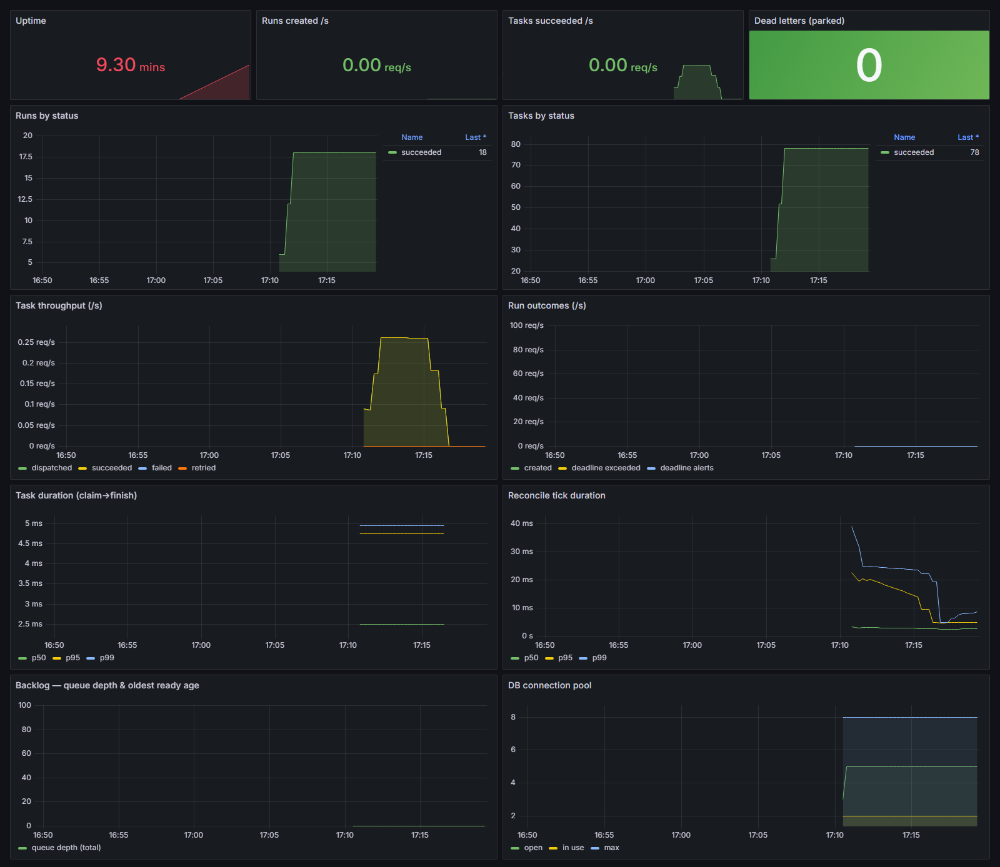

# Monitoring dagron with Prometheus + Grafana

A ready-to-run monitoring stack: **Prometheus** scrapes the dagron engine's
built-in metrics and **Grafana** renders the bundled **dagron — overview**
dashboard.



## What it shows

All panels use the engine's `scheduler_*` metrics (OSS build):

- **Throughput** — runs created/s, tasks dispatched/succeeded/failed/retried per second.
- **State** — runs and tasks by status (`scheduler_runs`, `scheduler_tasks`), queue depth, dead-letters parked.
- **Latency** — task duration and reconcile-tick p50/p95/p99 (from the histograms).
- **Backlog** — ready tasks per runner class and the oldest ready-task age.
- **Saturation** — DB connection pool (open / in-use / max) and uptime.

## Prerequisites

The engine must expose `/metrics`, which needs:

1. an **`ops` build** (the root `compose.yaml` engine uses `FEATURES=postgres,ops` — already fine), and
2. `API_ADDR` set (the root stack sets `API_ADDR=0.0.0.0:8787`).

`GET /metrics` is unauthenticated on the engine's management API (`text/plain; version=0.0.4`); the `dagron-api` gateway only serves JSON at `/api/metrics`, so Prometheus points at the **engine**, not the gateway.

## Run it

From the module root (`rust_modules/lab/module_54`):

```console
# 1. bring up the dagron stack (creates the dagron-ui_default network)
docker compose up -d            # or: podman compose up -d

# 2. bring up monitoring (joins that network, scrapes engine:8787)
docker compose -f examples/monitoring/compose.yaml up -d
```

- **Grafana** → <http://localhost:3001> — the *dagron / dagron — overview*
  dashboard is auto-provisioned. Anonymous viewing is on; admin is
  `admin` / `admin` (override with `GRAFANA_USER` / `GRAFANA_PASSWORD`).
- **Prometheus** → <http://localhost:9090> — check
  *Status → Targets* shows `dagron-engine` **UP**.

Generate some traffic (see the [how-to guide](../../docs/HOWTO.md)) and the
panels fill in within a scrape interval (15s).

## Pointing at an engine elsewhere

Edit [`prometheus/prometheus.yml`](prometheus/prometheus.yml) `targets`:

- Engine on the host (not in the compose network): `host.docker.internal:8787`
  and drop the `dagron` external network from `compose.yaml`.
- Engine in Kubernetes: scrape its Pod/Service `:<API_ADDR port>/metrics`
  (a `ServiceMonitor`/`PodMonitor` if you run the Prometheus Operator).

## Files

| File | Purpose |
| --- | --- |
| `compose.yaml` | Prometheus + Grafana, wired to the dagron network |
| `prometheus/prometheus.yml` | scrape config (engine `:8787/metrics`) |
| `grafana/provisioning/` | datasource + dashboard auto-provisioning |
| `grafana/dashboards/dagron-overview.json` | the dashboard model |

> The dashboard uses only OSS metrics. Enterprise builds additionally expose
> `scheduler_catchup_runs_total`, `scheduler_auto_reruns_total`,
> `scheduler_overdue_schedules`, `scheduler_schedule_lag_seconds`, and
> `scheduler_incomplete_runs` — add panels for those if you run that build.
